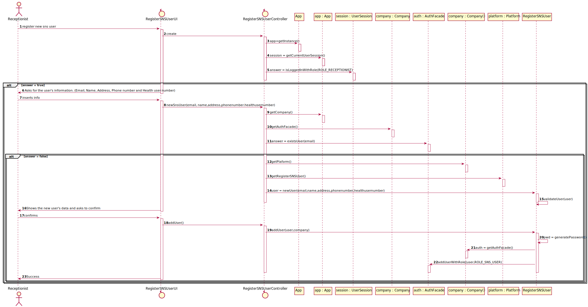

## US 03 - As a receptionist, I want to register a SNS user

1. Requirements Engineering
In this section, it is suggested to capture the requirement description and specifications as provided by the client as well as any further clarification on it. It is also suggested to capture the requirements acceptance criteria and existing dependencies to other requirements. At last, identify the involved input and output data and depicted an Actor-System interaction in order to fulfill the requirement.

### 1.1. User Story Description
As a receptionnist, I want to register a SNS user

### 1.2. Customer Specifications and Clarifications
The "Auth" component avaliable in the repository must be reused.

### 1.3. Acceptance Criteria
The SNS user must become a system user, he must be able to login and access the menus avaliables to users with this role.

### 1.4. Found out Dependencies
The user has to be log into the system as a receptionist.

### 1.5 Input and Output Data
* Input: 
    * Name
    * Adress
    * Phone number
    * Health user number
* Output:
    * Confirmation of the operation

### 1.6. System Sequence Diagram (SSD)

### 1.7 Other Relevant Remarks
The only requirement that must be met is that the SNS user becomes a system user, there are practically no variations to this user story and it is used everytime a new user walks into a vaccination center for the first time and needs to be registered.

## 2. OO Analysis
### 2.1. Relevant Domain Model Excerpt

### 2.2. Other Remarks
Use this section to capture some aditional notes/remarks that must be taken into consideration into the design activity. In some case, it might be usefull to add other analysis artifacts (e.g. activity or state diagrams).

## 3. Design - User Story Realization
### 3.1. Rationale
The rationale grounds on the SSD interactions and the identified input/output data.

Interaction ID	Question: Which class is responsible for...	Answer	Justification (with patterns)
Step 1	...specifying a new vaccine type?		
Step 2			
Step 3			
Step 4			
Step 5			
Step 6			
Step 7			
Step 8			
Step 9			
Step 10			
Systematization
According to the taken rationale, the conceptual classes promoted to software classes are:

Other software classes (i.e. Pure Fabrication) identified: * 
* RegisterVaccineTypeController

### 3.2. Sequence Diagram (SD)
In this section, it is suggested to present an UML dynamic view stating the sequence of domain related software objects' interactions that allows to fulfill the requirement.

## 3.3. Class Diagram (CD)
In this section, it is suggested to present an UML static view representing the main domain related software classes that are involved in fulfilling the requirement as well as and their relations, attributes and methods.

## 4. Tests
In this section, it is suggested to systematize how the tests were designed to allow a correct measurement of requirements fulfilling.

DO NOT COPY ALL DEVELOPED TESTS HERE

Test 1: Check that it is not possible to create an instance of the Example class with null values.

@Test(expected = IllegalArgumentException.class)
    public void ensureNullIsNotAllowed() {
    Exemplo instance = new Exemplo(null, null);
}
It is also recommended to organize this content by subsections.

## 5. Construction (Implementation)
In this section, it is suggested to provide, if necessary, some evidence that the construction/implementation is in accordance with the previously carried out design. Furthermore, it is recommeded to mention/describe the existence of other relevant (e.g. configuration) files and highlight relevant commits.

It is also recommended to organize this content by subsections.

## 6. Integration and Demo
In this section, it is suggested to describe the efforts made to integrate this functionality with the other features of the system.

## 7. Observations
In this section, it is suggested to present a critical perspective on the developed work, pointing, for example, to other alternatives and or future related work.