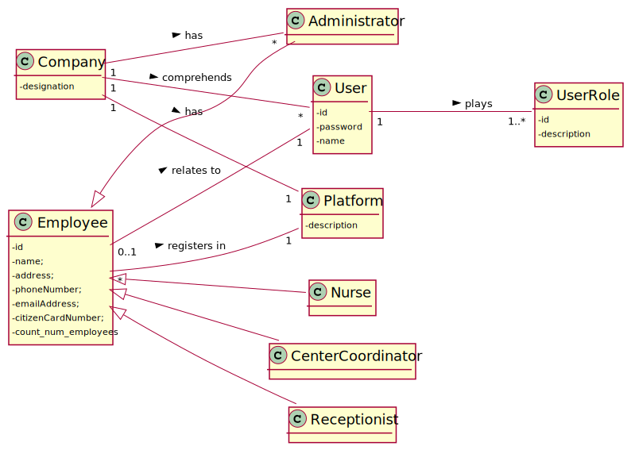

# US 10 - To Register an Employee

## 1. Requirements Engineering

### 1.1. User Story Description

As an administrator, I want to register an Employee.

### 1.2. Customer Specifications and Clarifications 

**From the specifications document:**

>	An Administrator is responsible for properly configuring and managing the core information (e.g.:
type of vaccines, vaccines, vaccination centers, employees) required for this application to be
operated daily by SNS users, nurses, receptionists, etc.

>	The DGS has Administrators who administer the application. Any Administrator uses the
application to register centers, SNS users, center coordinators, receptionists, and nurses enrolled in
the vaccination process.

**From the client clarifications:**

> **Question:** Besides a password and a user name, what other (if any) information should the Admin use to register a new employee? Are any of them optional?
>  
> **Answer:** Every Employee has only one role (Coordinator, Receptionist, Nurse).
Employee attributes: Id (automatic), Name, address, phone number, e-mail and Citizen Card number.
All attributes are mandatory.
> 
> **Question:** What is the correct format for the employee's phone number and cc? Should we consider that these follow the portuguese format?
> 
> **Answer:** Consider that these two attributes follow the portuguese format.
> 
> **Question:** Is the password generated automatically, or is it specified by the user operating the system?
> 
> **Answer:** The password should be generated automatically.

  

### 1.3. Acceptance Criteria

* **AC1:** Each user must have a single role define in the system. The "auth" component available on the repository must be reused(without modifications).
* **AC2:** All attributes are mandatory(none of them can be null).
* **AC3:** All those who wish to use the
  application must be authenticated with a password holding seven alphanumeric characters,
  including three capital letters and two digits. The password should be generated automatically.
* **AC4:** When registering an Employee with an already existing reference, the system must reject such operation and the Administrator must have to start another register process.
* **AC5:** Phone number follow the portuguese format.
* **AC5:** Citizen Card Number follow the portuguese format.

### 1.4. Found out Dependencies

* There is a dependency to classes such as "User","UserStore","UserRole","UserRoleStore","UserRoleDTO" since at least a role must exist to classify the type of Employee being created and check if he is already a user.

### 1.5 Input and Output Data

**Input Data:**

* Typed data:
 
	* a name, 
	* an address,
	* a phone number
	* an email address,
	* a citizen card number
	
* Selected data:
	* Specifying role of Employee

**Output Data:**

* List of existing roles
* Shows the data inserted for the employee and request a confirmation
* (In)Success of the operation

### 1.6. System Sequence Diagram (SSD)

**Alternative 1**

**Other alternatives might exist.**

### 1.7 Other Relevant Remarks

* Employee roles can be of type receptionist, center coordinator, nurse, administrator.

## 2. OO Analysis

### 2.1. Relevant Domain Model Excerpt 

### 2.2. Other Remarks

n/a

## 3. Design - User Story Realization 

### 3.1. Rationale

**SSD - Alternative 1 is adopted.**

| Interaction ID                  | Question: Which class is responsible for...        | Answer                     | Justification (with patterns)                                                                                                                      |
|:--------------------------------|:---------------------------------------------------|:---------------------------|:---------------------------------------------------------------------------------------------------------------------------------------------------|
| Step 1  		                      | 	... interacting with the actor?                   | RegisterEmployeeUI         | Pure Fabrication: there is no reason to assign this responsibility to any existing class in the Domain Model.                                      |
| 			  		                         | 	... coordinating the US?                          | RegisterEmployeeController | Controller                                                                                                                                         |
| 						                          | ...knowing the app instance?                       | App                        | Creator(rule 3): App closely uses Singleton                                                                                                        |
|                                 | ...knowing the company?                            | App	                       | Creator(Rule 4): App has the data used to initialize Company                                                                                       |
| 	                               | ...knowing the platform?                           | Company                    | Creator(Rule 4): Company has the data used to initialize Platform                                                                                  |
| 			  		                         | ... knowing the user using the system?             | UserSession                | IE: cf. A&A component documentation.                                                                                                               |
| 			  		                         | 	... knowing to which company the user belongs to? | App                        | IE: has registered the user sessions                                                                                                               |
| 			  		                         | 	... getting the register(list) of Employees?      | Platform                   | IE:  in the DM Platform is responsible for all the registers                                                                                       |
| 			  		                         | 				                                               | RegisterEmployee           | HC + LC: knows/has its own Employees                                                                                                               |                                                                                                
|                                 | ....knowing the Employee roles to show?            | AuthFacade                 | IE:Having the roles is the responsibility off the external component which the interaction point its through the class "AuthFacade"                |
| Step 2                          |                                                    |
| Step 3                          | ...holds temporarily the select role?              | RegisterEmployeeUI         | IE : Holding on temporarily the role select before passing it, after asking for the Employee data                                                  |
| Step 4  		                      | 							                                            |                            |                                                                                                                                                    |
| Step 5   		                     | 	... instantiating a new Employee?                 | RegisterEmployee           | Creator (Rule 1): in the DM Platform register Employees.                                                                                           |	
| 		                              | 	...saving the inputted data?                      | Employee                   | IE: object created in step 5 has its own data.                                                                                                     |                                                              |
| 		                              | 	... saving the selected role?                     | Employee                   | IE: object created in step 5 is classified with on role.                                                                                           |                        |                                                                                                               |              
| 		                              | 	... validating all data (local validation)?       | Employee                   | IE: owns its data.                                                                                                                                 | 
| 			  		                         | 	... validating all data (global validation)?      | RegisterEmployee           | HC + LC: knows all its Employees.                                                                                                                  | 
| Step 6                          |
| Step 7                          | ...saving employee as system user?                 |  AuthFacade| IE: adding the users to the system is the responsibility off the external component which the interaction point its through the class "AuthFacade" |
| 			  		 | 	... saving the created Employee?                  | RegisterEmployee           | HC + LC: owns all its Employees.                                                                                                                   | 
| Step 8  		                      | 	... informing operation success?                  | RegisterEmployeeUI         | IE: is responsible for user interactions.                                                                                                          | 

### Systematization ##

According to the taken rationale, the conceptual classes promoted to software classes are: 

 * Company
 * Platform
 * Employee
 * Nurse
 * Receptionist
 * CenterCoordinator
 * Administrator
 * RegisterEmployee

Other software classes (i.e. Pure Fabrication) identified: 

 * RegisterEmployeeUI 
 * RegisterEmployeeController

Other classes off the system:

* UserSession
* UserRole
* UserRoleStore
* UserRoleDTO
* User
* UserStore
* UserRoleMapper
* App
* AuthFacade

## 3.2. Sequence Diagram (SD)

**Alternative 1**

## 3.3. Class Diagram (CD)

**From alternative 1**

# 4. Tests 

**Test 1:** Check that it is not possible to create an instance of the Employee class with null values. 

		@Test
    	public void ensureNullIsNotAllowed() {

        Exception exception = assertThrows(IllegalArgumentException.class, () -> {
         new Nurse(null, null, null, null, null);
        });

        String expectedMessage = "None of the arguments can be null or empty. PhoneNumber e Citizen card Number in PT format";
        String actualMessage = exception.getMessage();

        assertTrue(actualMessage.contains(expectedMessage));

    	}

**Test 2:** Check that it is not possible to create an instance of the Employee class with phone number not following  the portuguese format.

		@Test
    	public void ensureWrongFormatPhoneNumberNotAllowed() {

        Exception exception = assertThrows(IllegalArgumentException.class, () -> {
            new Nurse("Jonas", "Rua de Penalves", "9", "1181478@isep.ipp.pt", "12345678");
        });

        String expectedMessage = "None of the arguments can be null or empty. PhoneNumber e Citizen card Number in PT format";
        String actualMessage = exception.getMessage();

        assertTrue(actualMessage.contains(expectedMessage));

    }

**Test 3:** Check that it is not possible to create an instance of the Employee class 
with Citizen Card Number not following the portuguese format.

		@Test
    	public void ensureWrongFormatCitizenCardNumberNotAllowed() {

        Exception exception = assertThrows(IllegalArgumentException.class, () -> {
            new Nurse("Jonas", "Rua de Penalves", "916597487", "1181478@isep.ipp.pt", "1");
        });

        String expectedMessage = "None of the arguments can be null or empty. PhoneNumber e Citizen card Number in PT format";
        String actualMessage = exception.getMessage();

        assertTrue(actualMessage.contains(expectedMessage));

    }

*It is also recommended to organizing this content by subsections.* 

# 5. Construction (Implementation)

## Class RegisterEmployeeUI

	private RegisterEmployeeController m_controller;

    
    public RegisterEmployeeUI(){
        this.m_controller = new RegisterEmployeeController();
    }

    public void run(){

        System.out.println("\n Register Employee");

        int choice = Utils.showAndSelectIndex(this.m_controller.getRoles(),"SELECT ROLE:");

        if(choice >= 0 && choice < 4)
        {

            if(enterData(choice))
            {
                showData();

                if (Utils.confirm("Confirms the data? (S/N)"))
                {
                    m_controller.registerEmployee();
                    System.out.println("Registration successful");
                }
                else
                    run();
            }
            else
            {
                System.out.println("USER ALREADY EXISTS");
                run();
            }

        }else{
        System.out.println("Invalid selection");
    }

    }

    private boolean enterData(int roleChoice){

        String name = Utils.readLineFromConsole("Name: ");
        String address = Utils.readLineFromConsole("Address: ");
        String phoneNumber = Utils.readLineFromConsole("Phone Number: ");
        String emailAddress = Utils.readLineFromConsole("Email Address: ");
        String citizenCardNumber = Utils.readLineFromConsole( "Citizen card number: ");

        return m_controller.newEmployee(name, address, phoneNumber, emailAddress, citizenCardNumber ,roleChoice);

    }

    private void showData(){
        System.out.println("\nEmployee:\n" + m_controller.getEmployeeString());
    }

## Class RegisterEmployeeController

	private App m_oApp;
    private Platform m_oPlatform;
    private Employee m_oEmployee;

    public RegisterEmployeeController() {
        this.m_oApp = App.getInstance();
        this.m_oPlatform = m_oApp.getCompany().getPlatform();

    }

    
    public List<String> getRoles(){return this.m_oPlatform.getRegisterEmployee().getRoles();}

    
    public boolean newEmployee(String name, String address, String phoneNumber, String emailAddress, String citizenCardNumber ,int roleChoice)
    {
        try
        {
            this.m_oEmployee = this.m_oPlatform.getRegisterEmployee().newEmployee(name, address, phoneNumber, emailAddress, citizenCardNumber,roleChoice);
            return this.m_oPlatform.getRegisterEmployee().validateEmployee(m_oEmployee);
        }
        catch(RuntimeException ex)
        {
            Logger.getLogger(Utils.class.getName()).log(Level.SEVERE, null, ex);
            this.m_oEmployee = null;
            return false;
        }
    }

    
    public boolean registerEmployee(){return this.m_oPlatform.getRegisterEmployee().registerEmployee(m_oEmployee);}

    
    public String getEmployeeString(){return this.m_oEmployee.toString();}

## Class Company

    private String designation;
    private AuthFacade authFacade;
    private Platform m_oPlatform;

    public Company(String designation)
    {
        if (StringUtils.isBlank(designation))
            throw new IllegalArgumentException("Designation cannot be blank.");

        this.designation = designation;
        this.authFacade = new AuthFacade();
        this.m_oPlatform = new Platform("Registers Platform");

    }
    ///...ommited
    
    public AuthFacade getAuthFacade() {return authFacade;}
    public Platform getPlatform(){return m_oPlatform;}

    }

## Class Platform

    private String description;
    private RegisterEmployee m_oRegisterEmployee;
    // ... (omitted)

    public Platform(String description) {
        if((description == null) || (description.isEmpty()))
            throw new IllegalArgumentException("argument can be null or empty");

        this.description = description;

        this.m_oRegisterVaccinationCenter = new RegisterVaccinationCenter();
        this.m_oRegisterVaccineType = new RegisterVaccineType();
       

    }

    public RegisterEmployee getRegisterEmployee(){return this.m_oRegisterEmployee;}
    
	// ... (omitted)

    public void initializeRegisters(AuthFacade authFacade) {
        this.m_oRegisterSNSUser = new RegisterSNSUser(authFacade);
        this.m_oRegisterEmployee = new RegisterEmployee(authFacade);
    }

## Class RegisterEmployee

	private final List<Employee> listEmployee ;
    private final AuthFacade authFacade;

  
    public RegisterEmployee(AuthFacade authFacade)
    {
        listEmployee = new ArrayList<>();
        this.authFacade = authFacade;
    }

    public Employee newEmployee(String name, String address, String phoneNumber, String emailAddress, String citizenCardNumber, int roleChoice)
    {

        if(roleChoice == 0)
            return new Receptionist(name, address, phoneNumber, emailAddress, citizenCardNumber);
        else if(roleChoice == 1)
            return new Administrator(name, address, phoneNumber, emailAddress,  citizenCardNumber);
        else if(roleChoice == 2)
            return new CenterCoordinator(name, address, phoneNumber, emailAddress, citizenCardNumber);
        else if(roleChoice == 3)
            return new Nurse(name, address, phoneNumber, emailAddress, citizenCardNumber);

        return null;
    }

   
    public boolean registerEmployee(Employee emp)
    {

        String pwd = passwordGenerator();

        if(emp instanceof Receptionist)
        {
            if (authFacade.addUserWithRole(emp.getName(), emp.getEmailAddress(),pwd, Constants.ROLE_RECEPTIONIST))
                return addEmployee(emp);

        }else if(emp instanceof Nurse)
        {
            if (authFacade.addUserWithRole(emp.getName(), emp.getEmailAddress(),pwd, Constants.ROLE_NURSE))
                return addEmployee(emp);

        }else if(emp instanceof CenterCoordinator)
        {
            if (authFacade.addUserWithRole(emp.getName(), emp.getEmailAddress(),pwd, Constants.ROLE_CENTER_COORDINATOR))
                return addEmployee(emp);

        }else if(emp instanceof Administrator)
        {
            if (authFacade.addUserWithRole(emp.getName(), emp.getEmailAddress(),pwd, Constants.ROLE_ADMIN))
                return addEmployee(emp);

        }

        return false;
    }

    private boolean addEmployee(Employee emp){return this.listEmployee.add(emp);}

    public boolean validateEmployee(Employee employee) {

        if(authFacade.existsUser(employee.getEmailAddress()))
            return false;
        else
            return true;

    }

    @Override
    public String passwordGenerator(){

        //Nested class declared within interface body. And this nested class implements outer interface.
        return new PasswordGenerator.PasswordGeneratorRandomly().passwordGenerator();

    }

	public List<String> getRoles(){

        List<UserRoleDTO> lRolesDTO;
        List<String> listOfRoles = new ArrayList<>();
        lRolesDTO = authFacade.getUserRoles();

        for (int i = 1; i < lRolesDTO.size() ; i++) {
            listOfRoles.add(lRolesDTO.get(i).getDescription());
        }

        return listOfRoles;
    }

	// ... (omitted)

## Interface PasswordGenerator

	
    public String passwordGenerator();

    
    class PasswordGeneratorRandomly implements PasswordGenerator{

        @Override
        public String passwordGenerator()
        {

            String upperCaseLetters = RandomStringUtils.randomAlphabetic(3).toUpperCase();
            String lowerCaseLetters = RandomStringUtils.randomAlphabetic(2).toLowerCase();
            String numbers = RandomStringUtils.randomNumeric(2);

            String combinedChars = upperCaseLetters.concat(lowerCaseLetters).concat(numbers);

            List<Character> pwdChars = combinedChars.chars().mapToObj(c -> (char) c).collect(Collectors.toList());

            Collections.shuffle(pwdChars);

            String password = pwdChars.stream().collect(StringBuilder::new, StringBuilder::append, StringBuilder::append).toString();

            return password;
        }
    }

## Class Employee

    private int id;
	private static int count_num_employees = 0;
	private String name;
	private String address;
	private String phoneNumber;
	private String emailAddress;
	private String citizenCardNumber;

    public Employee(String name, String address, String phoneNumber, String emailAddress, String citizenCardNumber) {
        if((name == null) || (name.isEmpty()) || (address == null) || (address.isEmpty())
            || (phoneNumber == null) || (phoneNumber.isEmpty()) || (emailAddress == null) || (emailAddress.isEmpty())
            || (citizenCardNumber == null) || (citizenCardNumber.isEmpty())
            || (phoneNumber.length() != 9) || !StringUtils.isNumeric(phoneNumber)
            || (citizenCardNumber.length() != 8) || !StringUtils.isNumeric(citizenCardNumber))
            throw new IllegalArgumentException("None of the arguments can be null or empty. PhoneNumber e Citizen card Number in PT format");

		this.name = name;
        this.address = address;
        this.phoneNumber = phoneNumber;
        this.emailAddress = emailAddress;
        this.citizenCardNumber = citizenCardNumber;

        this.id = count_num_employees;
        count_num_employees++;

    }

    public String getName() {return name;}
    public void setName(String name) {this.name = name;}
    public String getAddress() {return address;}
    public void setAddress(String address) {this.address = address;}
    public String getPhoneNumber() {return phoneNumber;}
    public void setPhoneNumber(String phoneNumber) {this.phoneNumber = phoneNumber;}
    public String getEmailAddress() {return emailAddress;}
    public void setEmailAddress(String emailAddress) {this.emailAddress = emailAddress;}
    public String getCitizenCardNumber() {return citizenCardNumber;}
    public void setCitizenCardNumber(String citizenCardNumber) {this.citizenCardNumber = citizenCardNumber;}
    public int getID(){return this.id;}
    public static int getTotalEmployess() { return count_num_employees; }

    @Override
    public int hashCode() {
        int hash = 7;
        hash = 23 * hash + Objects.hashCode(this.citizenCardNumber);
        return hash;
    }

    @Override
    public boolean equals(Object o)
    {
        if (this == o) {
            return true;
        }
        if (o == null || this.getClass() != o.getClass()) {
            return false;
        }

        Employee emp = (Employee) o;
        return this.citizenCardNumber.equalsIgnoreCase(emp.getCitizenCardNumber())
                || this.emailAddress.equalsIgnoreCase(emp.getEmailAddress())
                || this.phoneNumber.equalsIgnoreCase(emp.getPhoneNumber());
    }

    @Override
    public String toString() {
        String str = String.format("Employee: %s - %s - %s - %s - %s ", this.name, this.address, this.phoneNumber, this.emailAddress, this.citizenCardNumber);
        return str;
    }

## Class Administrator

	public Administrator (String name, String address, String phoneNumber, String emailAddress, String citizenCardNumber){
        super(name,address,phoneNumber,emailAddress,citizenCardNumber);
    }

## Class Nurse

	public Nurse (String name, String address, String phoneNumber, String emailAddress, String citizenCardNumber){
        super(name,address,phoneNumber,emailAddress,citizenCardNumber);
    }

## Class CenterCoordinator

	public CenterCoordinator (String name, String address, String phoneNumber, String emailAddress, String citizenCardNumber){
        super(name,address,phoneNumber,emailAddress,citizenCardNumber);
    }

## Class Receptionist

	public Receptionist (String name, String address, String phoneNumber, String emailAddress, String citizenCardNumber){
        super(name,address,phoneNumber,emailAddress,citizenCardNumber);
    }

# 6. Integration and Demo 

* A new option on the Administrator menu options was added.

* Some demo purposes some tasks are bootstrapped while system starts.

# 7. Observations

