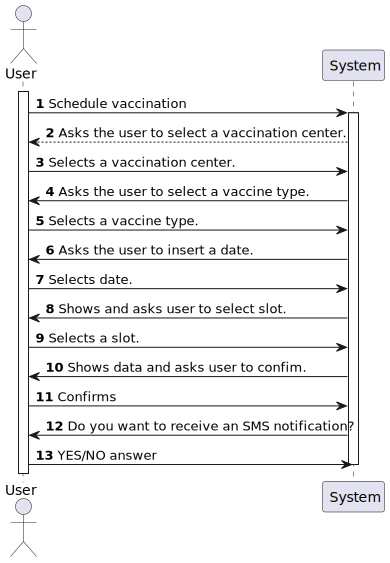
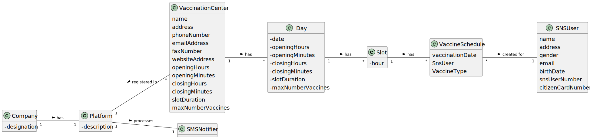
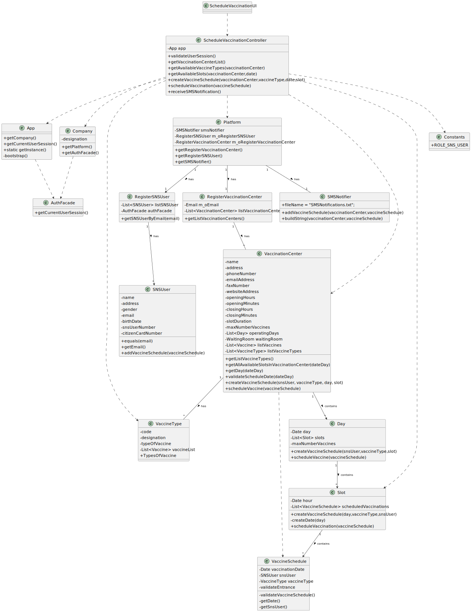

# US 01 - Schedule a Vaccine

## 1. Requirements Engineering

### 1.1. User Story Description

As a SNS user, I intend to use the application to schedule a vaccine.

### 1.2. Customer Specifications and Clarifications 

**From the specifications document:**

>	To take a vaccine, the SNS user should use the application to schedule his/her vaccination.

>	The user should introduce his/her SNS user number, select the vaccination center, the date, and the time (s)he wants to be vaccinated as well as the type of vaccine to be administered (by default, the system suggests the one related to the ongoing outbreak).

>	The application should check the vaccination center capacity for that day/time and, if possible, confirm that the vaccination is scheduled and inform the user that (s)he should be at the selected vaccination center at the scheduled day and time.

>	The SNS user may also authorize the DGS to send a SMS message with information about the scheduled appointment.

>	If the user authorizes the sending of the SMS, the application should send an SMS message when the vaccination event is scheduled and registered in the system.

**From the client clarifications:**

> **Question:** The project description says "To take a vaccine, the SNS user should use the application to schedule his/her vaccination. The user should introduce his/her SNS user number, select the vaccination center, the date, and the time(s)he wants to be vaccinated as well as the type of vaccine to be administered [...]".
Does the user have to enter the date and time they want or does the system have to show the available dates and times for the user to select?
>  
> **Answer:** In this sprint the actor should introduce (using the keyboard) the date and time (s)he wants to be vaccinated.

-

> **Question:** Regarding the US01 - Should the app ask for the location where the SNS User would like to take his vaccine or should it rather suggest a vaccination center for the SNS User to go, based on the timetable chosen by the SNS User?
>  
> **Answer:** 

### 1.3. Acceptance Criteria

* **AC1:** All required fiels must be filled in.
* **AC2:** Task reference must have at least 5 alphanumeric chars.
* **AC3:** When creating a task with an already existing reference, the system must reject such operation and the user must have the change to modify the typed reference.

### 1.4. Found out Dependencies

* There is a dependency to "US03 -RegisterSNSUser" , since the SNS user must already be registered to be able to schedule a vaccine.

### 1.5 Input and Output Data

**Input Data:**

* Typed data:
	* SNS user number,
	* the date and time for the vaccine, 
	* type of vaccine to be administered
	
* Selected data:
    * Vaccination Center 
    * Slot

**Output Data:**

* List of Typed and Selected data

### 1.6. System Sequence Diagram (SSD)

**Alternative 1**

**Other alternatives might exist.**

### 1.7 Other Relevant Remarks

n/a

## 2. OO Analysis

### 2.1. Relevant Domain Model Excerpt 

### 2.2. Other Remarks

n/a

## 3. Design - User Story Realization 

### 3.1. Rationale

**SSD - Alternative 1 is adopted.**

| Interaction ID | Question: Which class is responsible for...                        | Answer                        | Justification (with patterns)                                                                                 |
|:---------------|:-------------------------------------------------------------------|:------------------------------|:--------------------------------------------------------------------------------------------------------------|
| Step 1  		     | 	... interacting with the actor?                                   | ScheduleVaccinationUI         | Pure Fabrication: there is no reason to assign this responsibility to any existing class in the Domain Model. |
| 			  		        | 	... coordinating the US?                                          | ScheduleVaccinationController | Controller                                                                                                    |
| 			  		        | 	... knowing the app instance?                                     | App                           | Creator(Rule 3): App closely uses Singleton.                                                                  |
| 			  		        | ... knowing the user using the system?                             | App                           | To check User information                                                                                     |
| 			  		        | ... knowing if the user using the system is with the correct role? | UserSession                   | IE: cf. A&A component documentation.                                                                          |
| 			  		        | 	... knowing which Vaccination Centers are registered?             | Platform                      | IE: has registed all Vaccination Centers                                                                      |
| 			  		        | 	... getting the list of Vaccination Centers?						                | RegisterVaccinationCenter     | IE: has all Vaccination Centers stored inside                                                                 |
| Step 2  		     | 	 						                                                           |                               |                                                                                                               |
| Step 3  		     | 	...knowing the Available Vaccine Types?                           | VaccinationCenter             | Each center can have different Vaccine Types                                                                  |
| Step 4  		     | 	                                                                  |                               |                                                                                                               |
| Step 5  		     | 	                                                                  |                               |                                                                                                               |
| Step 6  		     | 							                                                            |                               |                                                                                                               |              
| Step 7  		     | 	... knowing the Available Slots?                                  | VaccinationCenter             | Each center has their own Slots                                                                               | 
| Step 8			  		  | 	                                                                  |                               |                                                                                                               |
| Step 9			  		  | 	... knowing the user identification?                              | UserSession                   | IE: cf. A&A component documentation.                                                                          | 
| 			  		        | 	... knowing the user registration?                                | Platform                      | IE: Platform is responsible for all the registers                                                             | 
| 			  		        | 	... getting the SNSUser email?						                              | RegisterSNSUser               | Because the class has all users                                                                               |
| 			  		        | 	... creating the Vaccine Schedule?						                          | VaccinationCenter             | Because each Vaccine schedule is associated with one and only one Vaccination Center                          |
| 			  		        | 							                                                            | VaccineSchedule               | IE:It has the atributes for the creation of the Vaccine Schedule                                              |
| 			  		        | 	... getting the opperating Day?						                             | Day                           | IE:Because the Vaccination Center does not operate everyday                                                   |
| Step 10  		    | 	... schedule a Vaccination?                                       | VaccinationCenter             | IE: is responsible for user interactions.                                                                     |
| 			  		        | 							                                                            | Slot                          | IE: Stores the slots from the Vaccination Centers                                                             |
| 			  		        | 	... adding a VaccineSchedule						                                | SNSUser                       | IE: The user knows its own data                                                                               |
| Step 11			  		 | 	... who is responsible for getting the SMS Notifier?						        | Platform                      | IE: Because its responsible for all registers                                                                 |
| 			  		        | 	... creating the SMS Notification?						                          | SMSNotifier                   | Because it is responsible for sending notifications to the user                                               |

### Systematization ##

According to the taken rationale, the conceptual classes promoted to software classes are: 

 * Platform
 * RegisterVaccinationCenter
 * RegisterSNSUser
 * VaccinationCenter
 * Day
 * Slot
 * VaccineSchedule
 * SNSUser
 * SMSNotifier

Other software classes (i.e. Pure Fabrication) identified: 

 * ScheduleVaccinationUI 
 * ScheduleVaccinationController

## 3.2. Sequence Diagram (SD)

**Alternative 1**

## 3.3. Class Diagram (CD)

**From alternative 1**
 

# 4. Tests 

**Test 1:** Checks List of Vaccination Centers

	    @Test
    void getVaccinationCenterList() {
        ScheduleVaccinationController svc = new ScheduleVaccinationController();
        VaccinationCenter vs = new CommunityMassVaccinationCenter("s joao", "porto","916597487","1181478@isep.ipp.pt","2525","www.sns.pt",10,0,20,0,10,10);

        assertTrue(svc.getVaccinationCenterList().toString().contains(vs.toString()));
    }
	

**Test 2:** Checks the Avalable Vaccine Types

	@Test
    void getAvailableVaccineTypes() {
        ScheduleVaccinationController svc = new ScheduleVaccinationController();
        //System.out.println(""+svc.getAvailableVaccineTypes(svc.getVaccinationCenterList().get(0)));

        VaccineType vt = new VaccineType("6655","flu-A","mRna");

            assertTrue(svc.getAvailableVaccineTypes(svc.getVaccinationCenterList().get(0)).toString().contains(vt.toString()));

*It is also recommended to organize this content by subsections.* 

# 5. Construction (Implementation)

## Class ScheduleVaccinationUI

		private ScheduleVaccinationController controller;

    @Override
    public void run() {
        controller = new ScheduleVaccinationController();

        if(!controller.validateUserSession()) {
            System.out.println("Invalid credentials.");
            return;
        }

        Object vaccinationCenter = Utils.showAndSelectOne(controller.getVaccinationCenterList(),"Select a vaccination center.");

        Object vaccineType = Utils.showAndSelectOne(controller.getAvailableVaccineTypes(vaccinationCenter),"Select a vaccine type.");

        Object date = Utils.readDateFromConsole("Insert vaccination date");

        if(controller.getAvailableSlots(vaccinationCenter,date) == null) {
            System.out.println("Invalid date or no slot available. Make sure the date inserted is in the correct format and is after the current system date.");
            return;
        }

        Object slot = Utils.showAndSelectOne(controller.getAvailableSlots(vaccinationCenter,date), "Select a vaccination slot.");

        Object vaccineSchedule = controller.createVaccineSchedule(vaccinationCenter,vaccineType,date,slot);

        if(vaccineSchedule == null) {
            System.out.println("Error creating vaccination slot. The user already has a vaccine of this type scheduled.");
            return;
        }

        System.out.println(vaccineSchedule);
        boolean confirm = Utils.confirm("Do you wish to schedule this vaccine? (S/N)");

        if(confirm){
            if(controller.scheduleVaccine(vaccinationCenter,vaccineSchedule)){
                System.out.println("Vaccine schedule created");
            }else{
                System.out.println("Error saving vaccine schedule.");
                return;
            }
        }

        boolean sms = Utils.confirm("Do you wish to receive a SMS notification? (S/N)");

        if(sms){
            boolean success = controller.receiveSMSNotification(vaccinationCenter,vaccineSchedule);
            if(success){
                System.out.println("SMS notification saved.");
                return;
            }

            System.out.println("Error creating sms notification.");
        }
    }

## Class ScheduleVaccinationController

	private App app;

    public ScheduleVaccinationController(){
        this.app = App.getInstance();
    }

    public boolean validateUserSession(){
        UserSession session = this.app.getCurrentUserSession();
        return session.isLoggedInWithRole(Constants.ROLE_SNS_USER);
    }

    public List<VaccinationCenter> getVaccinationCenterList(){
        return this.app.getCompany().getPlatform().getRegisterVaccinationCenter().getListVaccinationCenters();
    }

    public List<VaccineType> getAvailableVaccineTypes(Object vaccinationCenter){
        VaccinationCenter vc = (VaccinationCenter)  vaccinationCenter;
        return vc.getListVaccineTypes();
    }

    public List<Slot> getAvailableSlots(Object vaccinationCenter, Object day){
        VaccinationCenter vc = (VaccinationCenter)  vaccinationCenter;
        Date d = (Date) day;
        return vc.getAllAvailableSlotsInVaccinationCenter(d);
    }

    public VaccineSchedule createVaccineSchedule(Object vaccinationCenter, Object vaccineType, Object date, Object slot){
        VaccinationCenter vc = (VaccinationCenter)  vaccinationCenter;
        UserSession session = this.app.getCurrentUserSession();
        SNSUser user = this.app.getCompany().getPlatform().getRegisterSNSUser().getSNSUserByEmail(session.getUserId().getEmail());
        return vc.createVaccineSchedule(user,(VaccineType) vaccineType,(Date) date,(Slot) slot);
    }

    public boolean scheduleVaccine(Object vaccinationCenter, Object vaccineSchedule){
        VaccinationCenter vc = (VaccinationCenter)  vaccinationCenter;
        VaccineSchedule vs = (VaccineSchedule) vaccineSchedule;
        return vc.scheduleVaccine(vs);
    }

    public boolean receiveSMSNotification(Object vaccinationCenter, Object vaccineSchedule){
        SMSNotifier sms = this.app.getCompany().getPlatform().getSmsNotifier();
        return sms.addVaccineSchedule((VaccinationCenter) vaccinationCenter, (VaccineSchedule) vaccineSchedule);
    }

## Class SNSUser
	
	private List<VaccineSchedule> scheduledVaccinations;

	///...omitted

	 public boolean addVaccineSchedule(VaccineSchedule vaccineSchedule){
        return scheduledVaccinations.add(vaccineSchedule);
    }

    public List<VaccineSchedule> getScheduledVaccinations() {
        return scheduledVaccinations;
    }

## Class VaccinationCenter
	
	private String name;
    private String address;
    private String phoneNumber;
    private String emailAddress;
    private String faxNumber;
    private String websiteAddress;
    private Integer openingHours;
    private Integer openingMinutes;
    private Integer closingHours;
    private Integer closingMinutes;
    private Integer slotDuration;
    private Integer maxNumberVaccines;
    private List<Day> operatingDays;
    private WaitingRoom waitingRoom;
    private List<Vaccine> listVaccines;
    private List<VaccineType> listVaccineTypes;

	/// ... omitted

	public boolean scheduleVaccine(SNSUser snsUser, VaccineType vaccineType,Date day, int hour, int minutes){
        if(!validateScheduleDate(day))
            return false;

        if(this.getDay(day) == null){
            this.operatingDays.add(new Day(day, openingHours, openingMinutes,  closingHours, closingMinutes,  slotDuration,  maxNumberVaccines ));
            Collections.sort(operatingDays);
        }
        Day schedulingDay = getDay(day);

        return schedulingDay.scheduleVaccine(snsUser,vaccineType,hour,minutes);
    }

    public boolean scheduleVaccine(VaccineSchedule vaccineSchedule){
        Day day = getDay(vaccineSchedule.getDate());
        return day.scheduleVaccine(vaccineSchedule);
    }

    public VaccineSchedule createVaccineSchedule(SNSUser snsUser,VaccineType vaccineType, Date day, Slot s){
        if(!validateScheduleDate(day))
            return null;

        if(this.getDay(day) == null){
            this.operatingDays.add(new Day(day, openingHours, openingMinutes,  closingHours, closingMinutes,  slotDuration,  maxNumberVaccines ));
            Collections.sort(operatingDays);
        }
        Day schedulingDay = getDay(day);

        return schedulingDay.createVaccineSchedule(snsUser,vaccineType,s);
    }

    private boolean validateScheduleDate(Date day){
        Day operatingDay = new Day(day,0,0,0,0,0,0);

        Day currentDay = new Day(new Date(System.currentTimeMillis()),0,0,0,0,0,0);

        if(operatingDay.compareTo(currentDay) < 0 ){
            return false;
        }

        return true;
    }
	
	 public List<Slot> getAllAvailableSlotsInVaccinationCenter(Date dateDay) {
        if(!this.validateScheduleDate(dateDay))
            return null;

        if(this.getDay(dateDay) == null){
            this.operatingDays.add(new Day(dateDay, openingHours, openingMinutes,  closingHours, closingMinutes,  slotDuration,  maxNumberVaccines ));
            Collections.sort(operatingDays);
        }

        return this.getDay(dateDay).getAllAvailableSlots();
    }

## Class VaccineSchedule

	private Date vaccinationDate;

    private SNSUser snsUser;

    private VaccineType vaccineType;

    private boolean validateEntrance;

    public VaccineSchedule(Date vaccinationDate,  VaccineType vaccineType,SNSUser snsUser) {
        validateVaccineSchedule(vaccinationDate,snsUser.getSnsUserNumber());
        this.vaccinationDate = vaccinationDate;
        this.vaccineType = vaccineType;
        this.snsUser = snsUser;
        this.validateEntrance = false;
    }

	/// ... omitted

	public Date getDate() {
        return vaccinationDate;
    }

    public void setDate(Date date) {
        vaccinationDate = date;
    }

    public SNSUser getSnsUser() {
        return snsUser;
    }

    public boolean isValidateEntrance() {
        return validateEntrance;
    }

    public void setValidateEntrance(boolean validateEntrance) {
        this.validateEntrance = validateEntrance;
    }

    @Override
    public boolean equals(Object o){
        if(this == o) return true;

        if (o == null ) {
            return false;
        }

        VaccineSchedule vaccineSchedule = (VaccineSchedule) o;
        if(this.vaccinationDate.compareTo(vaccineSchedule.vaccinationDate) == 0
                && this.snsUser.getSnsUserNumber().compareToIgnoreCase(vaccineSchedule.snsUser.getSnsUserNumber()) == 0 )
        {
            System.out.println("Vaccine schedule with the same date,hour and SnsUserNumber already exists");
            return true;
        }

        return false;

    }

    public VaccineType getVaccineType() {
        return vaccineType;
    }

    @Override
    public String toString() {
        return "VaccineSchedule{" +
                "vaccinationDate=" + vaccinationDate +
                ", SnsUserNumber='" + snsUser.getSnsUserNumber() + '\'' +
                ", validateEntrance=" + validateEntrance +
                '}';
    }

## Class RegisterVaccinationCenter

	private List<VaccinationCenter> listVaccinationCenters = new ArrayList<>();
	/// ... omitted
	public List<VaccinationCenter> getListVaccinationCenters(){
        return listVaccinationCenters;
    }

## Class Day

	private Date day;

    private List<Slot> slots;

    private int maxNumberVaccines;

	///... omitted

	    public boolean scheduleVaccine(SNSUser snsUser,VaccineType vaccineType,int hour, int minutes) {
        Calendar cal = Calendar.getInstance();
        cal.setTime(this.day);
        cal.set(Calendar.HOUR_OF_DAY, hour);
        cal.set(Calendar.MINUTE, minutes);

        Slot slot = getSlot(hour,minutes);

        if(slot == null)
            return false;

        if(slot.getCurrentNumberOfVaccinations() < this.maxNumberVaccines) {
            return slot.scheduledVaccination(this.day,vaccineType,snsUser);
        }

        return false;
    }

    private Slot getSlot(int hour, int minutes){
        Calendar cal = Calendar.getInstance();
        cal.setTime(this.day);
        cal.set(Calendar.HOUR_OF_DAY, hour);
        cal.set(Calendar.MINUTE, minutes);
        Date date = cal.getTime();

        Slot s = new Slot(date);

        int n = Collections.binarySearch(allSlots(),s);

        if(n < 0)
            return null;

        return this.slots.get(n);

    }

    public List<VaccineSchedule> getAllVaccineSchedules(){
        List<VaccineSchedule> list = new ArrayList<>();
        for (Slot s : slots){
            list.addAll(s.getScheduledVaccinations());
        }
        return list;
    }

    @Override
    public boolean equals(Object o) {
        if (this == o) return true;
        if (o == null || getClass() != o.getClass()) return false;
        Day comparingDay = (Day) o;
        Calendar day1 = Calendar.getInstance();
        day1.setTime(this.day);
        Calendar day2 = Calendar.getInstance();
        day2.setTime(comparingDay.day);

        if(day1.get(Calendar.YEAR) != day2.get(Calendar.YEAR))
            return false;

        if(day1.get(Calendar.MONTH) != day2.get(Calendar.MONTH))
            return false;

        return day1.get(Calendar.DAY_OF_MONTH) == day2.get(Calendar.DAY_OF_MONTH);

    }

    @Override
    public int hashCode() {
        Calendar day = Calendar.getInstance();
        day.setTime(this.day);
        return Objects.hash(day.get(Calendar.YEAR),day.get(Calendar.MONTH),day.get(Calendar.DAY_OF_MONTH));
    }

    public List<Slot> getAllAvailableSlots() {
        List<Slot> list = new ArrayList<>();
        for ( Slot s : allSlots()){
            if(s.getCurrentNumberOfVaccinations() < this.maxNumberVaccines)
                list.add(s);
        }
        return list;
    }

    public VaccineSchedule createVaccineSchedule(SNSUser snsUser,VaccineType vaccineType, Slot slot) {
        int pos = Collections.binarySearch(this.slots,slot);

        if(pos < 0)
            return null;

        Slot schedulingSlot = slots.get(pos);

        if(schedulingSlot == null)
            return null;

        return schedulingSlot.createVaccineSchedule(this.day,vaccineType,snsUser);
    }

    public boolean scheduleVaccine(VaccineSchedule vaccineSchedule) {
        Slot slot = this.getSlot(vaccineSchedule.getDate());
        return slot.scheduleVaccination(vaccineSchedule);
    }

    public Slot getSlot(Date hour){
        int pos = Collections.binarySearch(slots,new Slot(hour));

        if(pos<0)
            return null;

        return slots.get(pos);
    }

## Class Slot

	private Date hour;

    private List<VaccineSchedule> scheduledVaccinations;

    public Slot(Date hour){
        this.hour = hour;
        this.scheduledVaccinations = new ArrayList<>();
    }

    public int getCurrentNumberOfVaccinations(){
        return scheduledVaccinations.size();
    }

    public List<VaccineSchedule> getScheduledVaccinations(){
        return this.scheduledVaccinations;
    }

    @Override
    public int compareTo(Slot o) {
        Calendar hour1 = Calendar.getInstance();
        hour1.setTime(this.hour);
        Calendar hour2 = Calendar.getInstance();
        hour2.setTime(o.hour);
        int diff = Integer.compare(hour1.get(Calendar.HOUR_OF_DAY),hour2.get(Calendar.HOUR_OF_DAY));

        if(diff != 0)
            return diff;

        return Integer.compare(hour1.get(Calendar.MINUTE),hour2.get(Calendar.MINUTE));
    }

    @Override
    public String toString() {
        return "Slot{" +
                "hour=" + hour +
                "Scheduled vaccines:" + this.getCurrentNumberOfVaccinations() +
                '}';
    }

    public boolean scheduledVaccination(Date day, VaccineType vaccineType, SNSUser snsUser) {
        VaccineSchedule vaccineSchedule = createVaccineSchedule(day,vaccineType,snsUser);
        snsUser.addVaccineSchedule(vaccineSchedule);
        return scheduledVaccinations.add(vaccineSchedule);
    }

    public VaccineSchedule createVaccineSchedule(Date day,VaccineType vaccineType, SNSUser snsUser) {
        for (VaccineSchedule vs : snsUser.getScheduledVaccinations()){
            if(vs.getVaccineType().equals(vaccineType) && !vs.isValidateEntrance()){ //if there is a vaccine of this type already scheduled
                return null;
            }
        }
        return new VaccineSchedule(createDate(day),vaccineType,snsUser);
    }

    private Date createDate(Date date){
        Calendar dateTime = Calendar.getInstance();
        Calendar hour = Calendar.getInstance();
        hour.setTime(this.hour);
        Calendar scheduleDay = Calendar.getInstance();
        scheduleDay.setTime(date);
        dateTime.set(Calendar.YEAR, scheduleDay.get(Calendar.YEAR));
        dateTime.set(Calendar.MONTH, scheduleDay.get(Calendar.MONTH));
        dateTime.set(Calendar.DAY_OF_MONTH, scheduleDay.get(Calendar.DAY_OF_MONTH));
        dateTime.set(Calendar.HOUR_OF_DAY, hour.get(Calendar.HOUR_OF_DAY));
        dateTime.set(Calendar.MINUTE, hour.get(Calendar.MINUTE));
        dateTime.set(Calendar.SECOND,0);
        dateTime.set(Calendar.MILLISECOND,0);
        return dateTime.getTime();
    }

    public boolean scheduleVaccination(VaccineSchedule vaccineSchedule) {
        vaccineSchedule.getSnsUser().addVaccineSchedule(vaccineSchedule);
        return this.scheduledVaccinations.add(vaccineSchedule);
    }

## Class SMSNotifier

	private List<String> list;

    public static final String fileName = "SMSNotifications.txt";

    public SMSNotifier (){
        this.list = new ArrayList<>();
    }

    public boolean addVaccineSchedule(VaccinationCenter vaccinationCenter, VaccineSchedule vaccineSchedule){
        return this.list.add(buildString(vaccinationCenter,vaccineSchedule));
    }

    private String buildString(VaccinationCenter vc, VaccineSchedule vs){
        return "TO:" + vs.getSnsUser().getPhoneNumber() + " Message: The user " + vs.getSnsUser().getName() + " has a vaccination scheduled for " + vs.getDate() + " at the vaccination center " + vc.getName() +" for a vaccine of the type " + vs.getVaccineType().getDesignation() + ".";
    }
    public boolean exportNotifications(){
        try (PrintStream out = new PrintStream(new FileOutputStream(fileName))) {
            for (String s : list){
                out.println(s);
            }
            return true;
        } catch (FileNotFoundException e) {
            return false;
        }
    }

# 6. Integration and Demo 

* A new option on the SNS User menu options was added.

* Some demo purposes some tasks are bootstrapped while system starts.

# 7. Observations

n/a

