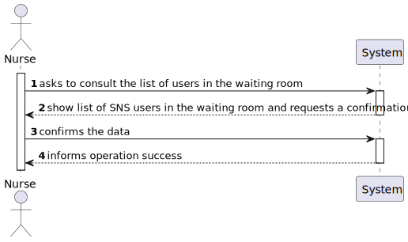
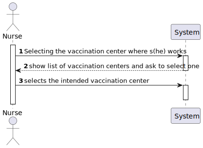

# US 05 - To consult the users in the waiting room

## 1. Requirements Engineering

### 1.1. User Story Description

As a nurse, I intend to consult the users in the waiting room of a vacination center.
### 1.2. Customer Specifications and Clarifications 

**From the specifications document:**

> A nurse responsible for administering the vaccine will use the application to check the list of SNS users that are present in the vaccination center to take the vaccine and will call one SNS user to administer him/her the vaccine.

>The nurse checks the user info and health conditions in the system and in accordance with the scheduled vaccine type, and the SNS user vaccination history, (s)he gets system instructions regarding the vaccine to be administered (e.g.: vaccine and respective dosage considering the SNS user age group).

**From the client clarifications:**

> **Question:** Regarding the US05. In the PI description it is said that, by now, the nurses and the receptionists will work at any center. Will this information remain the same on this Sprint, or will they work at a specific center?
> 
> **Answer:** Nurses and receptionists can work in any vaccination center.

> **Question:** Regarding US 05, what does consulting constitute in this context? Does it refer only to seeing who is present and deciding who gets the vaccine or is checking the user info to administer the vaccine, registering the process, and sending it to the recovery room also part of this US?
> 
> **Answer:** The goal is to check the list of users that are waiting and ready to take the vaccine.

> **Question:** We need to know if the nurse have to chose the vaccination center before executing the list or if that information comes from employee file?
> 
> **Answer:** When the nurse starts to use the application, firstly, the nurse should select the vaccination center where she his working. The nurse wants to check the list of SNS users that are waiting in the vaccination center where she his working.

> **Question:** We need to know what is the name of the attribute that defines that the user has arrived. In the last sprint we have created the “Status” attribute, can we continue using it?
> 
> **Answer:** This is not a question for the client.

> **Question:** I would like to know which are the attributes of the waiting room.
> 
> **Answer:** The waiting room will not be registered or defined in the system. The waiting room of each vaccination center has the capacity to receive all users who take the vaccine on given slot.

> **Question:** What information about the Users (name, SNS number, etc) should the system display when listing them?
> 
> **Answer:** Name, Sex, Birth Date, SNS User Number and Phone Number.

> **Question:** Regarding US05, the listing is supposed to be for the day itself or for a specific day.
> 
> **Answer:** The list should show the users in the waiting room of a vaccination center.
### 1.3. Acceptance Criteria

* N/A

### 1.4. Found out Dependencies

* There is a dependency to "US04 Register SNSUser Arrival" because there is a need to have SNSUser's in the vaccination center/waiting room to get the requested list.

### 1.5 Input and Output Data

**Input Data:**

* Typed data:
    * N/A

* Selected data:
    * Choosing Vaccination Center
      
**Output Data:**

* List of vaccination centers
* List of SNSUsers in the waiting room
* (In)Success of the operation

### 1.6. System Sequence Diagram (SSD)

**Principal SSD**

**SSD to select vaccination center**

### 1.7 Other Relevant Remarks

* For this task to come through, the nurse has to be already logged in into his account.

## 2. OO Analysis

### 2.1. Relevant Domain Model Excerpt 

### 2.2. Other Remarks

* N/A

## 3. Design - User Story Realization 

### 3.1. Rationale

**The rationale grounds on the SSD interactions and the identified input/output data.**

| Interaction ID | Question: Which class is responsible for... | Answer  | Justification (with patterns)  |
|:-------------  |:--------------------- |:------------|:---------------------------- |
| Step 1  		 | ...interacting with the actor? | SelectVaccinationCenterUI | Pure Fabrication: there is no reason to assign this responsibility to any existing class in the Domain Model. |
|     | ...coordinating the VaccinationCenter's selection? | SelectVaccinationCenterController | Controller |
|     | ...knowing the app instance? | App | Creator(rule 3): App closely uses Singleton |
|     | ...knowing the company? | App | Creator(Rule 4): App has the data used to initialize Company |
|     | ...knowing the platform? | Company | Creator(Rule 4): Company has the data used to initialize Platform |
|     | ...getting the register(list) of vaccination centers | Platform | IE: Platform is responsible for all the registers. |
|     | ...knowing the list of vaccination centers? | RegisterVaccinationCenter | IE: owns the list of registered VaccinationCenters. |
| Step 2  		 |							 |             |                              |
| Step 3  		 | ...getting the register(list) of employees? | Platform | IE:  in the DM Platform is responsible for all the registers. |
|     | ...knowing the user using the system? | UserSession | IE: cf. A&A component documentation. | 
|     | ...knowing employee by the email | RegisterEmployee | HC + LC: knows/has its own Employees. |
|     | ...setting the working vaccination center? | Employee | IE: owns the information of the working VaccinationCenter. |
| Step 4  		 | ...interacting with the actor? | WaitingRoomUI | Pure Fabrication: there is no reason to assign this responsibility to any existing class in the Domain Model. |
|     | ...coordinating the us? | WaitingRoomController | Controller |
|     | ...knowing the app instance? | App | Creator(rule 3): App closely uses Singleton |
|     | ...knowing the company? | App | Creator(Rule 4): App has the data used to initialize Company |
|     | ...knowing the platform? | Company | Creator(Rule 4): Company has the data used to initialize Platform |
|     | ...knowing the user using the system? | UserSession | IE: cf. A&A component documentation. |
|     | ...knowing  the user role? | UserSession | IE: cf. A&A component documentation. |
|     | ...knowing register of employees? | Platform | IE:  in the DM Platform is responsible for all the registers |
|     | ...knowing the email of the user | UserSession | IE: cf. A&A component documentation. | 
|     | ...knowing the working vaccination center? | Employee | IE: knows its own working VaccinationCenter.
|     | ...knowing the list of user in the waiting room? | VaccinationCenter | IE: knows its own list of waiting users. |
| Step 5  		 | ...showing the list of users in the waiting room? | WaitingRoomUI | IE: is responsible for user interactions. |
| Step 6  		 | ...confirms data? | WaitingRoomUI | IE: is responsible for user interactions. |              
| Step 7  		 | ...informing operation success? | WaitingRoomUI | IE: is responsible for user interactions. |

### Systematization ##

According to the taken rationale, the conceptual classes promoted to software classes are: 

 * RegisterVaccinationCenter
 * VaccinationCenter
 * waitingRoom
 * SNSUser
 * Platform
 * SelectVaccinationCenter
 * RegisterEmployee

Other software classes (i.e. Pure Fabrication) identified: 

 * WaitingRoomUI  
 * WaitingRoomController
 * SelectVaccinationCenterUI
 * SelectVaccinationCenterController
 * NurseUI

## 3.2. Sequence Diagram (SD)

**Principal SD**

**SD to select vaccination center**

**SD to create register of employees**

## 3.3. Class Diagram (CD)

**Principal CD**

**CD to select vaccination center**

# 4. Tests 
*In this section, it is suggested to systematize how the tests were designed to allow a correct measurement of requirements fulfilling.* 

**_DO NOT COPY ALL DEVELOPED TESTS HERE_**

**Test 1:** Check that it is not possible to create an instance of the Example class with null values. 

	@Test(expected = IllegalArgumentException.class)
		public void ensureNullIsNotAllowed() {
		Exemplo instance = new Exemplo(null, null);
	}

*It is also recommended to organize this content by subsections.* 

##WaitingRoomControllerTest
##WaitingRoom

# 5. Construction (Implementation)

##Class WaitignRoomUI

    private WaitingRoomController m_controller;
    
    public WaitingRoomUI(){this.m_controller = new WaitingRoomController();}

    public void run() {
        System.out.println("\n List SNSUser waiting room");

        if(!m_controller.checkLogin()) {
            System.out.println("Unauthorized user");
            return;
        }

        if (m_controller.getWorkingVaccinationCenter() == null) {
            System.out.println("BACK TO NURSE MENU");
        } else {
            showData();

            if (Utils.confirm("Confirms the data? (S/N)"))
            {
                System.out.println("Registration successful");
            }
            else
                run();
        }

    }

    private void showData() {
        Utils.showList(m_controller.getListUsersInWaitingRoom(m_controller.getWorkingVaccinationCenter()), "Waiting room SNS User order");
    }

##Class WaitingRoomController

    private App m_oApp;
    
    private Platform m_oPlatform;

    public WaitingRoomController(){
        this.m_oApp = App.getInstance();
        this.m_oPlatform = m_oApp.getCompany().getPlatform();

    }

    public boolean checkLogin(){
        return m_oApp.getCurrentUserSession().isLoggedInWithRole(Constants.ROLE_NURSE);
    }

    public VaccinationCenter getWorkingVaccinationCenter () {
        try {
            return m_oPlatform.getRegisterEmployee().getWorkingVaccinationCenter(m_oApp.getCurrentUserSession().getUserId().getEmail());
        } catch (NullPointerException ex) {
            System.out.println("null vaccination center");
            return null;
        }

    }

    public List<SNSUser> getListUsersInWaitingRoom(VaccinationCenter vaccinationCenter){
        return vaccinationCenter.getWaitingRoomSNSUsers();
    }

##Class WaitingRoom

    TreeMap<Date,SNSUser> map = new TreeMap<Date,SNSUser>();

    public WaitingRoom() {
    }
    
    boolean registerArrival(SNSUser user, Date arrival) {return (map.put(arrival,user) == null);}

    List<SNSUser> getUsersByArrivalDate() {return new ArrayList<>(map.values());}

# 6. Integration and Demo 

* A new option on the Nurse menu options was added.

# 7. Observations

*

