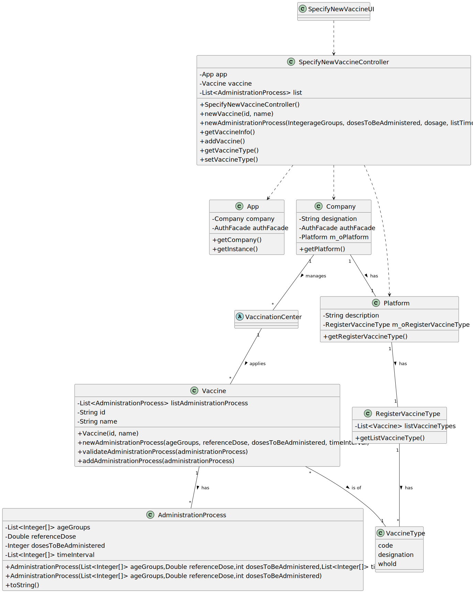

# US 13 - To specify a new vaccine 

## 1. Requirements Engineering

### 1.1. User Story Description

As an administrator, I intend to specify a new vaccine and its administration process.

### 1.2. Customer Specifications and Clarifications 

**From the specifications document:**

>   Yet, it is worth noticing that for each type of vaccine, several vaccines might exist, each one demanding a distinct administration process.

>	An Administrator is responsible for properly configuring and managing the core information (e.g.:type of vaccines, vaccines, vaccination centers, employees)

**From the client clarifications:**

> **Question:** When specifying a Vaccine and its Administration Process, are there any rules for the following attributes?
-Name -Id -Brand -Number of doses -Dosage
>  
> **Answer:** During Sprint B I will not introduce attribute rules/formats other than the ones that I already introduced (in this forum or in the project description).
> Please study the concepts and define appropriate formats for the attributes.

> **Question:** We would like to know if when specifying a new Vaccine and its Administration Process, should a list of the existing types of vaccines be displayed in order for him to choose one, or should he just input it?
>
> **Answer:** If the information is available in the system, it is a good practice to present the information to the user and ask the user to select;

> **Question:** As to the interval between doses, what time format are we to use? (e.g. days, weeks, months)
>
> **Answer:** Number of days.

### 1.3. Acceptance Criteria

* **AC1:** All required fields must be filled in.
* **AC2:** Every vaccine must have at least one administration process.
* **AC3:** When specifying a new vaccine, it cannot have the same attributes as any existing vaccine.

### 1.4. Found out Dependencies

* There is a dependency to "US12 Specify a new vaccine type" since at least a vaccine type must exist to classify the vaccine being created.

### 1.5 Input and Output Data

**Input Data:**

* Typed data:
    * an id, 
    * a name, 
    * a lowerAgeLimit
    * an upperAgeLimit
    * dosesToBeAdministered
    * a dosage
    * doseTimeInterval
    
* Selected data:
	* a vacineType

**Output Data:**

* List of vaccine types
* Vaccine information
* (In)Success of the operation

### 1.6. System Sequence Diagram (SSD)

### 1.7 Other Relevant Remarks

* 

## 2. OO Analysis

### 2.1. Relevant Domain Model Excerpt 

### 2.2. Other Remarks

n/a

## 3. Design - User Story Realization 

### 3.1. Rationale

**SSD - Alternative 1 is adopted.**

| Interaction ID | Question: Which class is responsible for... | Answer  | Justification (with patterns)  |
|:-------------  |:--------------------- |:------------|:---------------------------- |
| Step 1  		 |	...interacting with the actor? | SpecifyNewVaccineUI   |  Pure Fabrication: there is no reason to assign this responsibility to any existing class in the Domain Model. |
| 			     |	...coordinating the US? | SpecifyNewVaccineController | Controller |
| Step 2 		 |							 |             |                              |
| Step 3         |  ...getting the vaccine type list? | RegisterVaccineType |IE: knows its own data (e.g. vaccineType). |
| Step 4  		 |							 |             |                              |
| Step 5  		 |	...instantiating a new vaccine? | VaccineType  | Creator (Rule 1): VaccineType contains class Vaccine objects. |
|                |  ...knowing the user using the system? | UserSession | IE: cf. A&A component documentation. |
|                |  ...knowing to which company the user belongs to? | App | IE: has registed all companys. |
| 			  	 | 					| Platform | IE: knows/has its own Vaccine.|
| 			     |                  | Vaccine | IE: knows its own data (e.g. name).|
| Step 6		 |							 |             |                              |
| Step 7  		 |	...instantiating the amdministration process? | Vaccine  | Creator (Rule 1): Vaccine contains class AdministrationProcess objects. |
| 			  	 | 					| Vaccine | IE: knows/has its own Administration Process.|
| 			     |                  | AdministrationProcess | IE: knows its own data (e.g. dosage).|
| Step 8  		 |							 |             |                              |              
| Step 9  		 | 	...saving the inputted data? | VaccineType | HC + LC: object created in step 1 has its own data. |
|	             |  ... validating all data (local validation)? | Vaccine | IE: owns its data.| 
| 			  	 |	... validating all data (global validation)? | VaccineType | HC + LC: knows all its vaccine.| 
| 			  	 |	... saving the created vaccine? | VaccineType | HC + LC: owns all its vaccines.| 
| Step 10  		 |	... informing operation success?| SpecifyNewVaccineUI  | IE: is responsible for user interactions.  | 

### Systematization ##

According to the taken rationale, the conceptual classes promoted to software classes are: 

 * VaccineType
 * Platform
 * Vaccine
 * AdministrationProcess
 * RegisterVaccineType

Other software classes (i.e. Pure Fabrication) identified: 

 * SpecifyNewVaccineUI  
 * SpecifyNewVaccineController

## 3.2. Sequence Diagram (SD)

## 3.3. Class Diagram (CD)

# 4. Tests 

# 5. Construction (Implementation)

## Class SpecifyNewVaccineUI 

    private SpecifyNewVaccineController controller;

    public SpecifyNewVaccineUI(){ this.controller = new SpecifyNewVaccineController();}

    public void run(){

        System.out.println("\n Specify new Vaccine");

        Object type = Utils.showAndSelectOne(controller.getVaccineType(), "Choose a vaccine type:");

        controller.setVaccineType(type);

        String id = Utils.readLineFromConsole("Id:");
        String name = Utils.readLineFromConsole("Name:");

        if(!controller.newVaccine(id,name)){
            System.out.println("Invalid data.");
            return;
        }

        boolean finishedAdministrationProcesses = false;

        while(!finishedAdministrationProcesses) {
            System.out.println("Specify the vaccine's administration processes");
            boolean done = false;
            List<Integer[]> ageGroups = new ArrayList<>();
            while (!done) {
                int lowerAgeLimit = Utils.readIntegerFromConsole("Insert lower age limit:");
                int upperAgeLimit = Utils.readIntegerFromConsole("Insert upper age limit:");
                if (lowerAgeLimit > upperAgeLimit) {
                    System.out.println("The lower age limit can't be bigger then the upper limit");
                } else {
                    Integer[] arr = new Integer[2];
                    arr[0] = lowerAgeLimit;
                    arr[1] = upperAgeLimit;
                    ageGroups.add(arr);
                    done = !Utils.confirm("Do you want to specify more age groups for this administration process? (S - yes, N - no)");
                }
            }

            int dosesToBeAdministered = Utils.readIntegerFromConsole("Insert number of doses to be administered:");

            double dosage = Utils.readDoubleFromConsole("Insert the dosage: (in ml)");

            boolean differentTimeIntervals = false;

            if (dosesToBeAdministered > 2) {
                differentTimeIntervals = Utils.confirm("Are there any differences in time interval in between doses? (S-yes,N-no)" +
                        "\n (Eg. 1st to 2nd dose 15 days, 2nd to 3rd dose 20 days) ");
            }

            List<Integer[]> listTimeInterval = new ArrayList<>();
            if (differentTimeIntervals) { //if there are any special time intervals in between doses
                for (int i = 1; i < dosesToBeAdministered; i++) {
                    int doseTimeInterval = Utils.readIntegerFromConsole("After dose nº:" + i + ", what is the time period before dose nº:" + (i+1) + ".");
                    Integer[] arr = new Integer[2];
                    arr[0] = (i+1);
                    arr[1] = doseTimeInterval;
                    listTimeInterval.add(arr);
                }
            } else if (!differentTimeIntervals && dosesToBeAdministered == 2) { //if all time intervals are the same or there is only 2 doses to be administered
                int timeInterval = Utils.readIntegerFromConsole("Insert the time interval in between doses: (in days)");
                for (int i = 0; i < dosesToBeAdministered; i++) {
                    Integer[] arr = new Integer[2];
                    arr[0] = i + 1;
                    arr[1] = timeInterval;
                    listTimeInterval.add(arr);
                }
            } //if there is only 1 dose no time interval is requested

            if(!controller.newAdministrationProcess(ageGroups, dosesToBeAdministered, dosage, listTimeInterval)){
                System.out.println("Invalid data!");
            }

            finishedAdministrationProcesses = !Utils.confirm("Do you wish to specify more administration processes for this vaccine?");
        }

        System.out.println(controller.getVaccineInfo());

        if(Utils.confirm("Confirms the data? (S/N)" )){
            if(controller.addVaccine()){
                System.out.println("Registration successful");
            }else{
                System.out.println("It was not possible to conclude the registration successfully");
            }
        }
    }

## Class SpecifyNewVaccineController
    
    private App app;
    private Vaccine vaccine;
    private List<AdministrationProcess> list;
    private VaccineType vaccineType;

    public SpecifyNewVaccineController() {
        this.app = App.getInstance();
        list = new ArrayList<>();
    }

    public boolean newVaccine(String id, String name) {
        try {
            this.vaccine = VaccineType.newVaccine(id, name);
            return this.vaccineType.validateVaccine(vaccine);
        }
        catch(RuntimeException ex) {
            Logger.getLogger(Utils.class.getName()).log(Level.SEVERE, null, ex);
            this.vaccine = null;
            return false;
        }

    }

    public boolean newAdministrationProcess(List<Integer[]> ageGroups, int dosesToBeAdministered, double dosage, List<Integer[]> listTimeInterval){
        AdministrationProcess administrationProcess = this.vaccine.newAdministrationProcess(ageGroups,dosage,dosesToBeAdministered,listTimeInterval);
        if(vaccine.validateAdministrationProcess(administrationProcess))
            return vaccine.addAdministrationProcess(administrationProcess);

        return false;
    }

    public String getVaccineInfo(){
        return this.vaccine.toString();
    }

    public boolean addVaccine(){
        this.vaccineType.validateVaccine(this.vaccine);
        return this.vaccineType.addVaccine(vaccine);
    }

    public List<VaccineType> getVaccineType(){
        return this.app.getCompany().getPlatform().getRegisterVaccineType().getListVaccineType();
    }

    public boolean setVaccineType(Object type) {
        if(type.getClass() == VaccineType.class){
            this.vaccineType = (VaccineType)  type;
            return true;
        }else{
            return false;
        }
    }

##Class Platform
    private String description;

    ///omitted

    private final RegisterVaccineType m_oRegisterVaccineType;

    public Platform(String description) {
        if((description == null) || (description.isEmpty()))
            throw new IllegalArgumentException("argument can be null or empty");

        this.description = description;

        ///omitted

        this.m_oRegisterVaccineType = new RegisterVaccineType();

    }

    ///omitted

    public RegisterVaccineType getRegisterVaccineType(){return this.m_oRegisterVaccineType;}

    ///omitted

##Class RegisterVaccineType
    private List<VaccineType> listVaccineTypes = new ArrayList<>();

    public List<VaccineType> getListVaccineType()
    {
        return listVaccineTypes;
    }
##Class Vaccine
    private List<AdministrationProcess> listAdministrationProcess;
    private String id;
    private String name;

    public Vaccine(String id, String name) {

        this.id = id;
        this.name = name;
        this.listAdministrationProcess = new ArrayList<>();
    }

    public String getId() { return id; }

    public void setId(String id) { this.id = id; }

    public String getName() { return name; }

    public void setName(String name) { this.name = name; }

    @Override
    public int hashCode() {
        int hash = 7;
        hash = 23 * hash + Objects.hashCode(this.id);
        return hash;
    }

    @Override
    public boolean equals(Object o)
    {
        if (this == o) {
            return true;
        }
        if (o == null || this.getClass() != o.getClass()) {
            return false;
        }

        Vaccine vac = (Vaccine) o;
        return this.id.equalsIgnoreCase(vac.id);
    }

    public void setListAdministrationProcess(List<AdministrationProcess> listAdministrationProcess) {
        this.listAdministrationProcess = listAdministrationProcess;
    }

    @Override
    public String toString() {
        return "Vaccine{" +
                ", id='" + id + '\'' +
                ", name='" + name + '\'' +
                "Administration processes:=" + listAdministrationProcess +
                '}';
    }

    public AdministrationProcess newAdministrationProcess(List<Integer[]> ageGroups, Double referenceDose, int dosesToBeAdministered, List<Integer[]> timeInterval) {
        return new AdministrationProcess(ageGroups, referenceDose, dosesToBeAdministered, timeInterval);
    }

    public boolean validateAdministrationProcess(AdministrationProcess administrationProcess) {
        for(AdministrationProcess adminProc : listAdministrationProcess)
        {
            if(adminProc == administrationProcess){
                return false;
            }
        }
        return true;
    }

    public boolean addAdministrationProcess(AdministrationProcess administrationProcess) {
        return listAdministrationProcess.add(administrationProcess);
    }

##Class AdministrationProcess
    private List<Integer[]> ageGroups;
    private Double referenceDose;
    private Integer dosesToBeAdministered;
    private List<Integer[]> timeInterval;

    public AdministrationProcess(List<Integer[]> ageGroups,Double referenceDose,int dosesToBeAdministered,List<Integer[]> timeInterval){
        this.ageGroups = ageGroups;
        this.referenceDose = referenceDose;
        this.dosesToBeAdministered = dosesToBeAdministered;
        this.timeInterval = timeInterval;
    }

    public AdministrationProcess(List<Integer[]> ageGroups,Double referenceDose,int dosesToBeAdministered){
        this.ageGroups = ageGroups;
        this.referenceDose = referenceDose;
        this.dosesToBeAdministered = dosesToBeAdministered;
    }

    @Override
    public String toString() {
        return "AdministrationProcess{" +
                "ageGroups=" + ageGroups +
                ", referenceDose=" + referenceDose +
                ", dosesToBeAdministered=" + dosesToBeAdministered +
                ", timeInterval=" + timeInterval +
                '}';
    }

# 6. Integration and Demo 

* A new option on the Administrator menu options was added.

# 7. Observations

*

