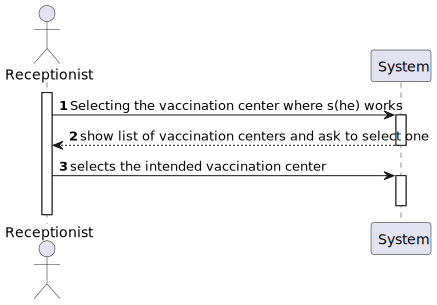
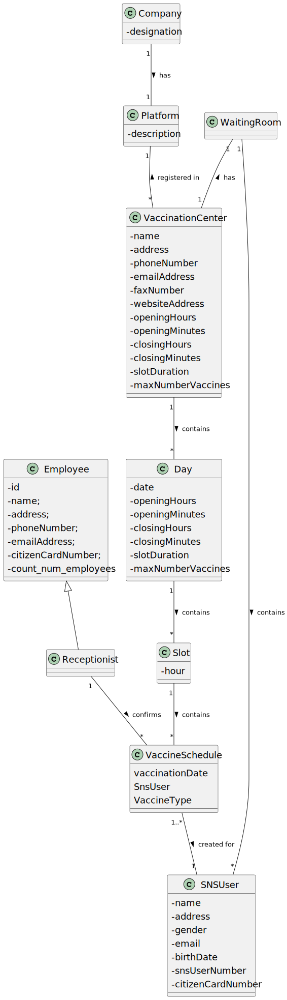

# US 04 - Register SNS User's Arrival

## 1. Requirements Engineering

### 1.1. User Story Description

As a receptionist at a vaccination center, I want to register the arrival of a SNS user to take the vaccine.

### 1.2. Customer Specifications and Clarifications 
 

**From the specifications document:**

> On the scheduled day and time, the SNS user should go to the vaccination center to get the vaccine.
When the SNS user arrives at the vaccination center, a receptionist registers the arrival of the user to
take the respective vaccine. The receptionist asks the SNS user for his/her SNS user number and
confirms that he/she has the vaccine scheduled for the that day and time. If the information is
correct, the receptionist acknowledges the system that the user is ready to take the vaccine.
 

**From the client's specifications:**

> **Question**: "Respectively to US04, after the receptionist registers the SNS User's arrival at the Vaccination Center, the system creates the list that will be available for the Nurse to view, correct? "
>
> **Answer**: The nurse checks the list (of SNS users in the waiting room) in US05.

> **Question**: "Regarding US04, I would like to know what's the capacity of the waiting room."
>
> **Answer**: The waiting room will not be registered or defined in the system. The waiting room of each vaccination center has the capacity to receive all users who take the vaccine on given slot.

> **Question:** "When the SNS user number is introduced by the receptionist and the system has no appointment for that SNS user number, how should the system proceed?"
> 
> **Answer:** The application should present a message saying that the SNS user did not scheduled a vaccination.

> **Question:** "Regarding US04, a receptionist register the arrival of a SNS user immediately when he arrives at the vaccination center or only after the receptionist confirms that the respective user has a vaccine schedule for that day and time."
>
> **Answer:** The receptionist registers the arrival of a SNS user only after confirming that the user has a vaccine scheduled for that day and time.

> **Question:** "Regarding US04, what are the attributes needed in order to register the arrival of a SNS user to a vaccination center". 
>
> **Answer:** The time of arrival should be registered.

>**Question:** "In this user story, the receptionist registers the arrival of an SNS User. Does the receptionist choose the center she works at during login like the nurse?"
> 
>**Answer:** To start using the application, the receptionist should first select the vaccination center where she is working. The receptionists register the arrival of a SNS user at the vaccination center where she is working.

>**Question:** "The nurse must have the possibility to choose which center she wants to register the SNS user's arrival every time she uses this feature, or should we make the nurse pick a center after they log in?"
>
>**Answer:** To start using the application, the nurse should first select the vaccination center where she is working.

>**Question:** "Regarding US04, the attribute "arrival time" should be considered to let the user enter the waiting room. For example, a user that arrives 40 minutes after his appointment wont be allowed to enter the center, and another who only arrives 10 minutes late may proceed. If so, how much compensation time should we provide to the user."
>
>**Answer:** In this sprint we are not going to address the problem of delays. All arriving users are attended and registered by the receptionist.

### 1.3. Acceptance Criteria

* **AC1:** No duplicate entries should be possible for the same SNS user
on the same day or vaccine period.

* **AC2:** The receptionist registers the arrival of a SNS user only if the user scheduled a vaccine beforehand. 

### 1.4. Found out Dependencies

* There is a dependency to class "UserSession", when we check if the current user session is with a user with role "Receptionist".
* There is a dependency to classes "RegisterEmployee","Receptionist", "RegisterSNSUser", "SNSUser", when we create roles for receptionists and SNS user, respectively.
* There is a dependency to class "SelectVaccinationCenterController", when we want to select which vaccination center to register the SNS user's arrival.

### 1.5 Input and Output Data

Input:

**Registering the SNS user arrival**
* SNS user number

**Selecting the vaccination center**
* Option selection

Output:

**Registering the SNS**

* Option Selection
* Confirmation of the operation
* Success of the operation

### 1.6. System Sequence Diagram (SSD)

### 1.7 Other Relevant Remarks

N/A

## 2. OO Analysis

### 2.1. Relevant Domain Model Excerpt 

### 2.2. Other Remarks

N/A

## 3. Design - User Story Realization 

### 3.1. Rationale

**SSD - Alternative 1 is adopted.**

| Interaction ID                    | Question: Which class is responsible for...             | Answer                            | Justification (with patterns)                                                                                 |
|:----------------------------------|:--------------------------------------------------------|:----------------------------------|:--------------------------------------------------------------------------------------------------------------|
| Step 1  	                         | 	... interacting with the actor?	                       | SelectVaccinationCenterUI         | Pure Fabrication: there is no reason to assign this responsibility to any existing class in the Domain Model. |
|                                   | 	... coordinating the VaccinationCenter's selection?	   | SelectVaccinationCenterController | Controller                                                                                                    |
|                                   | ... knowing the app instance?                           | App                               | Creator (rule 3): App closely uses Singleton.                                                                 |
|                                   | ... knowing the company?                                | App                               | Creator (rule 4): App has the data used to initialize Company.                                                |
|                                   | ... knowing the platform?                               | Company                           | Creator (rule 4): Company has the data used to initialize PLatform.                                           |
|                                   | ... getting the register(list) of VaccinationCenters?   | Platform                          | IE: Platform is responsible for all the registers.                                                            |
|                                   | ... knowing the list of VaccinationCenters?             | RegisterVaccinationCenter         | IE: owns the list of registered VaccinationCenters.                                                           |
| Step 2  	                         | 	                                                       |                                   |                                                                                                               |
| Step 3                            | ... getting the register(list) of Employees?            | Platform                          | IE: in the DM Platform is responsible for all the registers.                                                  |
| 	                                 | ...	knowing the user using the system?                  | UserSession                       | IE: cf. A&A component documentation.                                                                          |
| 	                                 | ...	knowing the user role?                              | UserSession                       | IE: cf. A&A component documentation.                                                                          |
|                                   | ... getting the Employee by email                       | RegisterEmployee                  | IE: owns the information of all Employees.                                                                    |
|                                   | ... setting the working VaccinationCenter?              | Employee                          | IE: owns the information of the working VaccinationCenter.                                                    |
| Step 4  	                         | ... interacting with the actor?	                        | RegisterSNSUserArrivalUI          | Pure Fabrication: there is no reason to assign this responsibility to any existing class in the Domain Model. |
|                                   | ... coordinating the US?                                | RegisterSNSUserArrivalController  | Controller                                                                                                    |
| 	                                 | ... knowing the user in the system?                     | UserSession                       | IE: cf.A&A component documentation.                                                                           |
|                                   | ... knowing to which company the user belongs to?       | App                               | IE: has registered the user sessions.                                                                         |
| Step 5 (CreatingRegisterEmployee) | ... knowing the app instance?                           | App                               | Creator (rule 3): App closely uses Singleton.                                                                 |
|                                   | ... knowing the company?                                | App                               | Creator (rule 4): App has the data used to initialize Company.                                                |
|                                   | ... knowing the platform?                               | Company                           | Creator (rule 4): Company has the data used to initialize PLatform.                                           |
|                                   | ... interacting with the Platform?                      | AuthFacade                        | Pure Fabrication: there is no reason to assign this responsibility to any existing class in the Domain Model. |
| Step 6 (CreatingRegisterEmployee) | ... instantiating a new Employee?                       | RegisterEmployee                  | Creator (rule 1): in the DM Platform registers Employees.                                                     |
|                                   | ... saving the employee data?                           | Employee                          | IE: object created in step 8 has its own data.                                                                |
| Step 7                            | ... knowing the working VaccinationCenter?              | Employee                          | HC + LC: knows its own working VaccinationCenter.                                                             |             
|                                   |                                                         |                                   |                                                                                                               |
| Step 8                            | 	                                                       |                                   |                                                                                                               |
| Step 9 (CreatingRegisterSNSUser)  | ... knowing the app instance?                           | App                               | Creator (rule 3): App closely uses Singleton.                                                                 |
|                                   | ... knowing the company?                                | App                               | Creator (rule 4): App has the data used to initialize Company.                                                |
|                                   | ... knowing the platform?                               | Company                           | Creator (rule 4): Company has the data used to initialize PLatform.                                           |
|                                   | ... interacting with the Platform?                      | AuthFacade                        | Pure Fabrication: there is no reason to assign this responsibility to any existing class in the Domain Model. |
| Step 10 (CreatingRegisterSNSUser) | ... instantiating a new SNSUser?                        | RegisterSNSUser                   | Creator (rule 1): in the DM Platform registers SNSUsers.                                                      |
|                                   | ... saving the SNS user data?                           | SNSUser                           | IE: object created in step 12 has its own data.                                                               |
| Step 11                           | ... getting the current day?                            | Day                               | HC + LC: knows the current time.                                                                              |
|                                   | ... getting the list of vaccine schedules for that day? | Day                               | IE: owns all the VaccineSchedules.                                                                            |
|                                   | ... validating the SNSUser's arrival?                   | VaccineSchedule                   | HC + LC: knows all the registered SNSUsers.                                                                   |
|                                   |                                                         | VaccinationCenter                 | IE: owns the list of SNSUsers that have arrived.                                                              |
| Step 12                           | 	                                                       |                                   |                                                                                                               |
| Step 13                           | ... saving the SNSUser's arrival?                       | VaccinationCenter                 | HC + LC: know all the SNSUsers that have arrived.                                                             |
|                                   |                                                         | Waiting Room                      | IE: owns the SNSUsers that have arrived.                                                                      |
| Step 14                           | ... informing operation success?	                       | RegisterSNSUserArrivalUI          | IE: is responsible for user interactions.                                                                     |  

### Systematization ##

According to the taken rationale, the conceptual classes promoted to software classes are: 

 * Company
 * Platform
 * Receptionist
 * VaccinationCenter
 * WaitingRoom
 * Employee
 * SNSUser
 * UserSession
 * Day
 
Other software classes (i.e. Pure Fabrication) identified: 

 * RegisterSNSUserArrivalUI  
 * RegisterSNSUserArrivalController
 * SelectVaccinationCenterUI
 * SelectVaccinationCenterController
 * RegisterVaccinationCenter
 * RegisterSNSUser
 * RegisterEmployee
 
Other classes of the system:

 * App
 * AuthFacade
 * UserSession
 * Constants

## 3.2. Sequence Diagram (SD)

**Alternative 1**

## 3.3. Class Diagram (CD)

**From alternative 1**

# 4. Tests 

**Test 1:** Check that the SelectVaccinationCenterController sets the working VaccinationCenter with success.
        
        @Test
        void getWorkingVaccinationCenterTest(){
            RegisterSNSUserArrivalController rsc = new RegisterSNSUserArrivalController();
            App.getInstance().doLogin("10@isep.ipp.pt","123456");
            SelectVaccinationCenterController svcc = new SelectVaccinationCenterController();
            svcc.setWorkingVaccinationCenter(svcc.getListVaccinationCenter().get(0));
            VaccinationCenter vacCentreA = new CommunityMassVaccinationCenter("s joao", "porto","916597487","1181478@isep.ipp.pt","2525","www.sns.pt",10,0,20,0,10,10);
            assertTrue(rsc.getWorkingVaccinationCenter().toString().contains(vacCentreA.toString()));
            App.getInstance().doLogout();
        }

**Test 2:** Check that it is possible to get the SNSUser class by using the SNS number.
        
        @Test
        void getSNSUserTest(){
            RegisterSNSUserArrivalController rsac = new RegisterSNSUserArrivalController();
            Calendar date1 = Calendar.getInstance();
            date1.set(Calendar.DAY_OF_MONTH,1);
            date1.set(Calendar.MONTH,1);
            date1.set(Calendar.YEAR,1930);
    
            SNSUser user1 = new SNSUser("jonas","Rua do Joao","Male","916597487","1181477@isep.ipp.pt",date1.getTime(),"12345677","12345677");
            SNSUser user2;
            String snsNumber = user1.getSnsUserNumber();
            user2 = rsac.getSNSUser(snsNumber);
    
            assertEquals(user1,user2);
        }

**Test 3:** Check that it is possible to find an already registered SNSUser class on the WaitingRoom class.

    @Test
    void checkWaitingListTest(){
        RegisterSNSUserArrivalController rsac = new RegisterSNSUserArrivalController();
        RegisterVaccinationCenter rvc = new RegisterVaccinationCenter();
        RegisterSNSUserController rsc = new RegisterSNSUserController();
        VaccinationCenter vc = rvc.newVaccinationCenter("s joao", "porto","916597487","1181478@isep.ipp.pt","2525","www.sns.pt",10,0,20,0,10,10,0);
        rvc.registerVaccinationCenter(vc);
        rsac.getListVaccinationCenter();
        Calendar date1 = Calendar.getInstance();
        date1.set(Calendar.DAY_OF_MONTH,1);
        date1.set(Calendar.MONTH,1);
        date1.set(Calendar.YEAR,1930);
    
        rsc.newSNSUser("rui","Rua do Joao","Male","916597489","1181479@isep.ipp.pt",date1.getTime(),"12345679","12345679");
        rsc.addUser();
    
        Boolean result = rsac.checkIfExistsSNSUser("12345679");
        Boolean exp = true;
        assertEquals(exp,result);
    }

# 5. Construction (Implementation)

## Class RegisterSNSUserArrivalUI

    private final RegisterSNSUserArrivalController m_controller;

    public RegisterSNSUserArrivalUI() {
        this.m_controller = new RegisterSNSUserArrivalController();
    }

    public void run() {

        System.out.println("Register new SNS User Arrival");

        if (!m_controller.checkLogin()) {
            System.out.println("Unauthorized user");
            return;
        }

            if (m_controller.getWorkingVaccinationCenter() == null) {
                System.out.println("BACK TO RECEPTIONIST MENU");
            } else {

                String snsUserNumber = Utils.readLineFromConsole("Insert SNS User Number:");
                while (!StringUtils.isNumeric(snsUserNumber)) {
                    System.out.println("SNS user number must be made up of numbers only and can't be empty!");
                    snsUserNumber = Utils.readLineFromConsole("Insert SNS User Number:");
                }

                if (!m_controller.checkIfExistsSNSUser(snsUserNumber)) {
                    System.out.println("SNS user number not found in the registered list.");
                } else {

                    if (m_controller.validateUserArrival(m_controller.getWorkingVaccinationCenter(),snsUserNumber)) {
                        if (Utils.confirm("A schedule for this sns user exits and was validated, send him/her to the waiting room? (S/N)"))
                        {
                            m_controller.registerUserArrival(m_controller.getWorkingVaccinationCenter(), m_controller.getSNSUser(snsUserNumber), Calendar.getInstance().getTime());
                            System.out.println("Registration successful");
                        }

                    }
                    else
                    {
                        System.out.println("it was not possible to register the user arrival");
                        run();
                    }
                }
            }
        }
    }

## Class RegisterSNSUserArrivalController

    private App m_oApp;
    private Platform m_oPlatform;

    public RegisterSNSUserArrivalController() {
        this.m_oApp = App.getInstance();
        this.m_oPlatform = m_oApp.getCompany().getPlatform();
    }

    public boolean checkLogin() {return m_oApp.getCurrentUserSession().isLoggedInWithRole(Constants.ROLE_RECEPTIONIST);}

    
    public VaccinationCenter getWorkingVaccinationCenter () {
        try {
            return m_oPlatform.getRegisterEmployee().getWorkingVaccinationCenter(m_oApp.getCurrentUserSession().getUserId().getEmail());
        } catch (NullPointerException ex) {
            System.out.println("null vaccination center");
            return null;
        }

    }

  
    public List<VaccinationCenter> getListVaccinationCenter(){
        return this.m_oPlatform.getRegisterVaccinationCenter().getListVaccinationCenters();
    }

    public boolean checkIfExistsSNSUser(String snsUserNumber)
    {
        if (this.m_oPlatform.getRegisterSNSUser().getSNSUserBySNSUserNumber(snsUserNumber) == null)
            return false;
        else
            return true;
    }

 
    public SNSUser getSNSUser(String snsUserNumber)
    {
       return this.m_oPlatform.getRegisterSNSUser().getSNSUserBySNSUserNumber(snsUserNumber);
    }

    public boolean validateUserArrival(VaccinationCenter vaccinationCenter,String snsUserNumber){
        return vaccinationCenter.validateUserArrival(snsUserNumber);
    }

    public boolean registerUserArrival(VaccinationCenter vaccinationCenter, SNSUser user, Date dateOfArrival) {
        return vaccinationCenter.registerUserArrival(user,dateOfArrival);
    }

## Class Platform

    private final SMSNotifier smsNotifier;
    private String description;

    private RegisterEmployee m_oRegisterEmployee;
    private final RegisterVaccinationCenter m_oRegisterVaccinationCenter;
    private final RegisterVaccineType m_oRegisterVaccineType;
    private RegisterSNSUser m_oRegisterSNSUser;
    private LoadUsersFromCSV m_oLoadUsersFromCSV;

    
    public Platform(String description) {
        if((description == null) || (description.isEmpty()))
            throw new IllegalArgumentException("argument cant be null or empty");

        this.description = description;

        this.m_oRegisterVaccinationCenter = new RegisterVaccinationCenter();
        this.m_oRegisterVaccineType = new RegisterVaccineType();

        this.smsNotifier = new SMSNotifier();

    }

    public SMSNotifier getSmsNotifier() {return smsNotifier;}

    public RegisterEmployee getRegisterEmployee(){return this.m_oRegisterEmployee;}

    public RegisterVaccinationCenter getRegisterVaccinationCenter(){return this.m_oRegisterVaccinationCenter;}

    public RegisterVaccineType getRegisterVaccineType() {return this.m_oRegisterVaccineType;}

    public RegisterSNSUser getRegisterSNSUser() {return this.m_oRegisterSNSUser;}

    public LoadUsersFromCSV getLoadUsersFromCSV(){return this.m_oLoadUsersFromCSV;}

    public void initializeRegisters(AuthFacade authFacade) {
        this.m_oRegisterSNSUser = new RegisterSNSUser(authFacade);
        this.m_oRegisterEmployee = new RegisterEmployee(authFacade);
        this.m_oLoadUsersFromCSV = new LoadUsersFromCSV(authFacade,m_oRegisterSNSUser);
    }

## Class Company

    private String designation;
    private AuthFacade authFacade;
    private Platform m_oPlatform;

    public Company(String designation)
    {
        if (StringUtils.isBlank(designation))
            throw new IllegalArgumentException("Designation cannot be blank.");

        this.designation = designation;
        this.authFacade = new AuthFacade();
        this.m_oPlatform = new Platform("Registers Platform");

    }

    
    public String getDesignation() {return designation;}
    public AuthFacade getAuthFacade() {return authFacade;}
    public Platform getPlatform(){return m_oPlatform;}

## Class Constants

    //omitted

    public static final String ROLE_RECEPTIONIST = "RECEPTIONIST";

    //omitted

## Class RegisterEmployee

    private final List<Employee> listEmployee ;
    private final AuthFacade authFacade;

   
    public RegisterEmployee(AuthFacade authFacade)
    {
        listEmployee = new ArrayList<>();
        this.authFacade = authFacade;
    }

    //omitted
 
    public Employee getEmployeeByEmail(String email)
    {
        for(Employee emp : listEmployee)
            if(emp.getEmailAddress().compareTo(email) == 0)
                return emp;

        return null;
    }

 
    public VaccinationCenter getWorkingVaccinationCenter(String email)
    {
        for(Employee emp : listEmployee)
            if(emp.getEmailAddress().compareTo(email) == 0)
                return emp.getWorkingVaccinationCenter();

        return null;
    }

## Class RegisterSNSUser

    private final List<SNSUser> listSNSUser;
    private final AuthFacade authFacade;

    public RegisterSNSUser(AuthFacade authFacade) {
        listSNSUser = new ArrayList<>();
        this.authFacade = authFacade;
    }

    //ommited

    public SNSUser getSNSUserBySNSUserNumber(String snsUserNumber){
        for (SNSUser user : listSNSUser){
            if(user.getSnsUserNumber().equals(snsUserNumber)){
                return user;
            }
        }
        return null;
    }

    //ommited

## Class RegisterVaccinationCenter

    private Email m_oEmail ;
    private List<VaccinationCenter> listVaccinationCenters = new ArrayList<>();

    //omitted

    public List<VaccinationCenter> getListVaccinationCenters(){return listVaccinationCenters;}

## Class SelectVaccinationCenterUI

    private final SelectVaccinationCenterController m_controller;

    public SelectVaccinationCenterUI()
    {
        this.m_controller = new SelectVaccinationCenterController();
    }

    public void run() {

        if (this.m_controller.getListVaccinationCenter() == null) {
            System.out.println("BACK TO ADMIN MENU");
        } else {
            if (this.m_controller.getListVaccinationCenter().isEmpty()) {
                System.out.println("There are no vaccination centers");
                return;
            }

            Object vaccinationCenter = Utils.showAndSelectOne(m_controller.getListVaccinationCenter(), "Select the Vaccination Center you work in ");
            m_controller.setWorkingVaccinationCenter((VaccinationCenter) vaccinationCenter);
        }
    }

## Class SelectVaccinationCenterController

    private App m_oApp; 
    private Platform m_oPlatform;

    public SelectVaccinationCenterController() {
        this.m_oApp = App.getInstance();
        this.m_oPlatform = m_oApp.getCompany().getPlatform();
    }

    public List<VaccinationCenter> getListVaccinationCenter(){
        return this.m_oPlatform.getRegisterVaccinationCenter().getListVaccinationCenters();
    }

    public void setWorkingVaccinationCenter(VaccinationCenter vaccinationCenter)
    {
        try {
            Employee emp = m_oPlatform.getRegisterEmployee().getEmployeeByEmail(m_oApp.getCurrentUserSession().getUserId().getEmail());
            emp.setWorkingVaccinationCenter(vaccinationCenter);
        }catch (NullPointerException ex)
        {
            System.out.println("null employee");
        }
    }

## Class VaccinationCenter

    private String name;
    private String address;
    private String phoneNumber;
    private String emailAddress;
    private String faxNumber;
    private String websiteAddress;
    private Integer openingHours;
    private Integer openingMinutes;
    private Integer closingHours;
    private Integer closingMinutes;
    private Integer slotDuration;
    private Integer maxNumberVaccines;
    private List<Day> operatingDays;
    private WaitingRoom waitingRoom;
    private List<Vaccine> listVaccines;
    private List<VaccineType> listVaccineTypes;

    public VaccinationCenter(String name, String address, String phoneNumber, String emailAddress, String faxNumber, String websiteAddress,Integer openingHours, Integer openingMinutes, Integer closingHours, Integer closingMinutes,Integer slotDuration, Integer maxNumberVaccines) {

        if((name == null) || (name.isEmpty()) || (address == null) || (address.isEmpty()) || (phoneNumber == null) || (phoneNumber.isEmpty()) ||
            (emailAddress == null) || (emailAddress.isEmpty()) || (faxNumber == null) || (faxNumber.isEmpty()) || (websiteAddress == null) || (websiteAddress.isEmpty()) ||
                (openingHours == null) || (openingMinutes == null || (closingHours == null) || closingMinutes == null ||
                    (slotDuration == null) || (maxNumberVaccines == null) ||
                       (phoneNumber.length() != 9) || !StringUtils.isNumeric(phoneNumber)))
                    throw new IllegalArgumentException("None of the arguments can be null or empty");

        this.name = name;
        this.address = address;
        this.phoneNumber = phoneNumber;
        this.emailAddress = emailAddress;
        this.faxNumber = faxNumber;
        this.websiteAddress = websiteAddress;
        this.openingHours = openingHours;
        this.openingMinutes = openingMinutes;
        this.closingHours = closingHours;
        this.closingMinutes = closingMinutes;
        this.slotDuration = slotDuration;
        this.maxNumberVaccines = maxNumberVaccines;
        this.operatingDays = new ArrayList<>();
        this.waitingRoom = new WaitingRoom();
        this.listVaccines = new ArrayList<>();
        this.listVaccineTypes = new ArrayList<>();
    }

    //omitted

    public Day getDay(Date day){
        int n = Collections.binarySearch(operatingDays,new Day(day,0,0,0,0,0,0));
        if(n < 0)
            return null;

        return operatingDays.get(n);
    }

    public boolean registerUserArrival(SNSUser user,Date dateOfArrival)
    {
       return waitingRoom.registerArrival(user, dateOfArrival);
    }

    //omitted

    public boolean validateUserArrival(String snsUserNumber)
    {

        //Day is the current day when running the program
        Day arrivalUserDay = this.getDay(Calendar.getInstance().getTime());
        if(arrivalUserDay == null){
            return false;
        }
        //Gets the list of all vaccine Schedule for today
        List<VaccineSchedule> listOfVaccineScheduleToday = arrivalUserDay.getAllVaccineSchedules();

        for (VaccineSchedule vs : listOfVaccineScheduleToday)
        {
            if(vs.getSnsUser().getSnsUserNumber().compareTo(snsUserNumber) == 0 && vs.isValidateEntrance() == false) {
                System.out.println("SCHEDULE\n" + vs);
                vs.setValidateEntrance(true);
                return true;
            }

        }

        return false;
    }

## Class SNSUser

    private String name;
    private String address;
    private String gender;
    private String phoneNumber;
    private String email;
    private Date birthDate;
    private String snsUserNumber;
    private String citizenCardNumber;

    private List<VaccineSchedule> scheduledVaccinations;

    public SNSUser(String email, String phoneNumber, String snsUserNumber, String citizenCardNumber) {
        this.email = email;
        this.phoneNumber = phoneNumber;
        this.snsUserNumber = snsUserNumber;
        this.citizenCardNumber = citizenCardNumber;
    }

    public enum Gender {

        Male("Male"),

        Female("Female"),

        Other("Other");

        private final String label;

        private Gender(String label){
            this.label = label;
        }

        public String toString(){
            return this.label;
        }
    }

    public SNSUser(String name, String address, String gender, String phoneNumber, String email, Date birthDate, String snsUserNumber, String citizenCardNumber) {
        validateUser(name,address,gender,phoneNumber,email,birthDate,snsUserNumber,citizenCardNumber);
        this.name = name;
        this.address = address;
        this.gender = gender;
        this.phoneNumber = phoneNumber;
        this.email = email;
        this.birthDate = birthDate;
        this.snsUserNumber = snsUserNumber;
        this.citizenCardNumber = citizenCardNumber;
        this.scheduledVaccinations = new ArrayList<>();
    }

    //omitted

    public String getSnsUserNumber() {
        return snsUserNumber;
    }

    public String getCitizenCardNumber() {
        return citizenCardNumber;
    }

    @Override
    public String toString() {
        return "SNSUser{" +
                "name='" + name + '\'' +
                ", address='" + address + '\'' +
                ", gender='" + gender + '\'' +
                ", phoneNumber='" + phoneNumber + '\'' +
                ", email='" + email + '\'' +
                ", birthDate=" + birthDate +
                ", snsUserNumber='" + snsUserNumber + '\'' +
                ", citizenCardNumber='" + citizenCardNumber + '\'' +
                '}';
    }

    @Override
    public boolean equals(Object o) {
        if (this == o) return true;
        if (o == null || getClass() != o.getClass()) return false;
        SNSUser snsUser = (SNSUser) o;
        if(getPhoneNumber().equals(snsUser.getPhoneNumber()))
            return true;
        if(getEmail().equals(snsUser.getEmail()))
            return true;
        if(getSnsUserNumber().equals(snsUser.getSnsUserNumber()))
            return true;
        return (getCitizenCardNumber().equals(snsUser.getCitizenCardNumber()));
    }

    //omitted

## Class Employee

    private int id;
    private static int count_num_employees = 0;
    private String name;
    private String address;
    private String phoneNumber;
    private Email emailAddress;
    private String citizenCardNumber;
    private VaccinationCenter vaccinationCenter;

    public Employee(String name, String address, String phoneNumber, String emailAddress, String citizenCardNumber) {
        if((name == null) || (name.isEmpty()) || (address == null) || (address.isEmpty())
            || (phoneNumber == null) || (phoneNumber.isEmpty()) || (emailAddress == null) || (emailAddress.isEmpty())
            || (citizenCardNumber == null) || (citizenCardNumber.isEmpty()))
            throw new IllegalArgumentException("None of the arguments can be null or empty");

        if(citizenCardNumber.length()!=8 || !StringUtils.isNumeric(citizenCardNumber))
            throw new IllegalArgumentException("The citizen card number must be in PT format and contain only 8 digits.");

        if(phoneNumber.length() != 9 || !StringUtils.isNumeric(phoneNumber))
            throw new IllegalArgumentException("The phone number must be in PT format and contain only 9 digits.");

        this.name = name;
        this.address = address;
        this.phoneNumber = phoneNumber;
        this.emailAddress = new Email(emailAddress);
        this.citizenCardNumber = citizenCardNumber;

        this.id = count_num_employees;
        count_num_employees++;

    }

    //omitted

    public String getEmailAddress() {
        return emailAddress.getEmail();
    }

    //omitted
  
    public VaccinationCenter getWorkingVaccinationCenter()
    {
        return vaccinationCenter;
    }
## Class WaitingRoom

    TreeMap<Date,SNSUser> map = new TreeMap<Date,SNSUser>();
 
    public WaitingRoom() {
    }
    
    boolean registerArrival(SNSUser user, Date arrival) {return (map.put(arrival,user) == null);}

    List<SNSUser> getUsersByArrivalDate() {return new ArrayList<>(map.values());}

## CLass VaccineSchedule

    private Date vaccinationDate;
    private SNSUser snsUser;
    private VaccineType vaccineType;
    private boolean validateEntrance;

    public VaccineSchedule(Date vaccinationDate,  VaccineType vaccineType,SNSUser snsUser) {
        validateVaccineSchedule(vaccinationDate,vaccineType,snsUser);
        this.vaccinationDate = vaccinationDate;
        this.vaccineType = vaccineType;
        this.snsUser = snsUser;
        this.validateEntrance = false;
    }

     //omitted   

    public boolean isValidateEntrance() {
        return validateEntrance;
    }

    public void setValidateEntrance(boolean validateEntrance) {
        this.validateEntrance = validateEntrance;
    }

    //omitted

## Class Day

    private Date day;

    private List<Slot> slots;

    private int maxNumberVaccines;

    public Day(Date day, int openingHours,int openingMinutes, int closingHours,int closingMinutes, int slotDuration, int maxNumberVaccines){
        this.day = day;
        this.maxNumberVaccines = maxNumberVaccines;

        Calendar opening = Calendar.getInstance();
        opening.setTime(day);

        Calendar closing = Calendar.getInstance();
        closing.setTime(day);

        opening.set(Calendar.HOUR_OF_DAY, openingHours);
        closing.set(Calendar.HOUR_OF_DAY, closingHours);

        opening.set(Calendar.MINUTE, openingMinutes);
        closing.set(Calendar.MINUTE, closingMinutes);

        slots = new ArrayList<>();
        while(opening.before(closing)){
            slots.add(new Slot(opening.getTime()));
            opening.add(Calendar.MINUTE, slotDuration);
        }
    }

    public List<Slot> allSlots(){
        return this.slots;
    }

    //omitted

    public List<VaccineSchedule> getAllVaccineSchedules(){
        List<VaccineSchedule> list = new ArrayList<>();
        for (Slot s : slots){
            list.addAll(s.getScheduledVaccinations());
        }
        return list;
    }

    //omitted

## Class Slot

    private Date hour;
    private List<VaccineSchedule> scheduledVaccinations;

    public Slot(Date hour){
        this.hour = hour;
        this.scheduledVaccinations = new ArrayList<>();
    }

    public int getCurrentNumberOfVaccinations(){
        return scheduledVaccinations.size();
    }

    public List<VaccineSchedule> getScheduledVaccinations(){
        return this.scheduledVaccinations;
    }

    //omitted

# 6. Integration and Demo 

* A new option on the receptionist menu was added.

# 7. Observations
