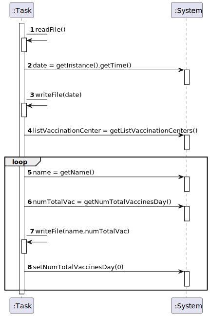
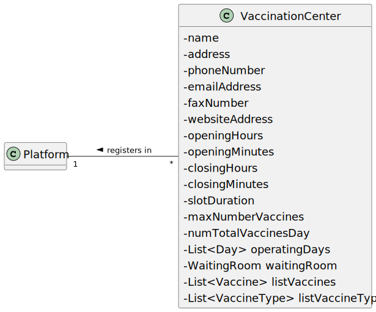
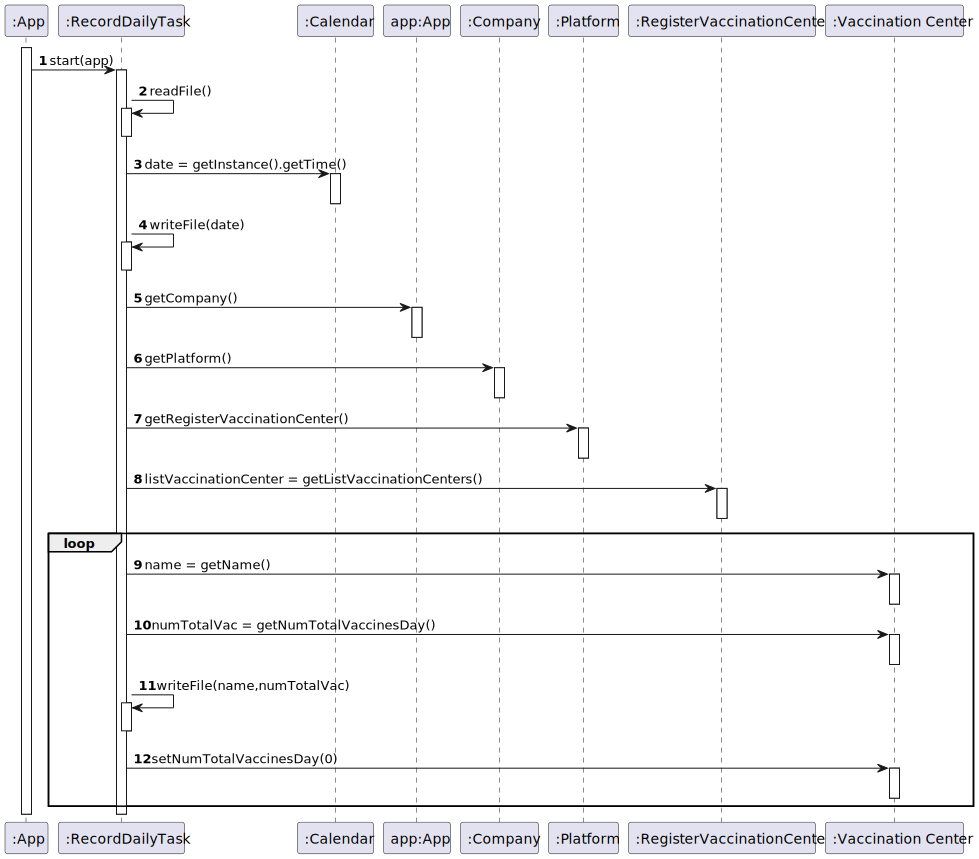
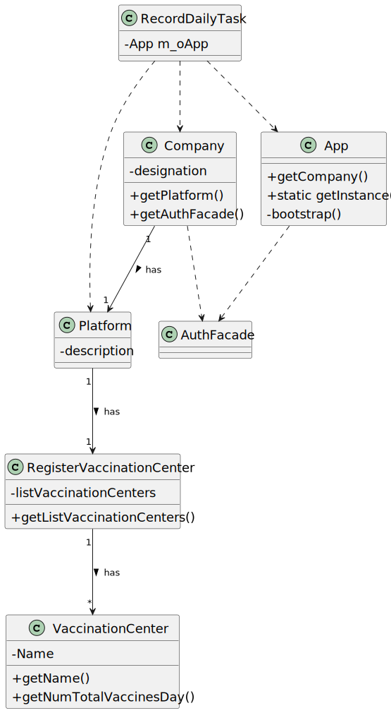

# US 06 - To record daily the total number of people vaccinated in each vaccination center

## 1. Requirements Engineering

### 1.1. User Story Description

DGS wants to record daily the total number of people vaccinated in each vaccination center.

### 1.2. Customer Specifications and Clarifications

**From the client clarifications:**

> **Question:** How it is supposed to register this information? Should it be recorded in a file (ex: txt,..) or recorded in the system (ex: in a store) ?
> 
> **Answer:** The data should be written to a CSV file (field delimiter should be a semicolon).

> **Question**: "[1-] I'd like to clarify something, should we implement some sort of message for when the file is saved or warning if there were any errors saving the file using JavaFX or use JavaFX in any other away in US06? [2-] Also, should the time be edited directly in the configuration file or should we have a way for an administrator or some other employee to change it.
>
> **Answer**: 1- No. The user story runs automatically without user interaction.    2- I already answered this question. The algorithm should run automatically at a time defined in a configuration file and should register the date, the name of the vaccination center and the total number of vaccinated users.
Please pay attention to the client answers and study ESOFT.

>**Question**: "After asking you to be more clear with your answer to my previous questions, you said that we can either access directly the "vaccinations report" file or create the option for center coordinators and administrators to view it's content, is this correct?"
>
>**Answer**: You misunderstood, I didn't say that. The file should be available in the file system and anyone having access to the file system can read the file contents.

>**Question**: "Does the report contain the count of vaccinations of the current day (which depending on the time of day can be incomplete) or the day before?"
>
>**Answer**: Should record vaccinations of the current day.

>**Question**: "In this situation, the system automatically prints what is requested so we dont need any user input.
So, my question is: Do we need to create an UI for this US? "
>
>**Answer**: No. Please study ESOFT!

>**Question**: "1. We would like to know which kind of user (Administrator, Nurse...) is supposed to have access to the file generated by the system.   2. Also, is it supposed to have the possibility to change the information on the configuration file? If so, who can do it?"
>
>**Answer**: 1. Someone from DGS.   2. Yes. Please discuss this question with ESOFT teachers.

>**Question**: "As per the acceptance criteria, can the job be deployed manualy by a specific actor like Receptionist, Administrator,...? Who does the initial configuration for the automatic job?"
>
>**Answer**: The algorithm should run automatically at a time defined in a configuration file and should register the date, the name of the vaccination center and the total number of vaccinated users.

>**Question**: "In the acceptance criteria, "the algorithm should run automatically at a time defined in a configuration file and should register a date, the name of the vaccination center and the total number of vaccinated users." How it is supposed to register this information? Should it be recorded in a file (ex: txt,..) or recorded in the system (ex: in a store) ?"
>
>**Answer**: The data should be written to a CSV file (field delimiter should be a semicolon).

>**Question**: "Should the Company choose first the vaccination center that wants to analyze or should the program show the information of all the vaccination centers?"
>
>**Answer**: Please read carefully the USs requirements and discuss them with your team. The application should show the information for all vaccination centers.

### 1.3. Acceptance Criteria

The algorithm should run automatically at a time defined in a configuration file and should register a date, the name of the vaccination center and the total number of vaccinated users.

### 1.4. Found out Dependencies

*

### 1.5 Input and Output Data

**Input Data:**

* Typed data:
    * N/A

* Selected data:
    * N/A
      
**Output Data:**

* N/A

### 1.6. System Sequence Diagram (SSD)

**Principal SSD**

### 1.7 Other Relevant Remarks

* For this task to come through, there should be at least one vaccination center.

## 2. OO Analysis

### 2.1. Relevant Domain Model Excerpt 

### 2.2. Other Remarks

* N/A

## 3. Design - User Story Realization 

### 3.1. Rationale

**The rationale grounds on the SSD interactions and the identified input/output data.**

| Interaction ID | Question: Which class is responsible for... | Answer  | Justification (with patterns)  |
|:-------------  |:--------------------- |:------------|:---------------------------- |
| Step 1         | ...starting the task? | App |  |
|         		 | ...interacting with the system? | RecordDailyTask | Task |
| Step 2  		 | ...reading the file? | RecordDailyTask | Task |
| Step 3  		 | ...knowing the current date? | Calendar | Java Class |
| Step 4  		 | ...writting the current date in the file? | RecordDailyTask | Task |
| Step 5  		 | ...knowing the company? | App | Creator(Rule 4): App has the data used to initialize Company. |
|                | ...knowing the platform? | Company | Creator(Rule 4): Company has the data used to initialize Platform |
|                | ...getting the register of vaccination centers? | Platform | IE: the Platform is responsible for all the registers. |
|        		 | ...knowing the list of vaccination centers? | RegisterVaccinationCenter | IE: owns the list of registered VaccinationCenters. |              
| Step 6  		 | ...knowing the name of the vaccination center? | VaccinationCenter | HC + LC: knows/has its own name. |
| Step 7         | ...knowing the number of vaccinated users on that day in the vaccination center? | VaccinationCenter | HC + LC: knows/has its own number of vaccinated users. |
| Step 8         | ...writing the name and number of vaccinated users of the vaccination center? | RecordDailyTask | Task |
| Step 9         | ...setting the number of vaccinated users for the next day back to zero? | RecordDailyTask | Task |

### Systematization ##

According to the taken rationale, the conceptual classes promoted to software classes are: 

 * Platform
 * RegisterVaccinationCenter
 * VaccinationCenter

Other software classes (i.e. Pure Fabrication) identified: 

 * RecordDailyTask

## 3.2. Sequence Diagram (SD)

**Principal SD**

## 3.3. Class Diagram (CD)

**Principal CD**

# 4. Tests 
*In this section, it is suggested to systematize how the tests were designed to allow a correct measurement of requirements fulfilling.* 

**_DO NOT COPY ALL DEVELOPED TESTS HERE_**

**Test 1:** Check that it is not possible to create an instance of the Example class with null values. 

	@Test(expected = IllegalArgumentException.class)
		public void ensureNullIsNotAllowed() {
		Exemplo instance = new Exemplo(null, null);
	}

*It is also recommended to organize this content by subsections.*

# 5. Construction (Implementation)

##RecordDailyTask

    public RecordDailyTask(App app){

        this.m_oApp = app;
    }

    public void run() {
        StringBuilder sb = new StringBuilder();

        try (Scanner sc = new Scanner(new File("dailyTotalVac.csv"))) {
            while (sc.hasNextLine()) {
                sb.append(sc.nextLine()).append("\n");
            }
        } catch (Exception e) {
            e.printStackTrace();
        }

        try {
            File file = new File("dailyTotalVac.csv");
            PrintWriter writeFile = new PrintWriter(file);
            String name;
            int numTotalVac;
            Calendar date = Calendar.getInstance();
            writeFile.println("==============================================================");
            writeFile.println(new SimpleDateFormat("dd/MM/yyyy").format(date.getTime()));
            List<VaccinationCenter> listVaccinationCenter = m_oApp.getCompany().getPlatform().getRegisterVaccinationCenter().getListVaccinationCenters();
            for (VaccinationCenter vacCent : listVaccinationCenter) {
                name = vacCent.getName();
                numTotalVac = vacCent.getNumTotalVaccinesDay();
                writeFile.printf(toString(name, numTotalVac));
                vacCent.setNumTotalVaccinesDay(0);
            }
            writeFile.close();
        } catch (Exception e){
            e.printStackTrace();
        }

    }

    public String toString(String name, int numTotalVac){
        return String.format(MessageBundle.getString("totalnumvactoday") + "%s: %d;\n",name,numTotalVac);
    }

##App

    public void dailyRecord(){
        System.out.println("task scheduled");
        Timer timer = new Timer();
        RecordDailyTask task = new RecordDailyTask(this);

        Calendar calendar = Calendar.getInstance();
        calendar.set(Calendar.HOUR_OF_DAY, 20);
        timer.schedule(task,calendar.getTime(),86400000);
    }

    private void bootstrap()
    {
        //omitted

        dailyRecord();
    }

# 6. Integration and Demo 

* 

# 7. Observations

*

