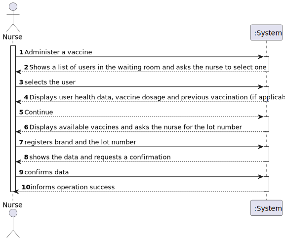
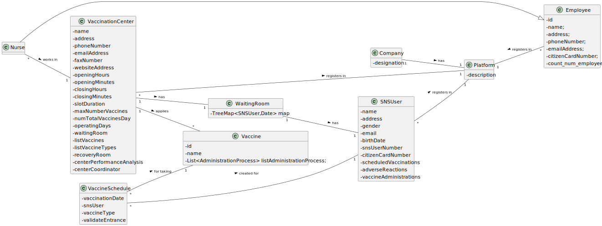
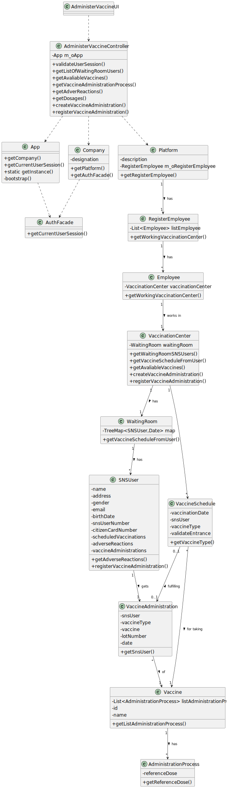

# US 08 - Administer a Vaccine

## 1. Requirements Engineering

### 1.1. User Story Description

As a nurse, i want to record the administration of a vaccine to a SNS user

### 1.2. Customer Specifications and Clarifications 

**From the specifications document:**

> At any time, a nurse responsible for administering the vaccine will use the application to check the
list of SNS users that are present in the vaccination center to take the vaccine and will call one SNS
user to administer him/her the vaccine.

> The nurse checks the user info and health conditions in the system and in accordance with
the scheduled vaccine type, and the SNS user vaccination history, (s)he gets system instructions
regarding the vaccine to be administered (e.g.: vaccine and respective dosage considering the SNS
user age group).

> After giving the vaccine to the user, each nurse registers the event in the system,
more precisely, registers the vaccine type (e.g.: Covid-19), vaccine name/brand (e.g.: Astra Zeneca,
Moderna, Pfizer), and the lot number used.

**From the client clarifications:**

> **Question:** "As we can read in Project Description, the vaccination flow follows these steps: 
>1. Nurse calls one user that is waiting in the waiting room to be vaccinated;
>2. Nurse checks the user's health data as well as which vaccine to administer; 3. Nurse administers the vaccine and registers its information in the system. 
>3. Nurse administers the vaccine and registers its information in the system.
> 
>The doubt is: do you want US08 to cover steps 2 and 3, or just step 3?"
>  
> **Answer:** 1.The nurse selects a SNS user from a list. 2. Checks user's Name, Age and Adverse Reactions registered in the system. 3. Registers information about the administered vaccine.

> **Question:** Previously the client answered that:
>1. The nurse selects a SNS user from a list.
>2. Checks user's Name, Age and Adverse Reactions registered in the system."
> 
>However, our group has five members and the US07: Register an adverse reaction is not obligatory to be implemented. So, with this in mind we would like to know if we, in step 2, should only show the Name and the Age or other information.
>  
> **Answer:** If your team does not implement US7, then you should show a message saying "No Adverse Reactions registered in the system".

### 1.3. Acceptance Criteria

* **AC1:** The nurse should select a vaccine and the administered dose number.

### 1.4. Found out Dependencies

* There is no dependency.

### 1.5 Input and Output Data

**Input Data:**

* Typed data:
    * n/a
	
* Selected data:
    * SNS user
    * Vaccine
    * Lot number

**Output Data:**
* n/a

### 1.6. System Sequence Diagram (SSD)

**Alternative 1**

**Other alternatives might exist.**

### 1.7 Other Relevant Remarks

n/a

## 2. OO Analysis

### 2.1. Relevant Domain Model Excerpt 

### 2.2. Other Remarks

n/a

## 3. Design - User Story Realization 

### 3.1. Rationale

**SSD - Alternative 1 is adopted.**

| Interaction ID | Question: Which class is responsible for...                        | Answer                        | Justification (with patterns)                                                                                 |
|:---------------|:-------------------------------------------------------------------|:------------------------------|:--------------------------------------------------------------------------------------------------------------|
| Step 1 | ...interacting with the actor? | AdministerVaccineUI | Pure Fabrication: there is no reason to assign this responsibility to any existing class in the Domain Model. |
|        | ...coordenating the us? | AdministerVaccineController | Controller |
|        | ...knowing the app instance? | App | Creator(rule 3): App closely uses Singleton | 
|        | ...getting current user using the system? | App | To check User information |
|        | ...knowing if the user is logged with the correct role? | UserSession | IE: cf. A&A component documentation. |
|        | ...knowing tne platform? | App | Creator(Rule 4): App has the data used to initialize Platform |
|        | ...getting the register of employees? | Platform | IE: Platform is responsible for all the registers. |
|        | ...knowing the working vaccination center? | Employee | IE: knows its own working VaccinationCenter. |
|        | ...getting the waiting room users of the working vaccination center? | VaccinationCenter | IE: knows its own list of waiting users. |
| Step 2 |  |  |  |
| Step 3 | ...knowing vaccination schedule from sns user? | VaccinationCenter | IE: A Vaccine schedule can only be registered in one Vaccination Center. |
|        | ...knowing the vaccine type to be administered? | VaccineSchedule | IE: knows its own vaccine type. |
|        | ...getting the available vaccines of its type? | VaccinationCenter | IE: knows its own vaccines. |
| Step 4 |  |  |  |
| Step 5 | ...knowing the administration process? | Vaccine | IE: has its own administration process. |
|        | ...knowing the adverse reactions? | SNSUser | IE: knows its own adverse reactions. |
| Step 6 |  |  |  |
| Step 7 | ...creating the vaccine administration in the vaccination center? | VaccineAdministration | IE: owns its data. |
|        | ...registering the vaccine administration? | SNSUser | IE: has its own vaccine administration. |
| Step 8 | ...informing operation success? | AdministerVaccineUI | IE: is responsible for user interactions. |

### Systematization ##

According to the taken rationale, the conceptual classes promoted to software classes are: 

 * Platform
 * RegisterEmployee
 * WaitingRoom
 * VaccinationCenter
 * VaccineAdministration
 * Vaccine
 * VaccineSchedule
 * SNSUser
 * AdministrationProcess

Other software classes (i.e. Pure Fabrication) identified: 

 * AdministerVaccineUI 
 * AdministerVaccineController

## 3.2. Sequence Diagram (SD)

**Alternative 1**

## 3.3. Class Diagram (CD)

**From alternative 1**
 

# 4. Tests 

# 5. Construction (Implementation)

## AdministerVaccineController

    App app;
    VaccinationCenter vaccinationCenter;

    public AdministerVaccineController(){
        app = App.getInstance();
    }

    public boolean validateUserSession(){
        return app.getCurrentUserSession().isLoggedInWithRole(Constants.ROLE_NURSE);
    }

    public List<SNSUser> getListOfWaitingRoomUsers(){
        String email = app.getCurrentUserSession().getUserId().getEmail();
        this.vaccinationCenter = this.app.getCompany().getPlatform().getRegisterEmployee().getWorkingVaccinationCenter(email);
        return this.vaccinationCenter.getWaitingRoomSNSUsers();
    }

    public List<Vaccine> getAvaliableVaccines(SNSUser snsUser){
        VaccineSchedule vs = vaccinationCenter.getVaccineScheduleFromUser(snsUser);
        return vaccinationCenter.getAvaliableVaccines(vs.getVaccineType());
    }

    public AdministrationProcess getVaccineAdministrationProcess(Vaccine vaccine){
        return vaccine.getListAdministrationProcess().get(0);
    }

    public List<AdverseReaction> getAdverReactions(SNSUser snsUser){
        return snsUser.getAdverseReactions();
    }

    public Double getDosages(Vaccine vaccine){
        return vaccine.getListAdministrationProcess().get(0).getReferenceDose();
    }

    public VaccineAdministration createVaccineAdministration(SNSUser snsUser, Vaccine vaccine, String lotNumber){
        VaccineSchedule vs = vaccinationCenter.getVaccineScheduleFromUser(snsUser);
        return  this.vaccinationCenter.createVaccineAdministration(snsUser,vs.getVaccineType(),vaccine,lotNumber);
    }

    public boolean registerVaccineAdministration(VaccineAdministration vaccineAdministration){
        SNSUser user = vaccineAdministration.getSnsUser();
        user.registerVaccineAdministration(vaccineAdministration);
        return this.vaccinationCenter.registerVaccineAdministration(vaccineAdministration);
    }

##RegisterEmployee

    public VaccinationCenter getWorkingVaccinationCenter(String email)
    {
        for(Employee emp : listEmployee)
            if(emp.getEmailAddress().compareTo(email) == 0)
                return emp.getWorkingVaccinationCenter();

        return null;
    }

##VaccinationCenter

    public List<SNSUser> getWaitingRoomSNSUsers(){
        return this.waitingRoom.getUsersByArrivalDate();
    }

    public VaccineSchedule getVaccineScheduleFromUser(SNSUser snsUser){
        return this.waitingRoom.getVaccineScheduleFromUser(snsUser);
    }

    public List<Vaccine> getAvaliableVaccines(VaccineType vaccineType) {
        List<Vaccine> list = new ArrayList<>();
        for (Vaccine v : this.listVaccines){
            if(vaccineType.getVaccineList().contains(v)){
                list.add(v);
            }
        }
        return list;
    }

    public VaccineAdministration createVaccineAdministration(SNSUser snsUser,VaccineType vaccineType, Vaccine vaccine, String lotNumber) {
        return new VaccineAdministration(snsUser,vaccineType, vaccine,lotNumber);
    }

    public boolean registerVaccineAdministration(VaccineAdministration vaccineAdministration) {
        Day day = getDay(vaccineAdministration.getDate());
        return day.registerVaccineAdministration(vaccineAdministration);
    }

##SNSUser

    public List<AdverseReaction> getAdverseReactions(){
        return this.adverseReactions;
    }

# 6. Integration and Demo 

* A new option on the Nurse menu options was added.

# 7. Observations

n/a

