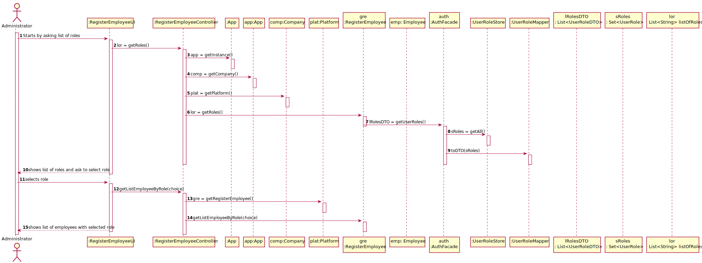

# US 011 - To Get List of Employees with a given function/role

## 1. Requirements Engineering

### 1.1. User Story Description

As an administrator, I want to get a list of Employees with a given function/role.

### 1.2. Customer Specifications and Clarifications 

**From the specifications document:**

>	N/A

**From the client clarifications:**

>**Question**: Besides the name of the employee, what other attributes do we need to show on the list? Can we show every single attribute, including password and username?
> 
>**Answer**: The application should present all Employee attributes. Password is not an Employee attribute.
>
> **Question**: Regarding US011, is there any requirement or input that the Administrator must insert to get the list of the employees? What are the criteria that those employees need to meet to appear on that list? Does the list of employees have any relevance on the functionality of the application? Should we assume SNSUsers must also appear on that list?
>
>**Answer**: I just answered a question that will clarify your doubts. Moreover, the SNS user is not an Employee.
>
> **Question**: Should we give the user the possibility of listing employees from more than 1 role?
>
> **Answer**: The Administrator should select a given role and all employees associated with the selected role should be listed.
>
> **Question**: Should the list be sorted in any specific way(for example alphabetical name order) or should we give the option to sort by other characteristics?
>
> **Answer**:  For now I just want to get a list of employees without considering the order of presentation.

### 1.3. Acceptance Criteria

* N/A

### 1.4. Found out Dependencies

* There is a dependency to "US010 Register an Employee" because there is a need to have Employees to get the requested list.

### 1.5 Input and Output Data

**Input Data:**

* Typed data:
    * N/A
	
* Selected data:
	* Choosing Role 

**Output Data:**

* List of roles
* List of employees with selected role
* (In)Success of the operation

### 1.6. System Sequence Diagram (SSD)

**Alternative 1**

**Other alternatives might exist.**

### 1.7 Other Relevant Remarks

* For this task to come through, the administrator has to be already logged in into his account.

## 2. OO Analysis

### 2.1. Relevant Domain Model Excerpt 

### 2.2. Other Remarks

* N/A

## 3. Design - User Story Realization 

### 3.1. Rationale

**SSD - Alternative 1 is adopted.**

| Interaction ID | Question: Which class is responsible for... | Answer                     | Justification (with patterns)                                                                                                                                                                |
|:-------------  |:--------------------------------------------|:---------------------------|:---------------------------------------------------------------------------------------------------------------------------------------------------------------------------------------------|
| Step 1  		 | 	... interacting with the actor?            | ListEmployeeByRoleUI         | Pure Fabrication: there is no reason to assign this responsibility to any existing class in the Domain Model (there needs to be an instance of Employee created to be able to list by role). |
| 			  		 | 	... coordinating the US?                   | ListEmployeeByRoleController | Controller                                                                                                                                                                                   |
| 						                          | ...knowing the app instance?                | App                        | Creator(rule 3): App closely uses Singleton                                                                                                        |
|                                 | ...knowing the company?                     | App	                       | Creator(Rule 4): App has the data used to initialize Company                                                                                       |
| 	                               | ...knowing the platform?                    | Company                    | Creator(Rule 4): Company has the data used to initialize Platform                                                                                  |
|                                 | ....knowing the Employee roles to show?     | AuthFacade                 | IE:Having the roles is the responsibility off the external component which the interaction point its through the class "AuthFacade"                |
| Step 2  		 | 							                                     |                            |                                                                                                                                                                                              |
| Step 3  		 | 	...knowing the list of employees?          | RegisterEmployee           | HC + LC: knows/has its own Employees                                                                                                                                                         |
| Step 4  		 | ...show list of employee with select role?  |    ListEmployeeByRoleUI                        |         IE: is responsible for user interactions.                                                                                                                                                                                        |

### Systematization ##

According to the taken rationale, the conceptual classes promoted to software classes are: 

 * Company
 * Platform
 * Employee
 * RegisterEmployee
 

Other software classes (i.e. Pure Fabrication) identified: 

 * ListEmployeeByRoleUI  
 * ListEmployeeByRoleController

Other classes off the system:

* UserRole
* UserRoleStore
* UserRoleDTO
* UserRoleMapper
* App
* AuthFacade

## 3.2. Sequence Diagram (SD)

**Alternative 1**

## 3.3. Class Diagram (CD)

**From alternative 1**

# 4. Tests 

**Test 1:** Check that the list of roles of employees it's the one that we want.

	    @Test
        void getListOfRoles() {
        
        RegisterEmployeeController rec = new RegisterEmployeeController();
        List<String> roles = new ArrayList<>();
        roles.add("RECEPTIONIST");
        roles.add("ADMINISTRATOR");
        roles.add("CENTER COORDINATOR");
        roles.add("NURSE");

        List<String> result = roles;
        List<String> expResult = rec.getRoles();

        assertLinesMatch(expResult,result);

        }

**Test 2:** Check that the list of employees match the one given

        @Test
    void getListEmployeeByRole() {

        RegisterEmployeeController rec = new RegisterEmployeeController();
        Employee vacx = new Receptionist("j","j","916597487","1181478@isep.ipp.pt","13765405");
        Employee vacy = new Receptionist("a","j","916597486","1181477@isep.ipp.pt","13765403");
        Employee vacz = new Receptionist("b","j","916597485","1181476@isep.ipp.pt","13765404");

        rec.newEmployee("j","j","916597487","1181478@isep.ipp.pt","13765405",1);
        rec.registerEmployee();
        rec.newEmployee("a","j","916597486","1181477@isep.ipp.pt","13765403",1);
        rec.registerEmployee();
        rec.newEmployee("b","j","916597485","1181476@isep.ipp.pt","13765404",1);
        rec.registerEmployee();

        ListEmployeeByRoleController l = new ListEmployeeByRoleController();

        List<Employee> empx = l.getListEmployeeByRole(1);

        List<Employee> emp = new ArrayList<>() ;
        emp.add(vacx);
        emp.add(vacy);
        emp.add(vacz);

        assertEquals(emp,empx);

    }

*It is also recommended to organize this content by subsections.* 

# 5. Construction (Implementation)

## Class ListEmployeeByRoleUI

    public ListEmployeeByRoleUI(){
        this.m_controller = new ListEmployeeByRoleController();
    }

    public void run(){

        System.out.println("\n Employee by Role");

        int choice = Utils.showAndSelectIndex(this.m_controller.getListOfRoles(),"SELECT ROLE:");

        enterData(choice);

    }

    private void enterData(int roleChoice){

        Utils.showList(m_controller.getListEmployeeByRole(roleChoice),"List");

    }

## Class ListEmployeeByRoleController

    private App m_oApp;
    private Platform m_oPlatform;
    private Company m_oCompany;

    public ListEmployeeByRoleController() {
        this.m_oApp = App.getInstance();
        this.m_oCompany = m_oApp.getCompany();
        this.m_oPlatform = m_oCompany.getPlatform();

    }
    public List<String> getRoles(){return this.m_oPlatform.getRegisterEmployee().getRoles();}
    public List<Employee> getListEmployeeByRole(int roleChoice){return this.m_oPlatform.getRegisterEmployee().getListEmployeeByRole(roleChoice);}
}

## Class Company

    private String designation;
    private AuthFacade authFacade;
    private Platform m_oPlatform;

    public Company(String designation)
    {
        if (StringUtils.isBlank(designation))
            throw new IllegalArgumentException("Designation cannot be blank.");

        this.designation = designation;
        this.authFacade = new AuthFacade();
        this.m_oPlatform = new Platform("Registers Platform");

    }
    ///...ommited
    
    public AuthFacade getAuthFacade() {return authFacade;}
    public Platform getPlatform(){return m_oPlatform;}

    }

## Class Platform

    private String description;

    private RegisterEmployee m_oRegisterEmployee;
    ///...ommited

    public Platform(String description) {
        if((description == null) || (description.isEmpty()))
            throw new IllegalArgumentException("argument can be null or empty");

        this.description = description;

        ///...ommited

    }

    public RegisterEmployee getRegisterEmployee(){return this.m_oRegisterEmployee;}
    ///...ommited

## Class RegisterEmployee

    private final List<Employee> listEmployee ;
    private final AuthFacade authFacade;

    
    public RegisterEmployee(AuthFacade authFacade)
    {
        listEmployee = new ArrayList<>();
        this.authFacade = authFacade;
    }

    ///...omitted 

    
    public List<String> getRoles(){

        List<UserRoleDTO> lRolesDTO;
        List<String> listOfRoles = new ArrayList<>();
        lRolesDTO = authFacade.getUserRoles();

        for (int i = 1; i < lRolesDTO.size() ; i++) {
            listOfRoles.add(lRolesDTO.get(i).getDescription());
        }

        return listOfRoles;
    }

    
    public List<Employee> getListEmployeeByRole( int roleChoice)
    {

        List<Employee> listEmployeeTemp = new ArrayList<>();

        for (Employee emp : listEmployee)
        {
            if (roleChoice == 0 && emp instanceof Receptionist)
            {
                listEmployeeTemp.add(emp);
            }
            else if (roleChoice == 1 && emp instanceof Administrator)
            {
                listEmployeeTemp.add(emp);
            }
            else if (roleChoice == 2 && emp instanceof CenterCoordinator)
            {
                listEmployeeTemp.add(emp);
            }
            else if (roleChoice == 3 && emp instanceof Nurse)
            {
                listEmployeeTemp.add(emp);
            }

        }
        return listEmployeeTemp;
    }

##Class Employee

    private int id;
	private static int count_num_employees = 0;
	private String name;
	private String address;
	private String phoneNumber;
	private String emailAddress;
	private String citizenCardNumber;

    public Employee(String name, String address, String phoneNumber, String emailAddress, String citizenCardNumber) {
        if((name == null) || (name.isEmpty()) || (address == null) || (address.isEmpty())
            || (phoneNumber == null) || (phoneNumber.isEmpty()) || (emailAddress == null) || (emailAddress.isEmpty())
            || (citizenCardNumber == null) || (citizenCardNumber.isEmpty())
            || (phoneNumber.length() != 9) || !StringUtils.isNumeric(phoneNumber)
            || (citizenCardNumber.length() != 8) || !StringUtils.isNumeric(citizenCardNumber))
            throw new IllegalArgumentException("None of the arguments can be null or empty. PhoneNumber e Citizen card Number in PT format");

		this.name = name;
        this.address = address;
        this.phoneNumber = phoneNumber;
        this.emailAddress = emailAddress;
        this.citizenCardNumber = citizenCardNumber;

        this.id = count_num_employees;
        count_num_employees++;

    }

    public String getName() {return name;}
    public void setName(String name) {this.name = name;}
    public String getAddress() {return address;}
    public void setAddress(String address) {this.address = address;}
    public String getPhoneNumber() {return phoneNumber;}
    public void setPhoneNumber(String phoneNumber) {this.phoneNumber = phoneNumber;}
    public String getEmailAddress() {return emailAddress;}
    public void setEmailAddress(String emailAddress) {this.emailAddress = emailAddress;}
    public String getCitizenCardNumber() {return citizenCardNumber;}
    public void setCitizenCardNumber(String citizenCardNumber) {this.citizenCardNumber = citizenCardNumber;}
    public int getID(){return this.id;}
    public static int getTotalEmployess() { return count_num_employees; }

    @Override
    public int hashCode() {
        int hash = 7;
        hash = 23 * hash + Objects.hashCode(this.citizenCardNumber);
        return hash;
    }

    @Override
    public boolean equals(Object o)
    {
        if (this == o) {
            return true;
        }
        if (o == null || this.getClass() != o.getClass()) {
            return false;
        }

        Employee emp = (Employee) o;
        return this.citizenCardNumber.equalsIgnoreCase(emp.getCitizenCardNumber())
                || this.emailAddress.equalsIgnoreCase(emp.getEmailAddress())
                || this.phoneNumber.equalsIgnoreCase(emp.getPhoneNumber());
    }

    @Override
    public String toString() {
        String str = String.format("Employee: %s - %s - %s - %s - %s ", this.name, this.address, this.phoneNumber, this.emailAddress, this.citizenCardNumber);
        return str;
    }

## Class Administrator

    public Administrator (String name, String address, String phoneNumber, String emailAddress, String citizenCardNumber){
    super(name,address,phoneNumber,emailAddress,citizenCardNumber);
    }

## Class Nurse

    public Nurse (String name, String address, String phoneNumber, String emailAddress, String citizenCardNumber){
        super(name,address,phoneNumber,emailAddress,citizenCardNumber);
    }

## Class Receptionist

    public Receptionist (String name, String address, String phoneNumber, String emailAddress, String citizenCardNumber){
        super(name,address,phoneNumber,emailAddress,citizenCardNumber);
    }

## Class CenterCoordinator

    public CenterCoordinator (String name, String address, String phoneNumber, String emailAddress, String citizenCardNumber){
    super(name,address,phoneNumber,emailAddress,citizenCardNumber);
    }

# 6. Integration and Demo 

* A new option on the Administrator menu options was added.

* Some demo purposes some tasks are bootstrapped while system starts.

# 7. Observations

The RegisterEmployeeUI and its Controller handle the role listing process, because you can't get a list without instances of the Employee class.

