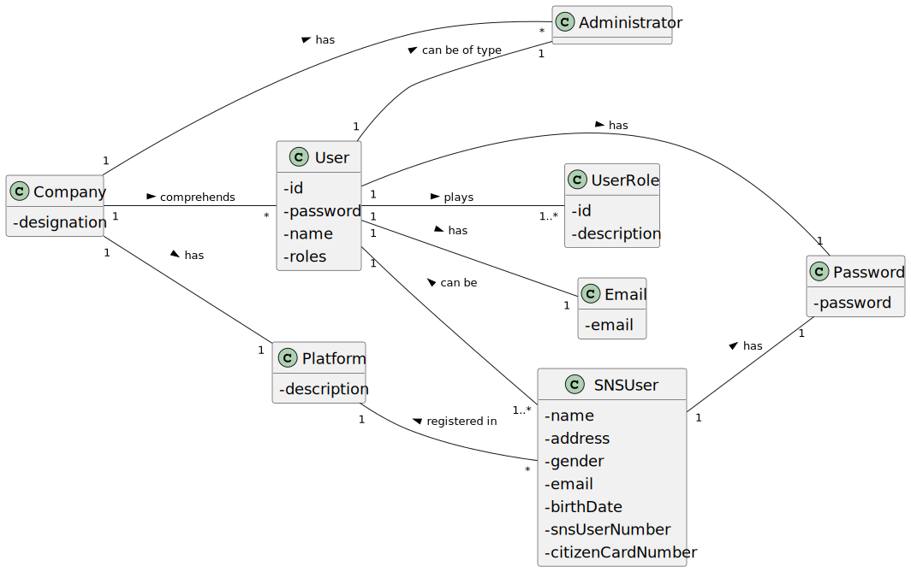
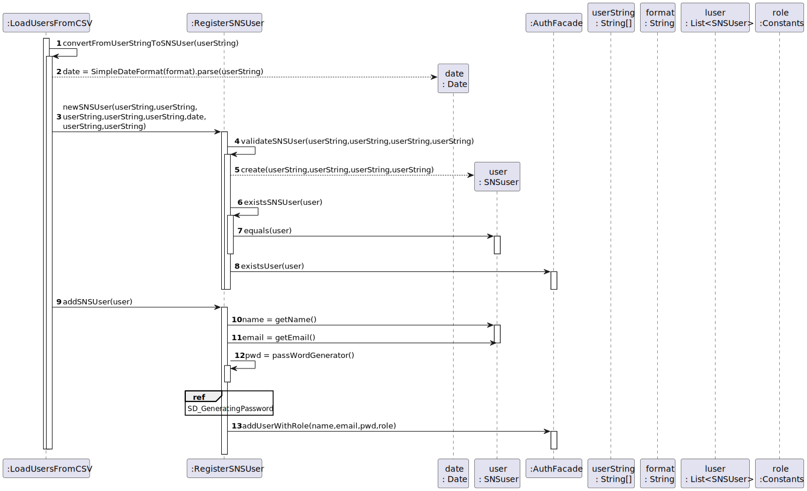

# US 14 - Load Users From a CSV file

## 1. Requirements Engineering

### 1.1. User Story Description

As an administrator , I want to load a set of users from a CSV file.

### 1.2. Customer Specifications and Clarifications 

**From the specifications document:**

>	N/A

**From the client clarifications:**

> **Question:** Regarding US014, I would like to clarify if the CSV file only contains information about SNS users of if the CSV file may also contain some information about employees from that vaccination center.
>  
> **Answer:** The CSV file only contains information about SNS users.
> 
> **Question:** What would be the sequence of parameters to be read on the CSV? For example: "Name | User Number.
> 
> **Answer:** Name, Sex, Birth Date, Address, Phone Number, E-mail, SNS User Number and Citizen Card Number.
> 
> **Question:** When the admin wants to upload a CSV file to be read, should the file be stored at a specific location on the computer (e.g. the desktop) or should the admin be able to choose the file he wants to upload in a file explorer?
> 
> **Answer:** The Administrator should write the file path. In Sprint C we do not ask students to develop a graphical user interface.
> 
> **Question:** Should we check if the users from the CSV file are already registered in the system? If so, which data should we use, the one already in the system or the one on the file?
> 
> **Answer** This feature of the system will be used to register a batch users. If the user is already registered in the system, then the information available in the CSV file should not be used to register that user.
> 
> **Question** Should our application detect if the CSV file to be loaded contains the header, or should we ask the user if is submitting a file with a header or not?"
> 
> **Answer** The application should automatically detect the CSV file type.
> 
> **Question** In witch format will be given the date of birth (YYYY/MM/DD or DD/MM/YYYY)
> 
> **Answer** In a previous clarification I said: "The dates registered in the system should follow the Portuguese format (dd/mm/yyyy)
> 
> **Question** Are there any SNS User attributes that can be omitted?
> 
> **Answer** I already answered one question related to US3 that answers your question. The Sex attribute is optional (it can also take the NA value). All other fields are required.
> 
> **Question** how should the admin receive the login data/passwords for all registered users?
> 
> **Answer** During this sprint, login and password data should be presented in the console application.
In US14 the application is used to register a batch of users. For each user, all the data required to register a user should be presented in the console.
> 
> **Question** On the last meeting you said that header contains names of the attributes that are listed in the file. My question is what is the delimiter for the header? Does it have points between words, commas or something else?
>
>  **Answer** Each type of CSV file has only one delimiter character. Acceptance criteria for US14: The application must support importing two types of CSV files: a) one type must have a header, column separation is done using “;” character; b) the other type does not have a header, column separation is done using “,” character.

 

### 1.3. Acceptance Criteria

* **AC1:** The application must support importing the following CSV file: 
   have a header, column separation is done using “;”
  character.
* **AC2:** The application must support importing the following CSV file:
  does not have a header, column separation is done using “,”
  character.

### 1.4. Found out Dependencies

* There is a dependency to class "UserSession", when we check if the current user session is with a user with role "Administrator".
* There is a dependency to class "RegisterSNSUser", "SNSUser", we transfer from CSV file SNSUsers that we need to add to the list of SNSUsers.
* There is a dependency to classes such as "User","UserStore","UserRole","UserRoleStore", used when we register a SNSUser as a system user or when we try to find out if the SNSUser already exists in the system.
* There is a dependency to classes "UserRoleStore","UserRole","UserRoleDTO","UserRoleMapper","UserStore","User","UserDTO","UserMapper" used when we print the system users.

### 1.5 Input and Output Data

**Input Data:**

* Typed data:
 
	* N/A
	
* Selected data:
	* Specifying a file to load

**Output Data:**

* List of existing files
* Shows the data imported of the SNSUsers and request a confirmation
* Shows the data registered in the system(SNSUsers are registered in the system as users) and request a confirmation.
* (In)Success of the operation

### 1.6. System Sequence Diagram (SSD)

**Other alternatives might exist.**

### 1.7 Other Relevant Remarks

* Files can only be of type CSV

## 2. OO Analysis

### 2.1. Relevant Domain Model Excerpt 

### 2.2. Other Remarks

n/a

## 3. Design - User Story Realization 

### 3.1. Rationale

**SSD - Alternative 1 is adopted.**

| Interaction ID | Question: Which class is responsible for...                                               | Answer                    | Justification (with patterns)                                                                                                                                                                                                                                                                                                                                                           |
|:---------------|:------------------------------------------------------------------------------------------|:--------------------------|:----------------------------------------------------------------------------------------------------------------------------------------------------------------------------------------------------------------------------------------------------------------------------------------------------------------------------------------------------------------------------------------|
| Step 1  		     | 	... interacting with the actor?                                                          | LoadUsersFileUI           | Pure Fabrication: there is no reason to assign this responsibility to any existing class in the Domain Model.                                                                                                                                                                                                                                                                           |
| 			  		        | 	... coordinating the US?                                                        | LoadUsersFileController   | Controller                                                                                                                                                                                                                                                                                                                                                                              |
| 						         | ...knowing the app instance?                                                 | App                       | Creator(Rule 3): App closely uses Singleton                                                                                                                                                                                                                                                                                                                                             |
|                | ...knowing the company?                                                                   | App	                      | Creator(Rule 4): App has the data used to initialize Company                                                                                                                                                                                                                                                                                                                            |
| 	              | ...knowing the platform?                                                                  | Company                   | Creator(Rule 4): Company has the data used to initialize Platform                                                                                                                                                                                                                                                                                                                       |
| 			  		        | ... knowing the user using the system?                                            | UserSession               | IE: cf. A&A component documentation.                                                                                                                                                                                                                                                                                                                                                    |
| 			  		        | 	... knowing  the user role?                                                     | UserSession               | IE: cf. A&A component documentation.                                                                                                                                                                                                                                                                                                                                                    |
| 			  		        | 	... knowing to which company the user belongs to?                               | App                       | IE: has registered the user sessions                                                                                                                                                                                                                                                                                                                                                    |
| Step 2         |                                                                                           |
| Step 3			  		  | 	... knowing the path to the files?                                           | LoadUsersFileUI           | IE: its responsible for user interactions.Admin should right the path to the were the files are stored                                                                                                                                                                                                                                                                                  |
| 		  		         | 	... getting the register(list) of SNSUsers?                                          | Platform                  | IE:  in the DM Platform is responsible for all the registers                                                                                                                                                                                                                                                                                                                            |
| 			  		        | 	...getting the loader(class that processes data imported) of SNSUsers?           | Platform                  | IE:  in the DM Platform is responsible for all the registers                                                                                                                                                                                                                                                                                                                            |
| 			  		        | 				                                                                    | LoadUsersFromCSV          | HC + LC: knows/has its own list of SNSUsers(stored as a list of string arrays)                                                                                                                                                                                                                                                                                                          |                                                                                                
| 			  		        | 				                                                                   | RegisterSNSUser           | HC + LC: knows/has its own SNSUsers                                                                                                                                                                                                                                                                                                                                                     |                                                                                                
|                | ....knowing the list of files to show?                                                    | LoadFromCSV               | Protected Variation: its the responsibility of interface LoadFromCSV to load any type of CSV file                                                                                                                                                                                                                                                                                       |
| Step 4  		     | 							                                                                                   |                           |                                                                                                                                                                                                                                                                                                                                                                                         |
| Step 5         | ...holds temporarily the select file?                                                     | LoadUsersFileUI           | IE : Holding on temporarily the file select before passing it. Passing it after asking for confirmation to import the select CSV file                                                                                                                                                                                                                                                   |
| Step 6  		     | 	                                                                                         |                           |                                                                                                                                                                                                                                                                                                                                                                                         |	
| Step 7		       | 	 ...load file from csv?                                                                  | LoadFromCSV               | Protected Variation: its the responsibility of interface LoadFromCSV to load any type of CSV file                                                                                                                                                                                                                                                                                       |	
| 		             | 	                                                                                         | ClassLoader               | IE: A class loader is an object that is responsible for loading classes. The class ClassLoader is an abstract class. Given the binary name of a class, a class loader should attempt to locate or generate data that constitutes a definition for the class. A typical strategy is to transform the name into a file name and then read a "class file" of that name from a file system. |	
| 		             | 	                                                                                         | Thread                    | IE: A thread is a thread of execution in a program. The Java Virtual Machine allows an application to have multiple threads of execution running concurrently.                                                                                                                                                                                                                          |
| 		             | 	                                                                                         | InputStream               | IE: This abstract class is the superclass of all classes representing an input stream of bytes.                                                                                                                                                                                                                                                                                         |	
|                | ...converting CSV inputStream(process the data imported from csv)?                        | LoadUsersFromCSV          | IE: its the responsibility off this class to process the data imported from the CSV                                                                                                                                                                                                                                                                                                     |
|                |                                                                                           | InputStreamReader         | IE: An InputStreamReader is a bridge from byte streams to character streams: It reads bytes and decodes them into characters using a specified charset.                                                                                                                                                                                                                                 |
|                |                                                                                           | StandardCharsets          | IE: Constant definitions for the standard charsets.                                                                                                                                                                                                                                                                                                                                     |
|                |                                                                                           | BufferedReader            | IE: Reads text from a character-input stream, buffering characters so as to provide for the efficient reading of characters, arrays, and lines.                                                                                                                                                                                                                                         |
|                | ...knowing the string delimiter?                                                          | Constants                 | HC + LC : knows/has its own data.                                                                                                                                                                                                                                                                                                                                                       |
|                | ...read the lines from the BufferedReader(using delimiter to split line) ?                | LoadUsersFromCSV          | IE:  its responsible for processing the data                                                                                                                                                                                                                                                                                                                                            |
|                | ...add the lines read to a list of string array?                                          | LoadUsersFromCSV          | HC + LC: knows/has its own data.                                                                                                                                                                                                                                                                                                                                                        |
|                | ...showing the data inside the list of string array?(list of SNS users imported from CSV) | LoadUsersFromCSV          | HC + LC: knows its own data.                                                                                                                                                                                                                                                                                                                                                            |
| Step 8         |                                                                                           |                           |                                                                                                                                                                                                                                                                                                                                                                                         |         
| Step 9         | ...knowing the list of string array?(list of SNS users imported from CSV)                 | LoadUsersFromCSV          | HC + LC: knows/has its own data.                                                                                                                                                                                                                                                                                                                                                        |
|                | ...instantiating a new date?                                                              | LoadUsersFromCSV          | Creator(Rule 4): LoadUsersFromCSV has the data used to initialize Date                                                                                                                                                                                                                                                                                                                  |
|                | ...instantiating a new SNS user?                                                          | RegisterSNSUser           | Creator (Rule 1): in the DM Platform register SNS users.                                                                                                                                                                                                                                                                                                                                |
|                | ...saving the SNS user data ?                                                             | SNSUser                   | 	IE: object created in step 9 has its own data.                                                                                                                                                                                                                                                                                                                                         |
| 		             | 	...validating all data(global validation)?                                               | RegisterSNSUser           | HC + LC :knows all its SNSUsers.                                                                                                                                                                                                                                                                                                                                                        |	
|                | ...... validating all data (local validation)?                                            | SNSUser                   | IE: owns its data.                                                                                                                                                                                                                                                                                                                                                                      |
|                | ...... check if SNSUser is a system user?                                                 | AuthFacade                | IE: knowing the users in the system is the responsibility off the external component which the interaction point its through the class "AuthFacade"                                                                                                                                                                                                                                     |
|                | ...saving the created SNS user ?                                                          | RegisterSNSUser           | 	HC + LC :owns all its SNSUsers.                                                                                                                                                                                                                                                                                                                                                        |
|                | ...call interface PasswordGenerator?                                                      | RegisterSNSUser           | 	Polymorphism: using polymorphism to create a implementation of interface PasswordGenerator.                                                                                                                                                                                                                                                                                            |
|                |                                                                                           | PasswordGenerator         | 	Protected Variation:  its the responsibility of interface PasswordGenerator to generate passwords for system users.                                                                                                                                                                                                                                                                    |
|                | ...instantiating a new PasswordsGeneratorRandomly ?                                       | RegisterSNSUser           | 	Creator(Rule 4): RegisterSNSUser has the data used to initialize PasswordGeneratorRandomly                                                                                                                                                                                                                                                                                             |
|                | ...generate the password according client specifications ?                                | PasswordGeneratorRandomly | 	HC + LC: knows the algorithm to use for generate passwords                                                                                                                                                                                                                                                                                                                             |
|               | ...sends email to SNS user?                                                                  | SendEmail                 | Protected Variation + Adapter:  its the responsibility of interface Sent Email to generate emails for system users and vaccine schedules(in another US's)                                                                                                                                                                                                                               |
|                | ...saving the SNS user as system user ?                                                   | AuthFacade                | 	IE: adding the users to the system is the responsibility off the external component which the interaction point its through the class "AuthFacade"                                                                                                                                                                                                                                     |
|                | ...showing the SNSUsers that are added or already exists as SNSUser/System user ?         | LoadUsersFromCSV          | HC + LC: knows/has its own data.                                                                                                                                                                                                                                                                                                                                                        |
|                | ...getting all system users?                                                              | AuthFacade                | IE: getting the users in the system is the responsibility off the external component which the interaction point its through the class "AuthFacade"                                                                                                                                                                                                                                     |
|                | ...instantiating a new user mapper?                                                       | AuthFacade                | Creator(Rule 4):  AuthFacade has the data used to initialize Mapper                                                                                                                                                                                                                                                                                                                     |   
|                | ...knowing all system users?                                                              | UserStore                 | HC + LC: knows/has all its Users.                                                                                                                                                                                                                                                                                                                                                       |
|                | ...transforming a set of Users in a list of UsersDTO?                                     | UserMapper                | LC: Mapper is independent and isolated.                                                                                                                                                                                                                                                                                                                                                 |
| Step 10        | ...showing system users?                                                                  | LoadUsersFileUI           | IE: is responsible for user interactions.                                                                                                                                                                                                                                                                                                                                               |
| Step 11        | ... informing operation success?                                                          | LoadUsersFileUI           | IE: is responsible for user interactions.                                                                                                                                                                                                                                                                                                                                               |

### Systematization ##

According to the taken rationale, the conceptual classes promoted to software classes are: 

 * Company
 * Platform
 * SNSUser
 * UserRole
 * User
 * Administrator
 * Email
 * Password
 

Other software classes (i.e. Pure Fabrication) identified: 

 * LoadUsersFileUI 
 * LoadUsersFileController
 * LoadUsersFromCSV
 * LoadFromCSV(interface)
 * RegisterSNSUser
 * Constants
 * SentEmail(interface)
 * PasswordGenerator(interface)

Other classes off the system:

* UserSession
* UserRoleStore
* UserRoleDTO
* UserStore
* UserRoleMapper
* App
* AuthFacade
* UserDTO
* UserMapper

External classes :
* File
* Files
* Collectors
* Paths
* Path(interface)
* ClassLoader
* Thread
* getContextClassLoader
* InputStream
* InputStreamReader
* BufferedReader
* StandardCharsets

External methods:

* getContextClassLoader
* getResourceAsStream

## 3.2. Sequence Diagram (SD)

**Alternative 1**

## 3.3. Class Diagram (CD)

**From alternative 1**

# 4. Tests 

**Test 1:** Check if is the Admin login

    @Test
    void checkLogin() {
        LoadUsersFileController lufc= new LoadUsersFileController();
        App.getInstance().doLogin("admin@lei.sem2.pt","123456");

        assertTrue(lufc.checkLogin());
    }

**Test 2:** Check if the SNS users in CSV were correctly added as system Users

    @Test
    void printSystemUsers() {

        LoadUsersFileController lufc= new LoadUsersFileController();

        List<UserDTO> ex = App.getInstance().getCompany().getAuthFacade().getUsers();
        List<UserDTO> exs = lufc.printSystemUsers();
        List<String> expResult = new ArrayList<>();
        List<String> result = new ArrayList<>();

        for(UserDTO user : ex)
        {
             expResult.add(user.getName());
             expResult.add(user.getId());
             expResult.add(user.getRoles().get(0).getDescription());
        }

        for(UserDTO user : exs)
        {
            result.add(user.getName());
            result.add(user.getId());
            result.add(user.getRoles().get(0).getDescription());
        }

        assertEquals(expResult,result);
    }
		

**Test 3:** Check if the list of files is correct 

    @Test
    void getListOfFiles() {
        LoadUsersFileController lufc= new LoadUsersFileController();

        List<String> listOfFilesname = new ArrayList<>();
        listOfFilesname.add("UsersFileWithComma.csv");
        listOfFilesname.add("UsersFileWithHeaderAndSemicolon.csv");

        assertLinesMatch(lufc.getListOfFiles("src/main/resources"),listOfFilesname);

    }
 

# 5. Construction (Implementation)

## Class LoadUsersFileUI

	private LoadUsersFileController m_controller;
    public LoadUsersFileUI(){this.m_controller = new LoadUsersFileController();}

    public void run() {

        System.out.println("\nLoad Users");

        if(!m_controller.checkLogin()) {
            System.out.println("Unauthorized user");
            return;
        }

        try {

            String path = Utils.readLineFromConsole("Introduce the path to the files( src/main/resources ) : ");
            while (path.isEmpty()) {
                System.out.println("path cant be empty");
                path = Utils.readLineFromConsole("Introduce the path to the files( src/main/resources ) : ");

            }

            try {

            if (!m_controller.getListOfFiles(path).isEmpty()) {
                Object choice = Utils.showAndSelectOne(m_controller.getListOfFiles(path), "SELECT CSV FILE:");

                if (choice == null) {
                    System.out.println("BACK TO ADMIN MENU");

                } else if (Utils.confirm("Import data from CSV file ? (S/N)")) {

                    if (m_controller.loadUsersFromCSV(choice.toString()))
                        m_controller.showData();
                    else
                        run();

                    if (Utils.confirm("Confirms Data? (S/N)")) {
                        m_controller.registerListStringUsersInSystem();
                        printSystemUsers();
                        System.out.println("\nOperation was successful");
                        System.out.println("BACK TO ADMIN MENU");

                    } else
                        System.out.println("BACK TO ADMIN MENU");

                } else
                    run();

            } else {
                System.out.println("There is no CSV to import");
                System.out.println("BACK TO ADMIN MENU");
            }
        }catch (NullPointerException ex)
            {
                System.out.println("file path doesnt exists");
                run();
            }

        }catch (NumberFormatException ex)
        {
            System.out.println("Your option needs to be a number");
            run();
        }

    }

    /**
     * Print system users.
     */
    public void printSystemUsers(){
        System.out.println("\nLIST OF USERS IN THE SYSTEM, AFTER ADDING CSV FILE USERS TO THE SYSTEM\n");

        List<UserDTO> usersMapper = m_controller.printSystemUsers();

        for(UserDTO user : usersMapper)
        {
            System.out.println(String.format("Name:%s  Email:%s  Role:%s ", user.getName(), user.getId()  ,user.getRoles().get(0).getDescription() ));
        }
    }

## Class LoadUsersFileController

    private App m_oApp;
    private Platform m_oPlatform;

    public LoadUsersFileController(){
        this.m_oApp = App.getInstance();
        this.m_oPlatform = m_oApp.getCompany().getPlatform();

    }

    public boolean checkLogin(){
        return m_oApp.getCurrentUserSession().isLoggedInWithRole(Constants.ROLE_ADMIN);
    }

    public List<String> getListOfFiles(String path)
    {
        try
        {
            return this.m_oPlatform.getLoadUsersFromCSV().getListOfFiles(path);

        }catch(RuntimeException ex)
        {
            System.out.println(ex.getMessage());
            return null;
        }
    }

    public boolean loadUsersFromCSV(String fileName){
        try
        {
            return this.m_oPlatform.getLoadUsersFromCSV().loadUsersFromCSV(fileName);
        }
        catch(RuntimeException ex)
        {
            System.out.println(ex.getMessage());
            return false;
        }
    }

    public boolean registerListStringUsersInSystem()
    {
        return this.m_oPlatform.getLoadUsersFromCSV().registerListStringUsersInSystem();
    }

    public boolean showData()
    {
        return this.m_oPlatform.getLoadUsersFromCSV().showData();
    }

    public List<UserDTO> printSystemUsers()
    {
       return this.m_oPlatform.getLoadUsersFromCSV().printSystemUsers();
    }

## Class Company

    private String designation;
    private AuthFacade authFacade;
    private Platform m_oPlatform;

    public Company(String designation)
    {
        if (StringUtils.isBlank(designation))
            throw new IllegalArgumentException("Designation cannot be blank.");

        this.designation = designation;
        this.authFacade = new AuthFacade();
        this.m_oPlatform = new Platform("Registers Platform");

    }
    ///...ommited
    
    public AuthFacade getAuthFacade() {return authFacade;}
    public Platform getPlatform(){return m_oPlatform;}

    }

## Class Platform

    private String description;
    private RegisterSNSUser m_oRegisterSNSUser;
    private LoadUsersFromCSV m_oLoadUsersFromCSV;
    // ... (omitted)

    public Platform(String description) {
        if((description == null) || (description.isEmpty()))
            throw new IllegalArgumentException("argument can be null or empty");

        this.description = description;

	//...(omitted)

    }

	public RegisterSNSUser getRegisterSNSUser() {return this.m_oRegisterSNSUser;}
	public LoadUsersFromCSV getLoadUsersFromCSV(){return this.m_oLoadUsersFromCSV;}

    public void initializeRegisters(AuthFacade authFacade) {
        this.m_oRegisterSNSUser = new RegisterSNSUser(authFacade);
		//...(omitted)
        this.m_oLoadUsersFromCSV = new LoadUsersFromCSV(authFacade,m_oRegisterSNSUser);
        //...(omitted)
    }
    

## Class LoadUsersFromCSV

	private List<String[]> usersListString = new ArrayList<>();
    private final AuthFacade authFacade;
    private  RegisterSNSUser m_oRegisterSNSUser;

    public LoadUsersFromCSV(AuthFacade authFacade, RegisterSNSUser m_oRegisterSNSUser)
    {
        this.authFacade = authFacade;
        this.m_oRegisterSNSUser = m_oRegisterSNSUser;
    }

    public List<String> getListOfFiles(String path) {

        return LoadFromCSV.getListOfFiles(path);
    }

    public boolean loadUsersFromCSV (String fileName)
    {
        try {
            InputStream inputStream = LoadFromCSV.loadFromCSV(fileName);
            convertCSV(inputStream);
        }catch (IllegalArgumentException ex)
        {
            System.out.println(ex.getMessage());
            return false;
        }
            return true;
    }

    private void convertCSV(InputStream inputStream) {

        String delimiterComma = Constants.DELIMITER_COMMA;
        String delimiterSemicolon = Constants.DELIMITER_SEMICOLON;

        try (InputStreamReader streamReader =new InputStreamReader(inputStream, StandardCharsets.UTF_8);
             BufferedReader reader = new BufferedReader(streamReader))
        {

            String header = reader.readLine();

            if(header.compareToIgnoreCase("Name;Address;Sex;PhoneNumber;Email;BirthDate;SNSUserNumber;CitizenCardNumber") == 0)
                convertFromBufferedReaderToStringSNSUser(reader,delimiterSemicolon);
            else
            {
                String[] splitHeader = header.split(delimiterComma);
                if(splitHeader[2].compareToIgnoreCase("NA") == 0 || splitHeader[2].compareTo("") == 0)
                    splitHeader[2] = "Other";

                if (!(splitHeader.length == 0 || Arrays.asList(splitHeader).contains("") || splitHeader.length != 8))
                {

                    try{
                        new Email(splitHeader[4]);

                        if(!StringUtils.isNumeric(splitHeader[3]) || !StringUtils.isNumeric(splitHeader[6]) || !StringUtils.isNumeric(splitHeader[7]))
                            convertFromBufferedReaderToStringSNSUser(reader, delimiterComma);
                        else
                        {
                            usersListString.add(splitHeader);
                            convertFromBufferedReaderToStringSNSUser(reader, delimiterComma);
                        }

                    }catch (IllegalArgumentException ex)
                    {
                        convertFromBufferedReaderToStringSNSUser(reader, delimiterComma);
                    }

                }
                else
                    convertFromBufferedReaderToStringSNSUser(reader,delimiterComma);
            }

        } catch (IOException e) {
            System.out.println(e.getMessage());
        }

    }

    private void  convertFromBufferedReaderToStringSNSUser(BufferedReader reader,String delimiter) {

        String row;

        try {
            while ((row = reader.readLine()) != null) {
                if ((row.trim()).length() > 0) {
                    String[] splitRowData = row.split(delimiter);
                    if(splitRowData[2].compareToIgnoreCase("NA") == 0 || splitRowData[2].compareTo("") == 0)
                        splitRowData[2] = "Other";

                    if (splitRowData.length == 0 || Arrays.asList(splitRowData).contains("") || splitRowData.length != 8)
                        continue;
                    else
                    {
                        try{
                            new Email(splitRowData[4]);

                            if(!StringUtils.isNumeric(splitRowData[3]) || !StringUtils.isNumeric(splitRowData[6]) || !StringUtils.isNumeric(splitRowData[7]))
                                continue;
                            else
                                usersListString.add(splitRowData);

                        }catch (IllegalArgumentException ex)
                        {
                            continue;
                        }

                    }
                }

            }
        } catch (IOException e) {
            e.getMessage();
        }

    }

    public boolean registerListStringUsersInSystem() {

        System.out.println("\nLIST OF SNS USERS THAT WILL BE ADDED TO SYSTEM UNLESS THEY ALREADY EXIST\n");

        for(String[] user: usersListString)
        {
            if(convertFromUserStringToSNSUser(user))
                System.out.println(String.format("User:%s with email:%s ADDED to the system", user[0], user[4]));
            else
                    System.out.println(String.format("User:%s with email:%s ALREADY EXISTS in the system", user[0], user[4]));

        }

        usersListString.clear();

        return true;
    }

    private boolean convertFromUserStringToSNSUser(String[] userString) {

        try {

            Date date1 = new SimpleDateFormat("dd-MM-yyyy").parse(userString[5]);
            SNSUser tempUser = m_oRegisterSNSUser.newSNSUser(userString[0], userString[1], userString[2], userString[3], userString[4], date1  , userString[6], userString[7]);

            if(tempUser == null)
                return false;
            else
                return m_oRegisterSNSUser.addSNSUser(tempUser);

        } catch (ParseException e) {
            System.out.println("Date invalid format");
            e.getMessage();
        }

        return false;
    }

    public boolean showData() {

        System.out.println("LIST OF USERS IN CSV FILE , BEFORE ADDING THEM TO THE SYSTEM\n");

        int i=0;
        for(String[] user : usersListString)
        {
            System.out.println("Name:" + user[i] + " Address:" + user[i+1] + " Gender:" + user[i+2] +
                                " Phone Number:" + user[i+3] + " Email:" + user[i+4] + " Birth Date:" + user[i+5] +
                                " SNS user number:" + user[i+6] + " Citizen card number:" + user[i+7]);
        }

        return true;
    }

    public List<UserDTO> printSystemUsers() {

        return authFacade.getUsers();
    }

## Interface LoadFromCSV

	static List<String> getListOfFiles() {

        try {
            List<File> files = Files.list(Paths.get("src/main/resources")).map(Path::toFile)
                    .filter(File::isFile)
                    .collect(Collectors.toList());

            List<String> listOfFilesName = new ArrayList<>(files.size());

            for (Object file : files)
            {
                String path = file.toString();
                Path phatToAFile = Paths.get(path);
                listOfFilesName.add(phatToAFile.getFileName().toString());
            }

            return listOfFilesName;
        } catch (IOException e) {
            System.out.println(e.getMessage());
        }

        return null;
    }

     static InputStream loadFromCSV(String fileName) {

        ClassLoader classloader = Thread.currentThread().getContextClassLoader();
        InputStream inputStream = classloader.getResourceAsStream(fileName);

        // the stream holding the file content
        if (inputStream == null) {
            throw new IllegalArgumentException("file not found!");
        } else {

            return inputStream;

        }

    }

## Interface PasswordGenerator

	

    public String passwordGenerator(String email);

    class PasswordGeneratorRandomly implements PasswordGenerator{

        @Override
        public String passwordGenerator(String email)
        {

            String upperCaseLetters = RandomStringUtils.randomAlphabetic(3).toUpperCase();
            String lowerCaseLetters = RandomStringUtils.randomAlphabetic(2).toLowerCase();
            String numbers = RandomStringUtils.randomNumeric(2);

            String combinedChars = upperCaseLetters.concat(lowerCaseLetters).concat(numbers);

            List<Character> pwdChars = combinedChars.chars().mapToObj(c -> (char) c).collect(Collectors.toList());

            Collections.shuffle(pwdChars);

            String password = pwdChars.stream().collect(StringBuilder::new, StringBuilder::append, StringBuilder::append).toString();

            System.out.println("Email/Login: " + email + " Password: " + password);
            String emailMessage = String.format("Email/Login: " + email + "\nPassword:" + password);
            SentEmail.SentEmail(email,emailMessage,"Account Details Lapr2");

            Password m_oPassword = new Password(password);
            if(m_oPassword.checkPassword(password))
                return password;
            else
                throw new RuntimeException("password empty or wrongly created");
        }
    }

## Interface SendEmail

    public interface SentEmail {

     static void SentEmail(String userEmail, String emailMessage, String emailSubject)  {

        // Recipient's email ID needs to be mentioned.
        String to = userEmail;

        // Sender's email ID needs to be mentioned
        String from = "vaccinationcenterLAPR2@gmail.com";

        // Assuming you are sending email from localhost
        String host = "smtp.gmail.com";

        // Get system properties
        Properties properties = System.getProperties();

        // Setup mail server
        properties.put("mail.smtp.host", host);
        properties.put("mail.smtp.port", "465");
        properties.put("mail.smtp.ssl.enable", "true");
        properties.put("mail.smtp.auth", "true");

        // Get the default Session object.

        Session session = Session.getInstance(properties, new javax.mail.Authenticator() {

            protected PasswordAuthentication getPasswordAuthentication() {

                return new PasswordAuthentication(from, "vaccination2022");

            }

        });

        try {
            // Create a default MimeMessage object.
            MimeMessage message = new MimeMessage(session);

            // Set From: header field of the header.
            message.setFrom(new InternetAddress(from));

            // Set To: header field of the header.
            message.addRecipient(Message.RecipientType.TO, new InternetAddress(to));

            // Set Subject: header field
            message.setSubject(emailSubject);

            // Now set the actual message
            message.setText(emailMessage);

            // Send message
            Transport.send(message);
            System.out.println("Sent message successfully....");
        } catch (MessagingException mex) {
            mex.printStackTrace();
        }

    }
}

## Class RegisterSNSUser

    private final List<SNSUser> listSNSUser;
    private final AuthFacade authFacade;

    
    public RegisterSNSUser(AuthFacade authFacade) {
        listSNSUser = new ArrayList<>();
        this.authFacade = authFacade;
    }

    private boolean validateSNSUser(String email, String phoneNumber, String snsUserNumber, String citizenCardNumber){
        SNSUser user = new SNSUser(email,phoneNumber,snsUserNumber,citizenCardNumber);

        if(existsSNSUser(user)){
            throw new IllegalArgumentException(String.format("A user with the same email(%s), phone number(%s), sns user number(%s) or citizen card number(%s) already exists.",
                            email,phoneNumber,snsUserNumber,citizenCardNumber));
        }

        authFacade.existsUser(email);

        return true;
    }

    private boolean existsSNSUser(SNSUser user) {
        for (SNSUser u : this.listSNSUser){
            if(u.equals(user)){
                return true;
            }
        }
        return false;
    }

    public SNSUser newSNSUser(String name, String address, String gender, String phoneNumber, String email, Date date, String snsUserNumber, String citizenCardNumber) {
        try {
            if (!validateSNSUser(email, phoneNumber, snsUserNumber, citizenCardNumber))
                return null;

            return new SNSUser(name, address, gender, phoneNumber, email, date, snsUserNumber, citizenCardNumber);
        } catch (IllegalArgumentException e) {
            System.out.println(e.getMessage());
            return null;
        }
    }

    
    public boolean addSNSUser(SNSUser user){
        listSNSUser.add(user);
        return authFacade.addUserWithRole(user.getName(), user.getEmail(), this.passwordGenerator() , Constants.ROLE_SNS_USER);
    }

    
    public SNSUser getSNSUserByEmail(String email){
        for (SNSUser user : listSNSUser){
            if(user.getEmail().equals(email)){
                return user;
            }
        }
        return null;
    }

    
    public SNSUser getSNSUserByPhoneNumber(String phoneNumber){
        for (SNSUser user : listSNSUser){
            if(user.getPhoneNumber().equals(phoneNumber)){
                return user;
            }
        }
        return null;
    }

    
    public SNSUser getSNSUserBySNSUserNumber(String snsUserNumber){
        for (SNSUser user : listSNSUser){
            if(user.getSnsUserNumber().equals(snsUserNumber)){
                return user;
            }
        }
        return null;
    }

    
    public SNSUser getSNSUserByCitizenCardNumber(String citizenCardNumber){
        for (SNSUser user : listSNSUser){
            if(user.getCitizenCardNumber().equals(citizenCardNumber)){
                return user;
            }
        }
        return null;
    }
    
    @Override
    public String passwordGenerator(String email) {
        return new PasswordGenerator.PasswordGeneratorRandomly().passwordGenerator(email);

    }

## Class SNSUser

	private String name;

    private String address;

    private String gender;

    private String phoneNumber;

    private String email;

    private Date birthDate;

    private String snsUserNumber;

    private String citizenCardNumber;

    public SNSUser(String email, String phoneNumber, String snsUserNumber, String citizenCardNumber) {
        this.email = email;
        this.phoneNumber = phoneNumber;
        this.snsUserNumber = snsUserNumber;
        this.citizenCardNumber = citizenCardNumber;
    }

    public enum Gender {

        Male("Male"),
        Female("Female"),
        Other("Other");

        private final String label;

        private Gender(String label){
            this.label = label;
        }

        public String toString(){
            return this.label;
        }
    }

    public SNSUser(String name, String address, String gender, String phoneNumber, String email, Date birthDate, String snsUserNumber, String citizenCardNumber) {
        validateUser(name,address,gender,phoneNumber,email,birthDate,snsUserNumber,citizenCardNumber);
        this.name = name;
        this.address = address;
        this.gender = gender;
        this.phoneNumber = phoneNumber;
        this.email = email;
        this.birthDate = birthDate;
        this.snsUserNumber = snsUserNumber;
        this.citizenCardNumber = citizenCardNumber;
    }

    private boolean validateUser(String name, String address, String gender, String phoneNumber, String email, Date birthDate, String snsUserNumber, String citizenCardNumber){
        if(name == null || address == null || gender == null || phoneNumber == null || email == null || birthDate == null || snsUserNumber == null || citizenCardNumber == null){
            throw new IllegalArgumentException("None of the arguments can be null.");
        }
        if(name.isEmpty() || address.isEmpty() || gender.isEmpty() || phoneNumber.isEmpty() || email.isEmpty() || snsUserNumber.isEmpty() || citizenCardNumber.isEmpty()){
            String error = "";
            if(name.isEmpty())
                error += "Name is empty.";
            if(address.isEmpty())
                error += "Address is empty.";
            if(gender.isEmpty())
                error += "gender is empty.";
            if(phoneNumber.isEmpty())
                error += "Phone number is empty.";
            if(email.isEmpty())
                error += "Email is empty.";
            if(snsUserNumber.isEmpty())
                error += "Sns user number is empty.";
            if(citizenCardNumber.isEmpty())
                error += "Citizen card number is empty.";
            throw new IllegalArgumentException(error + "None of the arguments can be empty.");
        }
        if(phoneNumber.length() != 9){
            throw new IllegalArgumentException("The phone number must be in PT format and contain only 9 digits.");
        }
        if(citizenCardNumber.length()!=8){
            throw new IllegalArgumentException("The citizen card number must be in PT format and contain only 8 digits.");
        }
        return true;
    }

    public String getEmail() {
        return email;
    }

    public String getName() {
        return name;
    }

    public String getPhoneNumber() {
        return phoneNumber;
    }

    public String getSnsUserNumber() {
        return snsUserNumber;
    }

    public String getCitizenCardNumber() {
        return citizenCardNumber;
    }

    @Override
    public String toString() {
        return "SNSUser{" +
                "name='" + name + '\'' +
                ", address='" + address + '\'' +
                ", gender='" + gender + '\'' +
                ", phoneNumber='" + phoneNumber + '\'' +
                ", email='" + email + '\'' +
                ", birthDate=" + birthDate +
                ", snsUserNumber='" + snsUserNumber + '\'' +
                ", citizenCardNumber='" + citizenCardNumber + '\'' +
                '}';
    }

    @Override
    public boolean equals(Object o) {
        if (this == o) return true;
        if (o == null || getClass() != o.getClass()) return false;
        SNSUser snsUser = (SNSUser) o;
        if(getPhoneNumber().equals(snsUser.getPhoneNumber()))
            return true;
        if(getEmail().equals(snsUser.getEmail()))
            return true;
        if(getSnsUserNumber().equals(snsUser.getSnsUserNumber()))
            return true;
        return (getCitizenCardNumber().equals(snsUser.getCitizenCardNumber()));
    }

    @Override
    public int hashCode() {
        return Objects.hash(getPhoneNumber(), getEmail(), getSnsUserNumber(), getCitizenCardNumber());
    }

    public boolean addVaccineSchedule(VaccineSchedule vaccineSchedule){
        return scheduledVaccinations.add(vaccineSchedule);
    }

    public List<VaccineSchedule> getScheduledVaccinations() {
        return scheduledVaccinations;
    }

## Class Constants

    public static final String ROLE_SNS_USER = "SNS USER";
    //...omitted
    public static final String DELIMITER_COMMA = ",";
    public static final String DELIMITER_SEMICOLON = ";";
    //...omitted

# 6. Integration and Demo 

* A new option on the Administrator menu options was added.

* Some demo purposes some tasks are bootstrapped while system starts.

# 7. Observations

