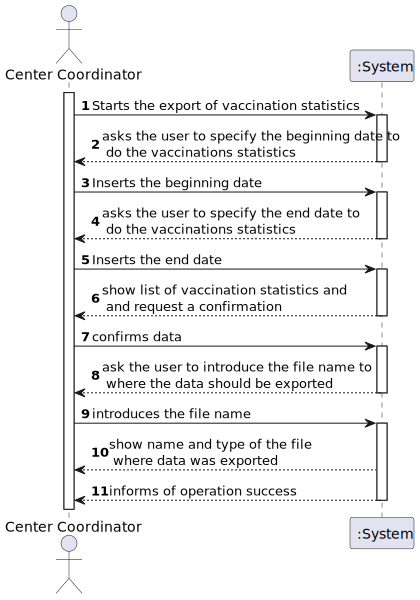
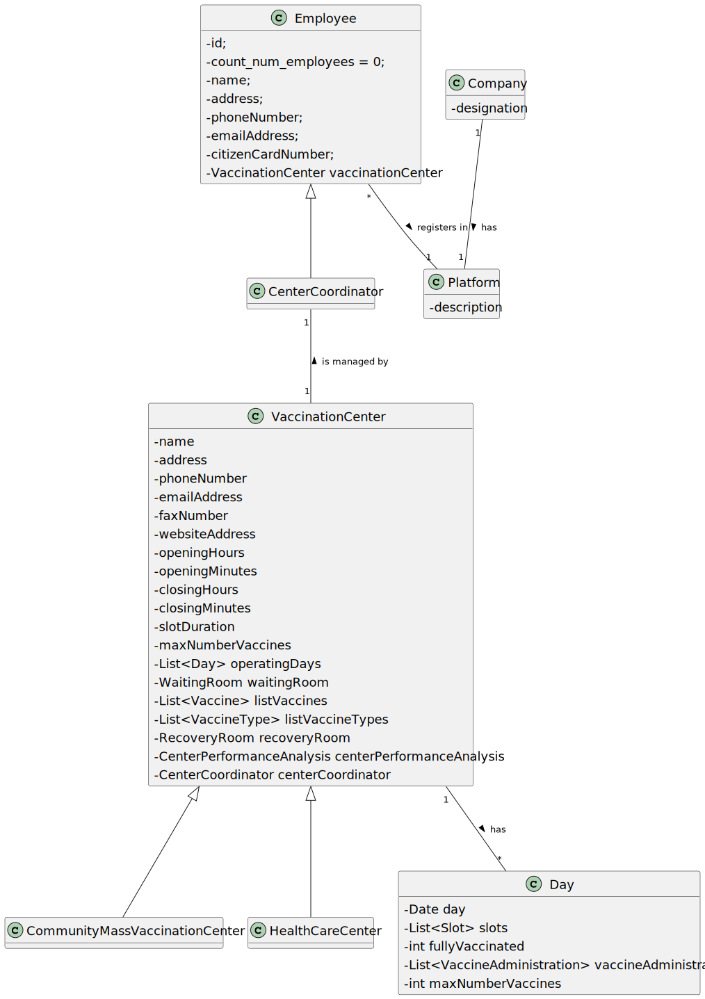
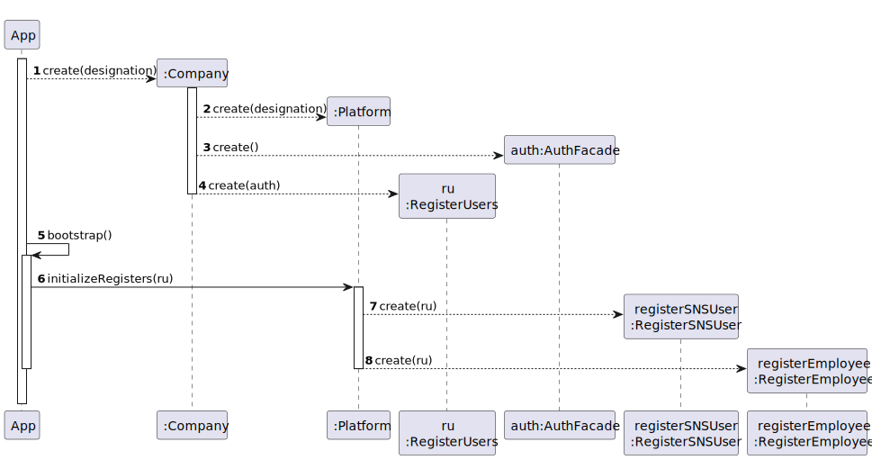
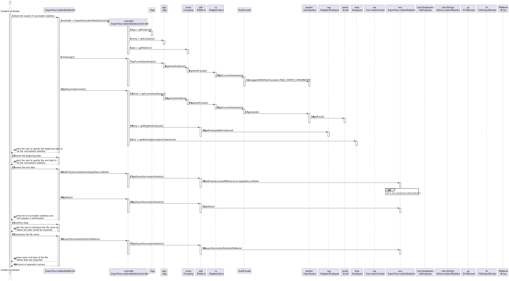
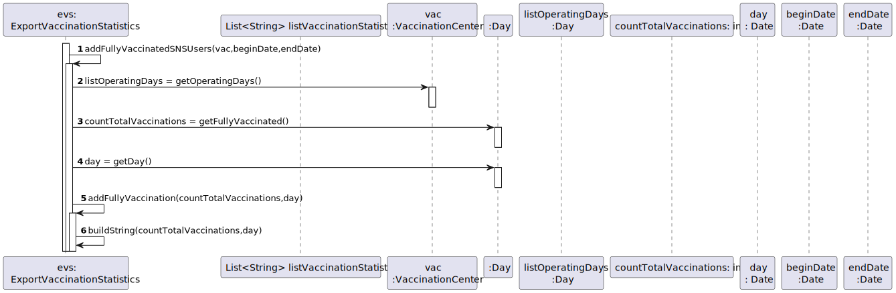
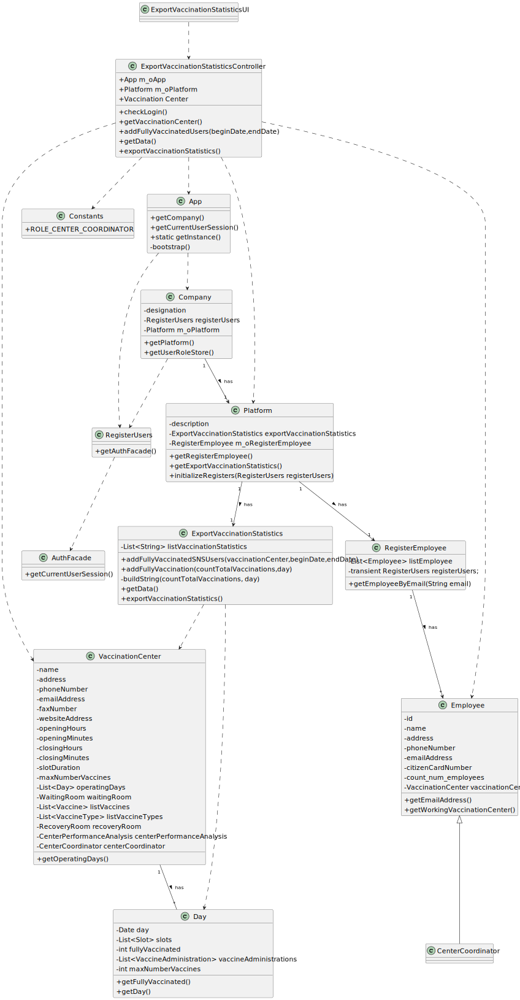

# US 015 - Export Vaccination Statistics 

## 1. Requirements Engineering

### 1.1. User Story Description

AS a center coordinator , I intend to check and export vaccination statistics. I want to export , to a csv file, the total number of fully vaccinated users per day.

### 1.2. Customer Specifications and Clarifications 

**From the specifications document:**

>"The Center Coordinator wants to monitor the vaccination process, to see statistics and charts, to evaluate the performance of the vaccination process"	 

**From the client clarifications:**

> **Question:** Is the exportation of the CSV file that contains the total number of fully vaccinated users per day, the only feature that needs to be implemented in code, for US15? 
>  
> **Answer:** Yes
> 
> **Question:** Do you want us to show the full vaccinated users in each individual day, or should we show the continuous sum of fully vaccinated users?
>
> **Answer:** In a previous answer, the client specified the format of the data: "day, number of fully vaccinated". The client wants the total of fully vaccinated users per day.
> 
> **Question:** On this US we only have to do a functionality that creates a csv file with the vaccination statistics right?
>
> **Answer:**  I already answered this question. The center coordinator wants to check the statistics in the application and should be able to export to a CSV file.
> 
> **Question:** What do you mean by "check statistics"? Are they supposed to appear on the terminal or console?
>
> **Answer:** I already answered this question. The center coordinator wants to check the statistics in the application and should be able to export to a CSV file.
> 
> **Question:** Which "vaccination statistics" are you referring to?
>
> **Answer:** The application should be used to check the total number of fully vaccinated users per day in the vaccination center that the center coordinator coordinates. Please draw appropriate charts.
> 
> **Question:** In a previous answer you said "Data format: date; number of fully vaccinated user.". So our question is: -> Should we group all sns users fully vaccinated per day of different vaccine types into a total number of that day? Or should we divide the number by vaccine types?
>
> **Answer:** The output data should be the date and the number of fully vaccinated users.
> 
> **Question:** I want to know what you mean about fully vaccinated, it is a person who have taken all the doses that are defined for a specific vaccine?
>
> **Answer:** I already answered this question, please pay more attention to client answers. Again, an SNS user is fully vaccinated when he receives all doses of a given vaccine. An SNS user that has received a single-dose vaccine is considered fully vaccinated and will not take more doses.
>
> **Question:** In this US should the Center Coordinator check and export the Vaccination Statistics of the Center where he/she works at or should just check and export the Vaccination Statistics of all centers?
>
> **Answer:** The center coordinator can only export statistics from the vaccination center that he coordinates.
> 
> **Question:** When exporting vaccination statistics,do we export the data from all days available in the system or does the center coordinator chooses the time interval?
>
> **Answer:** The user should define a time interval (two dates).
> 
> **Question:** Is there any kind of format our exported data should follow?
>
> **Answer:** Data format: date; number of fully vaccinated user.
> 
> **Question:** Should the user introduce the name of the file intended to export the vaccination statistics ?
>
> **Answer:** The user should introduce the name of the file.

### 1.3. Acceptance Criteria

* **AC1:** A SNS user needs to be fully vaccinated
* **AC2:** To generate the statistics report a count of fully vaccinated users per day needs to exist

### 1.4. Found out Dependencies

* There is a dependency to "US8 Record the Administration of a vaccine to an SNS user" since at least a vaccine needs to be administrated soo we can generate reports.

### 1.5 Input and Output Data

**Input Data:**

* Typed data:
    * beginning date to do the vaccination statistics
    * end date to do the vaccination statistics
    * file name where the data will be exported
	
* Selected data:
	* Confirming the data presented to the user 

**Output Data:**

* List with the total number of SNS users fully vaccinated per day
* Name of the file where the data was exported to
* (In)Success of the operation

### 1.6. System Sequence Diagram (SSD)

**Alternative 1**

**Other alternatives might exist.**

### 1.7 Other Relevant Remarks

* Files can only be of type CSV

## 2. OO Analysis

### 2.1. Relevant Domain Model Excerpt 

### 2.2. Other Remarks

n/a

## 3. Design - User Story Realization 

### 3.1. Rationale

**SSD - Alternative 1 is adopted.**

| Interaction ID | Question: Which class is responsible for...                                   | Answer                                | Justification (with patterns)                                                                                                                          |
|:---------------|:------------------------------------------------------------------------------|:--------------------------------------|:-------------------------------------------------------------------------------------------------------------------------------------------------------|
| Step 1  		     | 	... interacting with the actor?                                              | ExportVaccinationStatisticsUI         | Pure Fabrication: there is no reason to assign this responsibility to any existing class in the Domain Model.                                          |
| 			  		        | 	... coordinating the US?                                                     | ExportVaccinationStatisticsController | Controller                                                                                                                                             |
| 						         | ...knowing the app instance?                                                  | App                                   | Creator(Rule 3): App closely uses Singleton                                                                                                            |
|                | ...knowing the company?                                                       | App	                                  | Creator(Rule 4): App has the data used to initialize Company                                                                                           |
| 	              | ...knowing the platform?                                                      | Company                               | Creator(Rule 4): Company has the data used to initialize Platform                                                                                      |
| 			  		        | ... knowing the user using the system?                                        | UserSession                           | IE: cf. A&A component documentation                                                                                                                    |
| 			  		        | 	... knowing  the user role?                                                  | UserSession                           | IE: cf. A&A component documentation                                                                                                                    |
| 			  		        | 	... knowing to which company the user belongs to?                            | App                                   | IE: has registered the user sessions                                                                                                                   |
| 			            | ...knowing the email of the user that is logged?                              | UserSession                           | IE: cf. A&A component documentation.                                                                                                                   |	
|                | ...getting the register (list) of Employees?                                  | Platform                              | 	IE: in the DM Platform is responsible for all the registers                                                                                           |
|                |                                                                               | RegisterEmployee                      | 	HC + LC: knows/has its own Employees                                                                                                                  |
| 	 			          | ...knowing the email of the Employee?                                         | Employee                              | IE: knows its own data.                                                                                                                                |                                 
|                | ...getting the vaccination center where the employee works at?                | Employee                              | IE: knows its own data.                                                                                                                                | 
| 	Step 2        |                                                                               |                                       |                                                                                                                                                        |
| Step 3         | ...holds temporarily the begining date to do the statistics?                  | ExportVaccinationStatisticsUI         | IE: Holding on temporarily the date inputed before passing it, after asking for the end date to do the statistics                                      |
| Step 4         |                                                                               |                                       |                                                                                                                                                        |
| Step 5         | ...holds temporarily the end date to do the statistics?                       | ExportVaccinationStatisticsUI         | IE: Holding on temporarily the date inputed before passing it, now passes both dates                                                                   |
|                | ...getting the list of vaccination statistics?                                | Platform                              | IE: in the DM Platform is responsible for all the registers                                                                                            |
|                | ...knowing the list of vaccination statistics?                                | ExportVaccinationStatistics           | HC + LC: knows/has its own vaccination statistics                                                                                                      |
| 	              | ...add fully vaccinated users?                                                | ExportVaccinationStatistics           | HC + LC: knows/has its own list of vaccination statistics                                                                                              |
|                | ...knowing the list of operating days?                                        | VaccinationCenter                     | HC + LC: knows/has its own list of days                                                                                                                |
|                | ...knowing the count of fully vaccinated users in a specific day?             | Day                                   | IE: knows its own data                                                                                                                                 |
|                | ...knowing the day(date) in analysis ?                                        | Day                                   | IE: knows its own data                                                                                                                                 |
|                | ...build a string with the count of fully vaccinated users in a specific day? | ExportVaccinationStatistics           | IE: knows its own data                                                                                                                                 |
|                | ...add the count and day(date) to the list of vaccination statistics?         | ExportVaccinationStatistics           | IE: knows its own data                                                                                                                                 |
| Step 6         | ...showing the data before saving it in a csv file?                           | ExportVaccinationStatisticsUI         | IE: is responsible for showing the user the data that will be saved in the csv file                                                                    |
| Step 7         |                                                                               |                                       |                                                                               |
| Step 8         | ...holds temporarily the file name to do the statistics?                      | ExportVaccinationStatisticsUI         |IE: holding on temporarily the file name before passing it |
| Step 9         | ...export data to csv file?                                                   | ExportVaccinationStatistics           | HC + LC: knows/has its own list of vaccination statistics                                                                                              |
|                | 	                                                                             | PrintStream                           | IE:A PrintStream adds functionality to another output stream, namely the ability to print representations of various data values conveniently          |
|                |                                                                               | FileOutputStream                      | IE:Creates a file output stream to write to the file with the specified name. A new FileDescriptor object is created to represent this file connection |
| Step 10        | ...showing the file name?                                                     | ExportVaccinationStatisticsUI         | IE: is responsible for user interactions                                                                                                               |
| Step 11         | ...informing operation success?                                               | ExportVaccinationStatisticsUI         | IE: is responsible for user interactions                                                                                                               |

temporarily 

### Systematization ##

According to the taken rationale, the conceptual classes promoted to software classes are: 

* Company
* Platform
* Employee
* CenterCoordinator
* VaccinationCenter
* Day
* CommunityMassVaccinationCenter
* HealthCareCenter

Other software classes (i.e. Pure Fabrication) identified: 

* ExportVaccinationStatisticsUI
* ExportVaccinationStatisticsController
* ExportVaccinationStatistics
* RegisterEmployee
* RegisterUsers
* Constants

Other classes off the system:

* UserSession
* App
* AuthFacade
* User

External classes:

* PrintStream
* FileOutputStream

## 3.2. Sequence Diagram (SD)

## 3.3. Class Diagram (CD)

# 4. Tests 

**Test 1:** Check that the login is with a user that as the role of Center Coordinator

    App m_oApp = App.getInstance();
    ExportVaccinationStatisticsController controller = new ExportVaccinationStatisticsController();

    @Test
    void testCheckLogin() {
        m_oApp.doLogin("centercoordinator@lei.sem2.pt","123456");
        Assertions.assertEquals(true,controller.checkLogin());
        m_oApp.doLogout();
    }

**Test 2:** Check that the CenterCoordinator works in a specific VaccinationCenter

    @Test
    void getVaccinationCenter() {
        m_oApp.doLogin("centercoordinator@lei.sem2.pt","123456");
        Employee emp = m_oApp.getCompany().getPlatform().getRegisterEmployee().newEmployee("quim","rua","931093109","centercoordinator@lei.sem2.pt","15902210",1);
        m_oApp.getCompany().getPlatform().getRegisterEmployee().registerEmployee(emp);
        VaccinationCenter vac = m_oApp.getCompany().getPlatform().getRegisterVaccinationCenter().getVaccinationCenter("vaccinationcenterLAPR2@gmail.com");
        vac.setManageVaccinationCenter((CenterCoordinator) emp);
        emp.setWorkingVaccinationCenter(vac);

        controller.getVaccinationCenter();
        Assertions.assertEquals(true,controller.getVaccinationCenter());
        m_oApp.doLogout();
    }

**Test 3:** Check that is possible to add fully vaccinated users

    
    @Test
    void addFullyVaccinatedUsers() {
        SimpleDateFormat df = new SimpleDateFormat("dd-MM-yyyy");
        String strDate = "10-06-2022";
        String strDate1 = "30-07-2022";

        try {
            Date date = df.parse(strDate);
            Date date1 = df.parse(strDate1);

            m_oApp.doLogin("centercoordinator@lei.sem2.pt","123456");
            Employee emp = m_oApp.getCompany().getPlatform().getRegisterEmployee().newEmployee("quim","rua","931093109","centercoordinator@lei.sem2.pt","15902210",1);
            m_oApp.getCompany().getPlatform().getRegisterEmployee().registerEmployee(emp);
            VaccinationCenter vac = m_oApp.getCompany().getPlatform().getRegisterVaccinationCenter().getVaccinationCenter("vaccinationcenterLAPR2@gmail.com");
            vac.setManageVaccinationCenter((CenterCoordinator) emp);
            emp.setWorkingVaccinationCenter(vac);

            controller.getVaccinationCenter();
            controller.addFullyVaccinatedUsers(date,date1);
            Assertions.assertEquals(true,controller.addFullyVaccinatedUsers(date,date1));
            m_oApp.doLogout();

        } catch (ParseException e) {
            e.printStackTrace();
        }

    }

**Test 4:** Check that is possible to export data to a specific file

    @Test
    void testExportVaccinationStatistics() {
        ExportVaccinationStatisticsController evsc = new ExportVaccinationStatisticsController();
        boolean result = true;

        assertEquals(result,evsc.exportVaccinationStatistics("VaccinationStatistics.csv"));
    }

# 5. Construction (Implementation)

## Class ExportVaccinationStatisticsUI 

	public class ExportVaccinationStatisticsUI implements Runnable{

    private ExportVaccinationStatisticsController m_controller;

    public ExportVaccinationStatisticsUI(){
        m_controller = new ExportVaccinationStatisticsController();
    }

    public void run() {

        System.out.println("Export Vaccination Statistics");

        if (!m_controller.checkLogin()) {
            System.out.println(MessageBundle.getString("unauthorizeduser"));
            return;
        }

        if(m_controller.getVaccinationCenter())
        {

            Object beginDate = Utils.readDateFromConsole("Specify the begin date to do the vaccination statistics");
            Object endDate = Utils.readDateFromConsole("Specify the end date to do the vaccination statistics");

           if(m_controller.addFullyVaccinatedUsers((Date) beginDate,(Date) endDate))
           {
               for (String s : m_controller.getData())
                   System.out.println(s);

               if (Utils.confirm(MessageBundle.getString("confirmdata") + " (S/N)")) {

                   String fileName = Utils.readLineFromConsole("Introduce the file name(ex:VaccinationStatistics.csv):");
                   boolean success = m_controller.exportVaccinationStatistics(fileName);

                   if (success) {
                       System.out.println(MessageBundle.getString("fileexportedto") + fileName);
                       System.out.println(MessageBundle.getString("operationsucessful"));
                   } else {
                       System.out.println(MessageBundle.getString("errorexporting"));
                   }
               } else
                   run();
           }else
               run();

        }else
        {
            System.out.println("null vaccination center");
            run();
        }

    	}
	}

## Class ExportVaccinationStatisticsController

	public class ExportVaccinationStatisticsController {

	private App m_oApp;
    private Platform m_oPlatform;
    private VaccinationCenter vaccinationCenter;

    public ExportVaccinationStatisticsController(){
        this.m_oApp = App.getInstance();
        this.m_oPlatform = m_oApp.getCompany().getPlatform();
    }

    public boolean checkLogin() {
        return m_oApp.getCurrentUserSession().isLoggedInWithRole(Constants.ROLE_CENTER_COORDINATOR);
    }

    public boolean getVaccinationCenter()
    {
        try{
            Employee emp =  this.m_oPlatform.getRegisterEmployee().getEmployeeByEmail(m_oApp.getCurrentUserSession().getUserId().getEmail());
            this.vaccinationCenter = emp.getWorkingVaccinationCenter();

        }catch (NullPointerException ex)
        {
            System.out.println("null vaccination center or null employee");
            return false;
        }

        return true;
    }

    public boolean addFullyVaccinatedUsers(Date beginDate, Date endDate)
    {

        try {
            this.m_oPlatform.getExportVaccinationStatistics().addFullyVaccinatedSNSUsers(this.vaccinationCenter,beginDate,endDate);
        }catch (NullPointerException ex)
        {
            System.out.println(ex.getMessage());
        }

        return true;
    }

    public List<String> getData()
    {
         return this.m_oPlatform.getExportVaccinationStatistics().getData();
    }

    public boolean exportVaccinationStatistics(String fileName)
    {
        return this.m_oPlatform.getExportVaccinationStatistics().exportVaccinationStatistics(fileName);
    }

	}

## Class ExportVaccinationStatistics

	public class ExportVaccinationStatistics implements Serializable {

    private List<String> listVaccinationStatistics;
    

    public ExportVaccinationStatistics()
    {
        this.listVaccinationStatistics = new ArrayList<>();
    }

    public void addFullyVaccinatedSNSUsers(VaccinationCenter vaccinationCenter, Date beginDate, Date endDate) {
        List<String> listVaccinationStatistics = new ArrayList<>();
        List<Day> operatingDays = vaccinationCenter.getOperatingDays();

        for(Day day : operatingDays)
        {
            if(beginDate.getTime() <= day.getDay().getTime() && day.getDay().getTime() <= endDate.getTime())
                addFullyVaccination(day.getFullyVaccinated(),day.getDay());
        }

    }

    public boolean addFullyVaccination(int countTotalVaccinations, Date day)
    {
        return this.listVaccinationStatistics.add(buildString(countTotalVaccinations,day));
    }

    private String buildString(int countTotalVaccinations, Date day)
    {
        return "Total vaccinated people=" + countTotalVaccinations + " in day " + day;
    }

    public boolean exportVaccinationStatistics(String fileName){
        try (PrintStream out = new PrintStream(new FileOutputStream(fileName))) {
            for (String s : listVaccinationStatistics){
                out.println(s);
            }
            return true;
        } catch (FileNotFoundException e) {
            return false;
        }

    }

    public List<String> getData()
    {
        List<String> list = new ArrayList<>();
        for(String fullyVaccinated: listVaccinationStatistics)
        {
            list.add(fullyVaccinated);
        }
        return list;
    }

}

## Class Company

	public class Company implements Serializable {

    private String designation;
    private RegisterUsers registerUsers;
    private Platform m_oPlatform;

    public Company(String designation)
    {
        if (StringUtils.isBlank(designation))
            throw new IllegalArgumentException(MessageBundle.getString("designationcannotbeblank"));

        this.designation = designation;
        this.m_oPlatform = new Platform(MessageBundle.getString("registersplatform"));
        this.registerUsers = new RegisterUsers(new AuthFacade());

    }

    public String getDesignation() {return designation;}
    public Platform getPlatform(){return m_oPlatform;}
    public RegisterUsers getUserRoleStore() {return registerUsers;}

}

## Class Platform

	///...omitted
    private final ExportVaccinationStatistics exportVaccinationStatistics;
    private String description;
    private RegisterEmployee m_oRegisterEmployee;
    private RegisterSNSUser m_oRegisterSNSUser;

    public Platform(String description) {
        if((description == null) || (description.isEmpty()))
            throw new IllegalArgumentException(MessageBundle.getString("argumentcantbenull"));

        this.description = description;

		///...omitted

        this.exportVaccinationStatistics = new ExportVaccinationStatistics();

    }

	public RegisterEmployee getRegisterEmployee(){return this.m_oRegisterEmployee;}
	public ExportVaccinationStatistics getExportVaccinationStatistics(){ return this.exportVaccinationStatistics; }

	public void initializeRegisters(RegisterUsers registerUsers) {
       
		///...omitted
        this.m_oRegisterEmployee = new RegisterEmployee(registerUsers);
		///...omitted
    }

## Class Constants

	///...omitted
	public static final String ROLE_CENTER_COORDINATOR = "CENTER COORDINATOR";
	///...omitted

## Class RegisterEmployee

	///...omitted
	public Employee getEmployeeByEmail(String email)
    {
        for(Employee emp : listEmployee)
            if(emp.getEmailAddress().compareTo(email) == 0)
                return emp;

        return null;
    }
	///...omitted

## Class Employee

	///...omitted
	public VaccinationCenter getWorkingVaccinationCenter()
    {
        return vaccinationCenter;
    }
	///...omitted

## Class VaccinationCenter

	///...omitted

	private List<Day> operatingDays;
	public List<Day> getOperatingDays(){return this.operatingDays;}

	///...omitted

## Class Day
	
	///...omitted

	public int getFullyVaccinated(){
        return fullyVaccinated;
    }

    public Date getDay()
    {
        return this.day;
    }

	

# 6. Integration and Demo 

* A new option on the CenterCoordinator menu options was added.

* Some demo purposes some tasks are bootstrapped while system starts.

# 7. Observations

