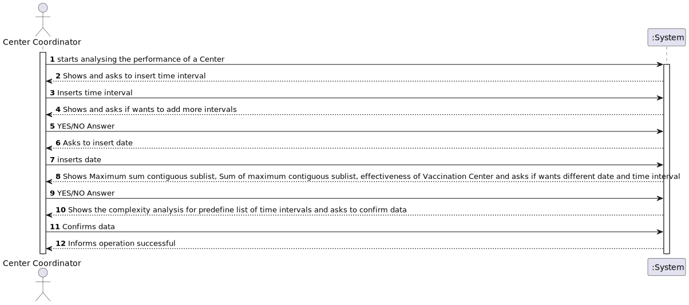
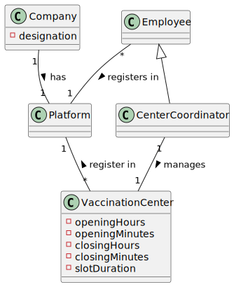
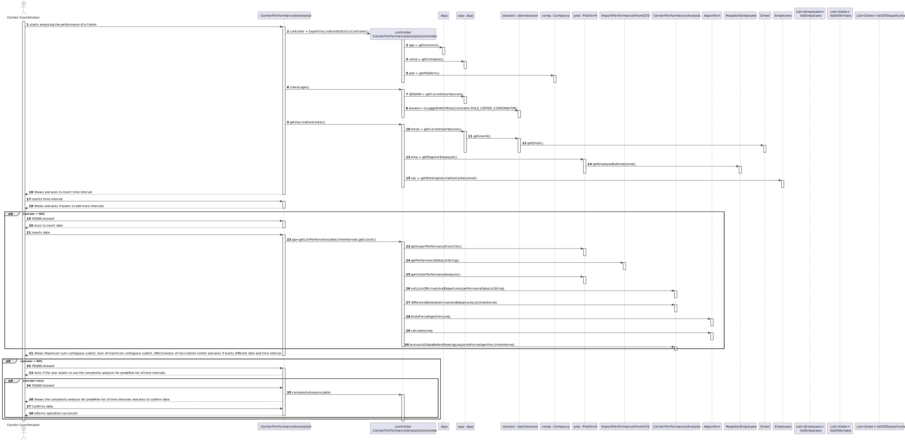
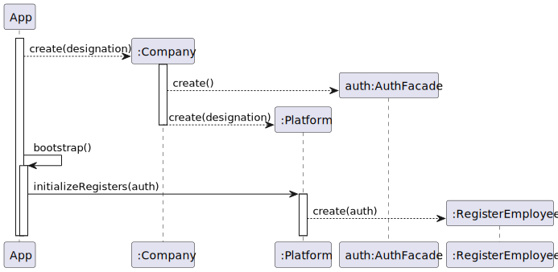
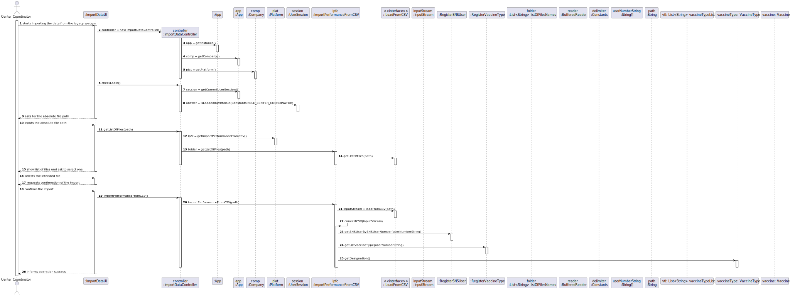
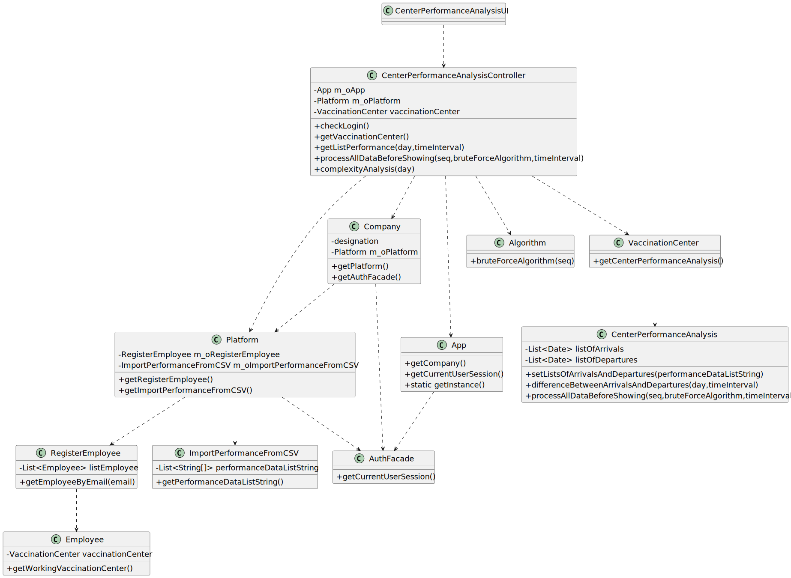

# US 16 - Analyze Performance of a Vaccination Center

## 1. Requirements Engineering

### 1.1. User Story Description

* As a center coordinator, I intend to analyze the performance of a center.

### 1.2. Customer Specifications and Clarifications 

> **Question:** "From the Sprint D requirements it is possible to understand that we ought to implement a procedure that creates a list with the differences between the number of new clients arriving and the number of leaving clients for each time interval. My question then is, should this list strictly data from the legacy system (csv file from moodle which is loaded in US17), or should it also include data from our system?"
>
> **Answer:** US 16 is for all the data that exists in the system.

> **Question:** "In US 16, should the coordinator have the option to choose which algorithm to run (e.g. via a configuration file or while running the application) in order to determine the goal sublist, or is the Benchmark Algorithm strictly for drawing comparisons with the Bruteforce one?"
>
> **Answer**: The algorithm to run should be defined in a configuration file.

> **Question:** "I would like to ask that if to analyse the performance of a center, we can assume (as a pre requirement) that the center coordinator was already attributed to a specific vaccination center and proceed with the US as so (like the center coordinator does not have to choose at a certain point where he is working. This is already treated before this US happens). Could you clarify this?"
>
> **Answer:** A center coordinator can only coordinate one vaccination center. The center coordinator can only analyze the performance of the center that he coordinates. 

> **Question:** "I would like to know if we could strict the user to pick only those intervals (m) (i.e. 1, 5, 10, 20, 30) as options for analyzing the performance of a center, since picking intervals is dependent on the list which is 720/m (which the length is an integer result). If we let the user pick an interval that results in a non-integer result, this will result in an invalid list since some data for the performance analysis will be lost. Can you provide a clarification on this situation?"
>
> **Answer:** The user can introduce any interval value. The system should validate the interval value introduced by the user. 

### 1.3. Acceptance Criteria

* **AC1:** This US should implement a procedure that, for a specific day, and time intervals of *m* minutes (for m = 30, 20, 10, 5 and 1, for example) chosen by the center coordinator, creates a list of length 720/*m* (lists of length 24, 36, 72, 144, 720, respectively).
* **AC2:** A brute-force algorithm to determine the contiguous sublist with maximum sum should be implemented.
* **AC3:** The performance analysis should be documented in the user manual.

### 1.4. Found out Dependencies

* There is a dependency to class "UserSession", when we check if the current user session is with a user with role "CenterCoordinator".
* This US needs the imported data from past legacy systems such as performance data and SNS Users data.

### 1.5 Input and Output Data

**Input Data:**
* Typed data:
    * N/A

* Selected Data:
  * Specifying a file to load
  * Option selection
  
**Output Data:**

* Confirmation requests
* (In)Success of the operation
* Inputted data
* Maximum sum contiguous sublist
* Shows the vaccination center's effectiveness

### 1.6. System Sequence Diagram (SSD)

*Insert here a SSD depicting the envisioned Actor-System interactions and throughout which data is inputted and outputted to fulfill the requirement. All interactions must be numbered.*

### 1.7 Other Relevant Remarks

* Files can only be of type CSV

## 2. OO Analysis

### 2.1. Relevant Domain Model Excerpt 
*In this section, it is suggested to present an excerpt of the domain model that is seen as relevant to fulfill this requirement.* 

### 2.2. Other Remarks

N/A

## 3. Design - User Story Realization 

### 3.1. Rationale

**Alternative 1 is chosen**

| Interaction ID                     | Question: Which class is responsible for...                                                       | Answer                              | Justification (with patterns)                                                                                                         |
|:-----------------------------------|:--------------------------------------------------------------------------------------------------|:------------------------------------|:--------------------------------------------------------------------------------------------------------------------------------------|
| Step 1  	                          | ... interacting with the actor?                                                                   | ImportDataUI                        | Pure Fabrication: there is no reason to assign this responsibility to any existing class in the Domain Model.                         |
| 	                                  | ... coordinating the US?                                                                          | ImportDataController                | Controller                                                                                                                            |
| 	                                  | ... knowing the app instance?                                                                     | App                                 | Creator(Rule 3): App closely uses Singleton                                                                                           |
|                                    | ... knowing the company?                                                                          | App	                                | Creator(Rule 4): App has the data used to initialize Company                                                                          |
| 	                                  | ... knowing the platform?                                                                         | Company                             | Creator(Rule 4): Company has the data used to initialize Platform                                                                     |
| 	                                  | ... knowing the user using the system?                                                            | UserSession                         | IE: cf. A&A component documentation.                                                                                                  |
| 	                                  | ... knowing  the user role?                                                                       | UserSession                         | IE: cf. A&A component documentation.                                                                                                  |
| 	                                  | ... knowing to which company the user belongs to?                                                 | App                                 | IE: has registered the user sessions                                                                                                  |
| Step 2  	                          |                                                                                                   |                                     |                                                                                                                                       |
| Step 3  	                          | ... knowing the path to the files?                                                                | ImportDataUI                        | IE: its responsible for user interactions.Admin should right the path to the were the files are stored                                |
| 	                                  | ... getting the register(list) of Performance Data?                                               | Platform                            | IE:  in the DM Platform is responsible for all the registers                                                                          |
| 	                                  | ...getting the loader(class that processes data imported) of Performance data?                    | Platform                            | IE:  in the DM Platform is responsible for all the registers                                                                          |
| 	                                  |                                                                                                   | ImportPerformanceFromCSV            | HC + LC: knows/has its own list of Performance Data(stored as a list of string arrays)                                                |
|                                    | ....knowing the list of files to show?                                                            | LoadFromCSV                         | Protected Variation: its the responsibility of interface LoadFromCSV to load any type of CSV file                                     |
| Step 4  	                          |                                                                                                   |                                     |                                                                                                                                       |
| Step 5                             | ... holds temporarily the select file?                                                            | ImportDataUI                        | IE : Holding on temporarily the file select before passing it. Passing it after asking for confirmation to import the select CSV file |
| Step 6  	                          |                                                                                                   |                                     |                                                                                                                                       |              
| Step 7                             | ... import file from csv?                                                                         | LoadFromCSV                         | Protected Variation: its the responsibility of interface LoadFromCSV to load any type of CSV file                                     |
| 	                                  |                                                                                                   | InputStream                         | IE: This abstract class is the superclass of all classes representing an input stream of bytes.                                       |	
|                                    | ... converting CSV inputStream(process the data imported from csv)?                               | ImportPerformanceFromCSV            | IE: its the responsibility off this class to process the data imported from the CSV                                                   |
|                                    | ... knowing the string delimiter?                                                                 | Constants                           | HC + LC : knows/has its own data.                                                                                                     |
|                                    | ... read the lines from the BufferedReader(using delimiter to split line) ?                       | ImportPerformanceFromCSV            | IE:  its responsible for processing the data.                                                                                         |
|                                    | ... add the lines read to a list of string array?                                                 | ImportPerformanceFromCSV            | HC + LC: knows/has its own data.                                                                                                      |
|                                    | ... showing the data inside the list of string array?(list of Performance Data imported from CSV) | ImportPerformanceFromCSV            | HC + LC: knows its own data.                                                                                                          |
| Step 8                             | ... informing operation success?                                                                  | ImportDataUI                        | IE: is responsible for user interactions                                                                                              |
| Step 9  	                          | ...	interacting with the user?                                                                    | CenterPerformanceAnalysisUI         | Pure Fabrication: there is no reason to assign this responsibility to any existing class in the Domain Model.                         |
|                                    | ... coordinating the Center's performance analysis?                                               | CenterPerformanceAnalysisController | Controller                                                                                                                            |
|                                    | ... knowing the app instance?                                                                     | App                                 | Creator (rule 3): App closely uses Singleton.                                                                                         |
|                                    | ... knowing the company?                                                                          | App                                 | Creator (rule 4): App has the data used to initialize Company.                                                                        |
|                                    | ... knowing the platform?                                                                         | Company                             | Creator (rule 4): Company has the data used to initialize PLatform.                                                                   |
| 	                                  | ...	knowing the user using the system?                                                            | UserSession                         | IE: cf. A&A component documentation.                                                                                                  |
| 	                                  | ...	knowing the user role?                                                                        | UserSession                         | IE: cf. A&A component documentation.                                                                                                  |
|                                    | ... knowing to which company the user belongs to?                                                 | App                                 | IE: has registered the user sessions.                                                                                                 |
| Step 10 (CreatingRegisterEmployee) | ... knowing the app instance?                                                                     | App                                 | Creator (rule 3): App closely uses Singleton.                                                                                         |
|                                    | ... knowing the company?                                                                          | App                                 | Creator (rule 4): App has the data used to initialize Company.                                                                        |
|                                    | ... knowing the platform?                                                                         | Company                             | Creator (rule 4): Company has the data used to initialize PLatform.                                                                   |
|                                    | ... interacting with the Platform?                                                                | AuthFacade                          | Pure Fabrication: there is no reason to assign this responsibility to any existing class in the Domain Model.                         |
| Step 11 (CreatingRegisterEmployee) | ... instantiating a new Employee?                                                                 | RegisterEmployee                    | Creator (rule 1): in the DM Platform registers Employees.                                                                             |
|                                    | ... saving the employee data?                                                                     | Employee                            | IE: object created in step 2 has its own data.                                                                                        |
| Step 12                            | ... knowing the working VaccinationCenter?                                                        | Employee                            | HC + LC: knows its own working VaccinationCenter.                                                                                     |
| Step 13  	                         | 	                                                                                                 |                                     |                                                                                                                                       |
| Step 14                            | ... holds temporarily the time interval?                                                          | CenterPerformanceAnalysisUI         | IE : Holds temporarily the time interval before passing it to the Controller.                                                         |
| Step 15  	                         | 	                                                                                                 |                                     |                                                                                                                                       |
| Step 16  	                         | ... knowing the analyzer (class that processes data imported) of performance?                     | Platform                            | IE: In the DM, Platform is responsible for all the analyzers.                                                                         |
|                                    |                                                                                                   | ImportPerformanceFromCSV            | HC + LC: knows/has its own list of performance data (stored as a list of string arrays).                                              |
| 	                                  | ... analyzing the imported data?                                                                  | CenterPerformanceAnalysis           | IE: knows about the Center's performance.                                                                                             |
|                                    | ... knowing the brute force algorithm?                                                            | Platform                            | IE: In the DM, Platform is responsible for all the algorithms.                                                                        |
|                                    | ... calculate the difference between the arrival time and the leaving time?                       | Algorithm                           | HC + LC: BruteForceAlgorithm is responsible for the necessary calculations.                                                           |
|                                    | ... processing the input data?                                                                    | CenterPerformanceAnalysis           | HC + LC: CenterPerformanceAlgorithm is responsible for handling the preocessed input data.                                            |
| Step 17                            | 	                                                                                                 |                                     |                                                                                                                                       |
| Step 18 	                          | ... analyzing the worst-case time complexity?                                                     | CenterPerformanceAnalysisController | IE: knows the analyzed information.                                                                                                   |
| Step 19                            | ... showing the worst-case time complexity?                                                       | CenterPerformanceAnalysisUI         | IE: is responsible for user inetraction.                                                                                              |
| Step 20                            | ... informing the operation's success?                                                            | CenterPerformanceAnalysisUI         | IE: is responsible for user interactions.                                                                                             |  

### Systematization ##

According to the taken rationale, the conceptual classes promoted to software classes are: 

 * App
 * Platform
 * Company
 * CenterCoordinator
 * VaccinationCenter
 * Employee
 * UserSession

Other software classes (i.e. Pure Fabrication) identified: 
 * AuthFacade
 * CenterPerformanceAnalysisUI  
 * CenterPerformanceAnalysisController
 * CenterPerformanceAnalysis
 * BruteForceAlgorithm
 * RegisterEmployee

## 3.2. Sequence Diagram (SD)

**Alternative 1**

**Other alternatives might exist**

## 3.3. Class Diagram (CD)

*In this section, it is suggested to present an UML static view representing the main domain related software classes that are involved in fulfilling the requirement as well as and their relations, attributes and methods.*

# 4. Tests 
*In this section, it is suggested to systematize how the tests were designed to allow a correct measurement of requirements fulfilling.* 

**_DO NOT COPY ALL DEVELOPED TESTS HERE_**
**Test 1:** Check that the login is with a user that as the role of Center Coordinator

     @Test
    void checkLogin() {
        m_oApp.doLogin("centercoordinator@lei.sem2.pt","123456");
        Assertions.assertEquals(true,controller.checkLogin());
        m_oApp.doLogout();
    }

**Test 2:** Check that the CenterCoordinator works in a specific VaccinationCenter

    @Test
    void getVaccinationCenter() {
        m_oApp.doLogin("centercoordinator@lei.sem2.pt","123456");
        Employee emp = m_oApp.getCompany().getPlatform().getRegisterEmployee().newEmployee("quim","rua","931093109","centercoordinator@lei.sem2.pt","15902210",1);
        m_oApp.getCompany().getPlatform().getRegisterEmployee().registerEmployee(emp);
        VaccinationCenter vac = m_oApp.getCompany().getPlatform().getRegisterVaccinationCenter().getVaccinationCenter("vaccinationcenterLAPR2@gmail.com");
        vac.setManageVaccinationCenter((CenterCoordinator) emp);
        emp.setWorkingVaccinationCenter(vac);

        controller.getVaccinationCenter();
        Assertions.assertEquals(true,controller.getVaccinationCenter());
        m_oApp.doLogout();
    }

*It is also recommended to organize this content by subsections.* 

# 5. Construction (Implementation)

##Class CenterPerformanceAnalysisController

    public class CenterPerformanceAnalysisController {

    private App m_oApp;

    private Platform m_oPlatform;

    private VaccinationCenter vaccinationCenter;

    public CenterPerformanceAnalysisController(){
        this.m_oApp = App.getInstance();
        this.m_oPlatform = m_oApp.getCompany().getPlatform();
    }

    public boolean checkLogin() {
        return m_oApp.getCurrentUserSession().isLoggedInWithRole(Constants.ROLE_CENTER_COORDINATOR);
    }

    public boolean getVaccinationCenter()
    {
        try{
            Employee emp =  this.m_oPlatform.getRegisterEmployee().getEmployeeByEmail(m_oApp.getCurrentUserSession().getUserId().getEmail());
            this.vaccinationCenter = emp.getWorkingVaccinationCenter();

        }catch (NullPointerException ex)
        {
            System.out.println("null vaccination center or null employee");
            return false;
        }

        return true;
    }

    public String getListPerformance(Object day, int timeInterval)
    {
        Date d = (Date) day;

        List<String[]> performanceDataListString = this.m_oPlatform.getImportPerformanceFromCSV().getPerformanceDataListString();
        vaccinationCenter.getCenterPerformanceAnalysis().setListsOfArrivalsAndDepartures(performanceDataListString);
        int[] seq = vaccinationCenter.getCenterPerformanceAnalysis().differenceBetweenArrivalsAndDepartures(d,timeInterval);
        int[] bruteForceAlgorithm  = Algorithms.bruteForceAlgorithm(seq);

        return processAllDataBeforeShowing(seq,bruteForceAlgorithm,timeInterval);
    }

    public String processAllDataBeforeShowing(int[] seq,int[] bruteForceAlgorithm, int timeInterval)
    {
        return this.vaccinationCenter.getCenterPerformanceAnalysis().processAllDataBeforeShowing(seq,bruteForceAlgorithm,timeInterval);
    }

    public String complexityAnalysis(Object day)
    {
        Date d = (Date) day;

        List<Integer> timesIntervals = new ArrayList<>(){{
            add(24);
            add(36);
            add(72);
            add(144);
            add(720);
        }};

        String s = "";
        for(Integer timeInterval : timesIntervals)
        {
            int[] seq = this.vaccinationCenter.getCenterPerformanceAnalysis().differenceBetweenArrivalsAndDepartures(d,timeInterval);

            long start = System.nanoTime();
            int[] bruteForceAlgorithm  = Algorithms.bruteForceAlgorithm(seq);
            long end = System.nanoTime();
            s+=("For m=" +timeInterval +" Elapsed Time in nano seconds= "+ (end-start) ) + "\n";

        }
        return s;
    }
    }

##Class Company

    public class Company implements Serializable {

    private String designation;
    private RegisterUsers registerUsers;
    private Platform m_oPlatform;
    /**
     * Instantiates a new Company.
     *
     * @param designation the designation
     */
    public Company(String designation)
    {
        if (StringUtils.isBlank(designation))
            throw new IllegalArgumentException(MessageBundle.getString("designationcannotbeblank"));

        this.designation = designation;
        this.m_oPlatform = new Platform(MessageBundle.getString("registersplatform"));
        this.registerUsers = new RegisterUsers(new AuthFacade());

    }
    ///...omitted
    
    public Platform getPlatform(){return m_oPlatform;}
    ///...omitted
    }

##Class App

    public class App {

    private Company company;
    ///...ommited

    public Company getCompany()
    {
        return this.company;
    }

    public UserSession getCurrentUserSession()
    {
        return this.company.getUserRoleStore().getAuthFacade().getCurrentUserSession();
    }
    
    ///...ommited
    
    private static App singleton = null;
    public static App getInstance()
    {
        if(singleton == null)
        {
            synchronized(App.class)
            {
                singleton = new App();
            }
        }
        return singleton;
    }
    ///... ommited

    }
    
    
##Class Platform

    public class Platform implements Serializable {

    private final SMSNotifier smsNotifier;
    private final EmailNotifier emailNotifier;
    private final ExportVaccinationStatistics exportVaccinationStatistics;
    private String description;

    private RegisterEmployee m_oRegisterEmployee;
    private final RegisterVaccinationCenter m_oRegisterVaccinationCenter;
    private final RegisterVaccineType m_oRegisterVaccineType;
    private RegisterSNSUser m_oRegisterSNSUser;
    private LoadUsersFromCSV m_oLoadUsersFromCSV;
    private ImportPerformanceFromCSV m_oImportPerformanceFromCSV;

    ///... ommited
    public RegisterEmployee getRegisterEmployee(){return this.m_oRegisterEmployee;}
    ///... ommited

    public ImportPerformanceFromCSV getImportPerformanceFromCSV(){return this.m_oImportPerformanceFromCSV;}

    public void initializeRegisters(RegisterUsers registerUsers) {
        this.m_oRegisterSNSUser = new RegisterSNSUser(registerUsers);
        this.m_oRegisterEmployee = new RegisterEmployee(registerUsers);
        this.m_oLoadUsersFromCSV = new LoadUsersFromCSV(registerUsers,m_oRegisterSNSUser);
        this.m_oImportPerformanceFromCSV = new ImportPerformanceFromCSV(registerUsers,m_oRegisterSNSUser,m_oRegisterVaccineType);

    }

    }

##Class Algorithm
    public class Algorithms {
    ///... ommited
    public static int[] bruteForceAlgorithm(int[] seq)
    {
        //int[] example = new int[]{29, -32, -9, -25, 44, 12, -61, 51, -9, 44, 74, 4};
        int[] result = Max(seq);
        //System.out.println(Arrays.toString(result)); // should print [51, -9, 44, 74, 4]

        return result;
    }

    public static int[] Max(int[] seq) {
            int start = 0;
            int end = 0;
            int max = Integer.MIN_VALUE;
            int currentSum = 0;
            for (int i = 0; i < seq.length; i++) {
                for (int j = seq.length-1; j >= i; j--) {
                    for (int k = i; k <= j; k++) {
                        currentSum += seq[k];
                    }
                    if (currentSum > max) {
                        max = currentSum;
                        start = i;
                        end = j;
                    }
                    currentSum= 0;

                }
            }
            int[] arr = new int[2];
            arr[0] = start;
            arr[1] = end;
            return arr;
        }
      ///...ommited
    }

        
##Class VaccinationCenter
    public abstract class VaccinationCenter implements Serializable {
    ///... ommited
    public CenterPerformanceAnalysis getCenterPerformanceAnalysis()
    {
        return  this.centerPerformanceAnalysis;
    }
    ///... ommited
    }
##Class CenterPerformanceAnalysis
    
    public class CenterPerformanceAnalysis implements Serializable {

    private List<Date> listOfArrivals = new ArrayList<>();

    private List<Date> listOfDepartures = new ArrayList<>();
   
    public CenterPerformanceAnalysis()
    {
    }

        public void setListsOfArrivalsAndDepartures(List<String[]> performanceDataListString)
    {
        listOfArrivals.clear();
        listOfDepartures.clear();

        for(int i=0 ; i < performanceDataListString.size() ; i++)
        {
            String[] listElement = performanceDataListString.get(i);

            try
            {

                SimpleDateFormat format1 = new SimpleDateFormat("MM/dd/yyyy HH:mm");
                SimpleDateFormat format2 = new SimpleDateFormat("dd-MM-yyyy HH:mm");

                Date listElementArrivalTime = format1.parse(listElement[5]);
                format2.format(listElementArrivalTime);

                Date listElementLeavingTime = format1.parse(listElement[7]);
                format2.format(listElementLeavingTime);

                listOfArrivals.add(listElementArrivalTime);
                listOfDepartures.add(listElementLeavingTime);

            } catch (ParseException e)
            {
                System.out.println("Date invalid format");
                e.getMessage();
            }
        }
    }

    /**
     * Difference between arrivals and departures int [ ].
     *
     * @param day          the day
     * @param timeInterval the time interval
     * @return the int [ ]
     */
    public int[] differenceBetweenArrivalsAndDepartures(Date day , int timeInterval)
    {
        int[] diff = new int[720 / timeInterval];

        int[] arrivals = countArrivalsOrDeparturesInTimeInterval(day,timeInterval,listOfArrivals);
        int[] departures = countArrivalsOrDeparturesInTimeInterval(day,timeInterval,listOfDepartures);

        for(int i = 0 ; i < diff.length; i++)
        {
            diff[i] = arrivals[i] - departures[i];
        }

         return diff;
    }

    //returns the number of arrivals or departures in each timeInterval
    public int[] countArrivalsOrDeparturesInTimeInterval(Date day , int timeInterval,List<Date> listOfTimes ) {

        Calendar startsWork = Calendar.getInstance();
        startsWork.set(Calendar.HOUR_OF_DAY, 8);
        startsWork.set(Calendar.MINUTE, 0);

        Calendar leavesWork = Calendar.getInstance();
        leavesWork.set(Calendar.HOUR_OF_DAY, 20);
        leavesWork.set(Calendar.MINUTE, 0);

        Calendar chosenDay = Calendar.getInstance();
        chosenDay.setTime(day);

        int[] seq = new int[720 / timeInterval];

        for (Date dateLine : listOfTimes)
        {
            Calendar dayLine = Calendar.getInstance();
            dayLine.setTime(dateLine);

            int year = Integer.compare(chosenDay.get(Calendar.YEAR), dayLine.get(Calendar.YEAR));
            int month = Integer.compare(chosenDay.get(Calendar.MONTH), dayLine.get(Calendar.MONTH));
            int day_of_month = Integer.compare(chosenDay.get(Calendar.DAY_OF_MONTH), dayLine.get(Calendar.DAY_OF_MONTH));

            if (year == 0 && month == 0 && day_of_month == 0)
            {
                int startsWorkInMinutes = startsWork.get(Calendar.HOUR_OF_DAY) * 60 + startsWork.get(Calendar.MINUTE) ;
                int leavesWorkInMinutes = leavesWork.get(Calendar.HOUR_OF_DAY) * 60 + leavesWork.get(Calendar.MINUTE);
                int dateLineInMinutes = dayLine.get(Calendar.HOUR_OF_DAY) * 60 + dayLine.get(Calendar.MINUTE);
                int diff = dateLineInMinutes - startsWorkInMinutes;

                if(dateLineInMinutes >= leavesWorkInMinutes)
                    continue;
                else
                {
                    double division = diff / timeInterval;
                    int floor = (int) Math.floor(division);
                    seq[floor] = seq[floor] + 1;

                }
            }
        }

        return seq;
    }

    public String processAllDataBeforeShowing(int[] seq,int[] bruteForceAlgorithm, int timeInterval)
    {
        int sum = 0;
        for(int i=bruteForceAlgorithm[0]; i <= bruteForceAlgorithm[1]; i++)
        {
            sum = sum + seq[i];
        }

        int indexStart = bruteForceAlgorithm[0];
        int indexEnd = bruteForceAlgorithm[1];

        Calendar startsWork = Calendar.getInstance();
        startsWork.set(Calendar.HOUR_OF_DAY, 8);
        startsWork.set(Calendar.MINUTE, 0);

        long timeInSecs = startsWork.getTimeInMillis();
        Date beginDate = new Date(timeInSecs + (indexStart * timeInterval * 60 * 1000));
        Date endDate = new Date(timeInSecs + ((indexEnd+1) * timeInterval * 60 * 1000));

        Calendar beginD = Calendar.getInstance();
        beginD.setTime(beginDate);
        Calendar endD = Calendar.getInstance();
        endD.setTime(endDate);

        return getData(seq, Arrays.copyOfRange(seq,indexStart,indexEnd + 1),sum,beginD, endD);
    }

    public String getData(int[] seq, int[] bruteForceAlgorithm, int sum, Calendar beginDate, Calendar endDate)
    {
        String data = "";

        data+="Input List" +"\n";
        data+=Arrays.toString(seq)+"\n";
        data+="Maximum sum contiguous sublist"+"\n";
        data+=Arrays.toString(bruteForceAlgorithm)+"\n";
        data+="Sum of maximum contiguous sublist"+"\n";
        data+=sum+"\n";
        data+="Vaccination Center was less effective from " + beginDate.get(Calendar.HOUR_OF_DAY) + " to " + endDate.get(Calendar.HOUR_OF_DAY)+"\n";
        return data;

    }

    }

##Class Employee
    
    public abstract class Employee implements Serializable {
    
    ///... ommited
    private VaccinationCenter vaccinationCenter;
    ///... ommited
    public VaccinationCenter getWorkingVaccinationCenter()
    {
        return vaccinationCenter;
    }
    

##Class ImportPerformanceFromCSV

    public class ImportPerformanceFromCSV implements Serializable, LoadFromCSV {

    private List<String[]> performanceDataListString = new ArrayList<>();

    public List<String[]> getPerformanceDataListString()
    {
        return this.performanceDataListString;
    }
    }

##Class AuthFacade
    
    public class AuthFacade {
    private UserSession userSession = new UserSession();
    
    ///...ommited
    
    public UserSession getCurrentUserSession() {
        return this.userSession;
    }
    }

##Class RegisterEmployee

    public class RegisterEmployee implements Serializable, PasswordGenerator {

    private final List<Employee> listEmployee ;
    
    ///... ommited
    
    public Employee getEmployeeByEmail(String email)
    {
        for(Employee emp : listEmployee)
            if(emp.getEmailAddress().compareTo(email) == 0)
                return emp;

        return null;
    }
    ///... ommited
    }

# 6. Integration and Demo 

* A new option on the CenterCoordinator menu options was added.

# 7. Observations

* N/A

