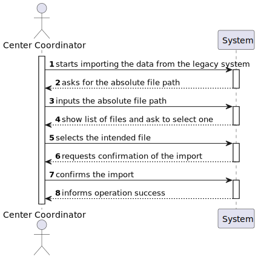
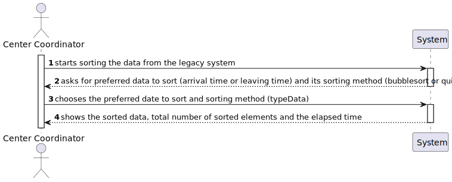
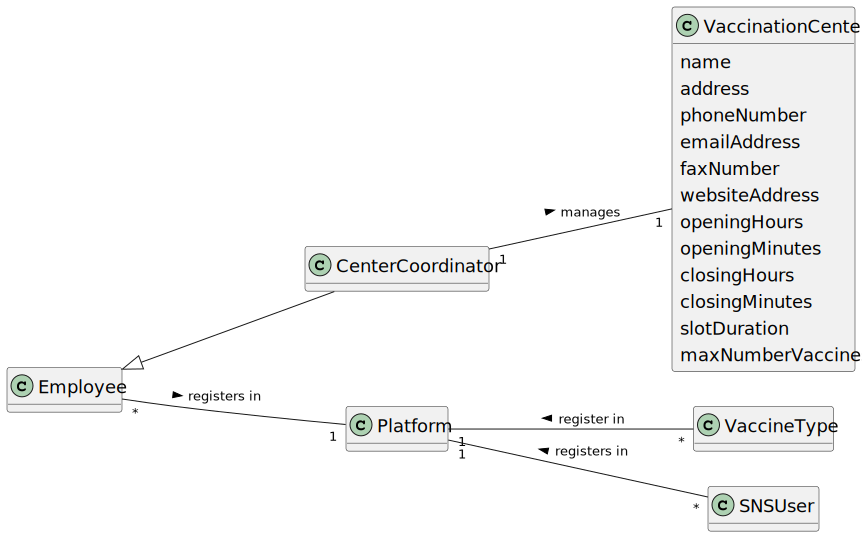
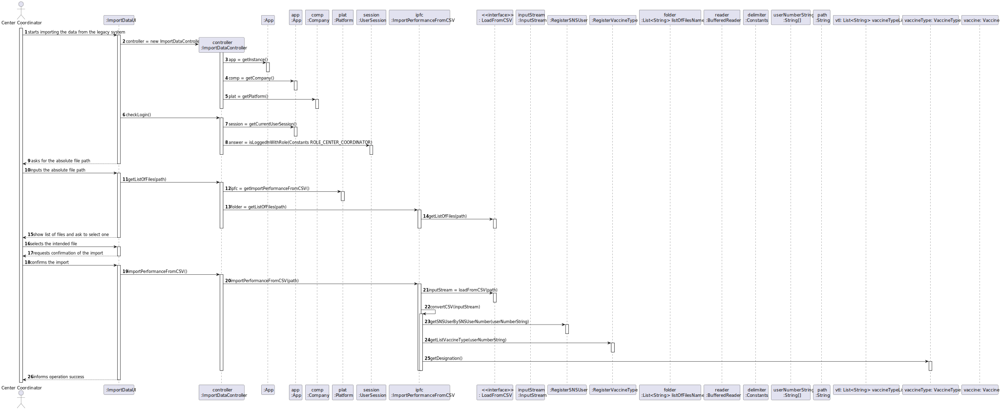
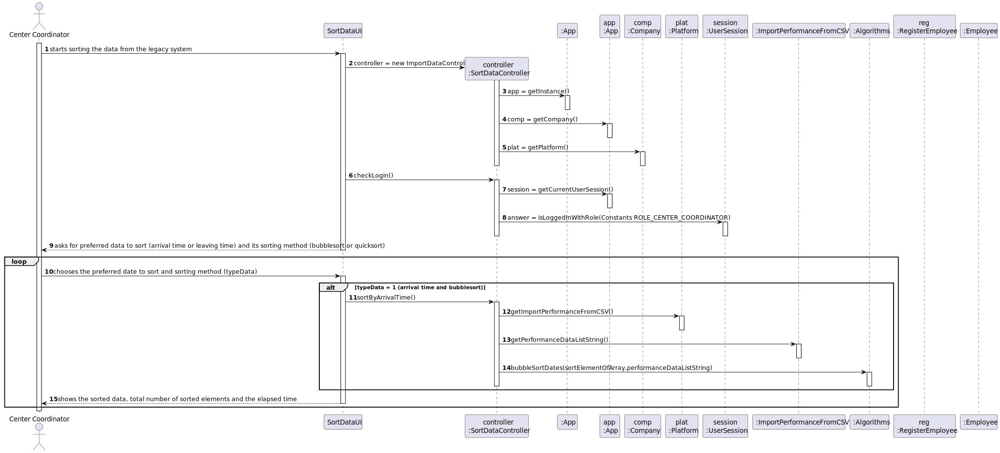
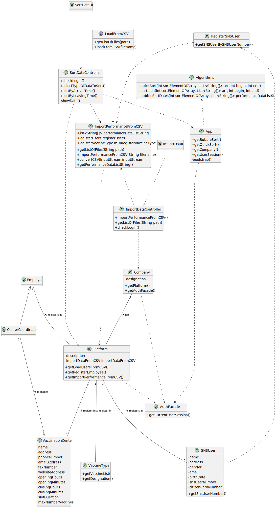

# US 17 - Import Legacy System Data

## 1. Requirements Engineering

*In this section, it is suggested to capture the requirement description and specifications as provided by the client as well as any further clarification on it. It is also suggested to capture the requirements acceptance criteria and existing dependencies to other requirements. At last, identify the involved input and output data and depicted an Actor-System interaction in order to fulfill the requirement.*

### 1.1. User Story Description

* As a center coordinator, I want to import data from a legacy system that was used in the past to manage centers. The imported data should be presented to the user sorted by arrival time or by the center leaving time. The name of the SNS user and the vaccine type *Short Description* attribute should also be presented to the user.

### 1.2. Customer Specifications and Clarifications 

> **Question:** "in a meeting you already clarified that when uploading a file from a legacy system the application should check if the SNS Users are already registered and if not US 014 should be put to use. My question is now if only one or two SNS Users are not registered, should the whole legacy file be discarded?"
>
> **Answer:** SNS users that are not registered should be loaded/registered. The other SNS users should not be registered again and should be ignored.

> **Question:** "I noticed that some postal codes in the address does not follow the format of XXXX-YYY. For example some of them are XXXX-Y. Are we supposed to be able to load those users as well?"
>
> **Answer:** Yes.

> **Question:** "I was analysing the csv file that should be imported for US17 (the one that is in moodle), I noticed that the date attributes are written like this 5/30/2022 I thought that the date format should be DD/MM/YYYY. I also noticed, that the time is written like this, 9:43, I also thought that the time format should be written like this HH:MM, (in this case it would be 09:43). Are the date and time formats diferent for US17?"
>
> **Answer:** That file is from a legacy system, that uses a different date and time format. The date and time should be converted when loading the data into the application that we are developing.

> **Question:** "US17: As a center coordinator, I want to import data from a legacy system that was used in the past to manage centers. The imported data should be presented to the user sorted by arrival time or by the center leaving time. The name of the SNS user and the vaccine type Short Description attribute should also be presented to the user.
It should be an option to choose to either sort by arrival time or by the center leaving time?
> 
> **Answer:** The user can choose to sort by arrival time or by the center leaving time.

> **Question:** "In the Sprint D requirements is stated that two sorting algorithms should be implemented and that the imported data should be sorted by arrival time or center leaving time. Should each algorithm be capable of both sortings or is one of the algorithms supposed to do one (e.g. arrival time) and the other the remaining sorting criteria (e.g. leaving time)?"
>
> **Answer:** Each algorithm should be capable of doing both sortings. The application should be prepared to run both algorithms. The algorithm that will be used to sort data should be defined in a configuration file.

> **Question:** "Is there any correct format for the lot number? Should we simply assume that the lot number will always appear like this 21C16-05 ,like it's written in the file, and not validate it?"
>
> **Answer:** The lot number has five alphanumeric characters an hyphen and two numerical characters (examples: 21C16-05 and A1C16-22 )

> **Question:** "You already have clarified that when uploading a file from a legacy system the application should check if the SNS Users are already registered and if not, we should register them using US 014. How exactly do you want this to proceed, in case there aren't registered users, should the application ask the center coordinator to select the file with the users data to be uploaded?"
>
> **Answer:** US14 and US17 are two different features of the system. In US17, if the SNS user does not exist in the system, the vaccination of this SNS user should not be loaded. The system should continue processing the CSV file until all vaccinations are processed.

> **Question:** "Should the vaccine named Spikevax, (the one in the given CSV file for US17), be registered before loading the CSV file?"
>
> **Answer:** Yes.

### 1.3. Acceptance Criteria

* Two sorting algorithms should be implemented (to be chosen manually by the coordinator), and worst-case time complexity of each algorithm should be documented in the application user manual (in the annexes) that must be delivered with the application. 
* The center coordinator must be able to choose the file that is to be uploaded.
 
### 1.4. Found out Dependencies

* There is a dependency to "US14 Load Users From CSV File" since there is a need to have all the Users from the Legacy System already loaded into the application.

### 1.5 Input and Output Data

**Input Data:**

* Typed data:

    * N/A

* Selected data:
    * Specifying a file to load

**Output Data:**

* List of existing files
* Shows list of imported data from the Legacy System and requests confirmation
* Shows the data registered in the system(Performance Data) and requests confirmation

### 1.6. System Sequence Diagram (SSD)

### 1.7 Other Relevant Remarks

*Use this section to capture other relevant information that is related with this US such as (i) special requirements ; (ii) data and/or technology variations; (iii) how often this US is held.* 

## 2. OO Analysis

### 2.1. Relevant Domain Model Excerpt 
*In this section, it is suggested to present an excerpt of the domain model that is seen as relevant to fulfill this requirement.* 

### 2.2. Other Remarks

*Use this section to capture some aditional notes/remarks that must be taken into consideration into the design activity. In some case, it might be usefull to add other analysis artifacts (e.g. activity or state diagrams).* 

## 3. Design - User Story Realization 

### 3.1. Rationale

**The rationale grounds on the SSD interactions and the identified input/output data.**

| Interaction ID | Question: Which class is responsible for...                                                       | Answer                   | Justification (with patterns)                                                                                                         |
|:---------------|:--------------------------------------------------------------------------------------------------|:-------------------------|:--------------------------------------------------------------------------------------------------------------------------------------|
| Step 1  	      | ... interacting with the actor?                                                                   | ImportDataUI             | Pure Fabrication: there is no reason to assign this responsibility to any existing class in the Domain Model.                         |
| 	              | ... coordinating the US?                                                                          | ImportDataController     | Controller                                                                                                                            |
| 	              | ... knowing the app instance?                                                                     | App                      | Creator(Rule 3): App closely uses Singleton                                                                                           |
|                | ... knowing the company?                                                                          | App	                     | Creator(Rule 4): App has the data used to initialize Company                                                                          |
| 	              | ... knowing the platform?                                                                         | Company                  | Creator(Rule 4): Company has the data used to initialize Platform                                                                     |
| 	              | ... knowing the user using the system?                                                            | UserSession              | IE: cf. A&A component documentation.                                                                                                  |
| 	              | ... knowing  the user role?                                                                       | UserSession              | IE: cf. A&A component documentation.                                                                                                  |
| 	              | ... knowing to which company the user belongs to?                                                 | App                      | IE: has registered the user sessions                                                                                                  |
| Step 2  	      |                                                                                                   |                          |                                                                                                                                       |
| Step 3  	      | ... knowing the path to the files?                                                                | ImportDataUI             | IE: its responsible for user interactions.Admin should right the path to the were the files are stored                                |
| 	              | ... getting the register(list) of Performance Data?                                               | Platform                 | IE:  in the DM Platform is responsible for all the registers                                                                          |
| 	              | ...getting the loader(class that processes data imported) of Performance data?                    | Platform                 | IE:  in the DM Platform is responsible for all the registers                                                                          |
| 	              |                                                                                                   | ImportPerformanceFromCSV | HC + LC: knows/has its own list of Performance Data(stored as a list of string arrays)                                                |
|                | ....knowing the list of files to show?                                                            | LoadFromCSV              | Protected Variation: its the responsibility of interface LoadFromCSV to load any type of CSV file                                     |
| Step 4  	      |                                                                                                   |                          |                                                                                                                                       |
| Step 5         | ... holds temporarily the select file?                                                            | ImportDataUI             | IE : Holding on temporarily the file select before passing it. Passing it after asking for confirmation to import the select CSV file |
| Step 6  	      |                                                                                                   |                          |                                                                                                                                       |              
| Step 7         | ... import file from csv?                                                                         | LoadFromCSV              | Protected Variation: its the responsibility of interface LoadFromCSV to load any type of CSV file                                     |
| 	              |                                                                                                   | InputStream              | IE: This abstract class is the superclass of all classes representing an input stream of bytes.                                       |	
|                | ... converting CSV inputStream(process the data imported from csv)?                               | ImportPerformanceFromCSV | IE: its the responsibility off this class to process the data imported from the CSV                                                   |
|                | ... knowing the string delimiter?                                                                 | Constants                | HC + LC : knows/has its own data.                                                                                                     |
|                | ... read the lines from the BufferedReader(using delimiter to split line) ?                       | ImportPerformanceFromCSV | IE:  its responsible for processing the data.                                                                                         |
|                | ... add the lines read to a list of string array?                                                 | ImportPerformanceFromCSV | HC + LC: knows/has its own data.                                                                                                      |
|                | ... showing the data inside the list of string array?(list of Performance Data imported from CSV) | ImportPerformanceFromCSV | HC + LC: knows its own data.                                                                                                          |
| Step 8         | ... informing operation success?                                                                  | ImportDataUI             | IE: is responsible for user interactions                                                                                              |
| Step 9  	      | ... interacting with the actor?                                                                   | SortDataUI               | Pure Fabrication: there is no reason to assign this responsibility to any existing class in the Domain Model.                         |
|                | ... coordinating the US?                                                                          | SortDataController       | Controller                                                                                                                            |
| Step 10        | ... knowing the list of string array?(list of SNS users imported from CSV)                        | ImportPerformanceFromCSV | HC + LC: knows/has its own data.                                                                                                      |
|                | ... sorting the Data?                                                                             | Algorithms               | IE: knows the algorithm that will sort the data.	                                                                                     |
| Step 11        | ... showing imported data already sorted?                                                         | SortDataUI               | IE: is responsible for user interactions.                                                                                             |  

### Systematization ##

According to the taken rationale, the conceptual classes promoted to software classes are: 

 * Platform
 * SNSUsers
 * Employee
 * VaccinationCenter
 * UserRole
 * User
 * CenterCoordinator
 * Email
 * Password

Other software classes (i.e. Pure Fabrication) identified: 
 * ImportDataUI  
 * ImportDataController
 * SortDataUI
 * SortDataController
 * Algorithms
 * ImportPerformanceFromCSV
 * LoadFromCSV(interface)

Other classes of the system:

* App
* AuthFacade
* UserSession
* Constants

## 3.2. Sequence Diagram (SD)

## 3.3. Class Diagram (CD)

# 4. Tests 
*In this section, it is suggested to systematize how the tests were designed to allow a correct measurement of requirements fulfilling.* 

**_DO NOT COPY ALL DEVELOPED TESTS HERE_**

**Test 1:** Check that it is possible to the ImportDataController to find the path to the files. 

    @Test
    void getListOfFiles() {
        ImportDataController idc = new ImportDataController();
        String path = "src/main/resources";
        idc.getListOfFiles(path);

        assertTrue(idc.getListOfFiles(path).contains("SNSUserDataFromGaoFuNationalCenterDoPortoVaccinationCenter.csv"));
    }
**Test 2:** Check that it is possible to add more sorting options to the application.
  
      @Test
      void selectTypeOfDataToSort() {
      SortDataController sdc = new SortDataController();
      List<String> listOfDataToSort = new ArrayList<>();

        listOfDataToSort.add("Sort data by arrival time using Bubble sort");
        listOfDataToSort.add("Sort data by arrival time using QuickSort");
        listOfDataToSort.add("Sort data by center leaving time using Bubble sort");
        listOfDataToSort.add("Sort data by center leaving time using QuickSort");

        assertTrue(sdc.selectTypeOfDataToSort().toString().contains(listOfDataToSort.toString()));
    }

*It is also recommended to organize this content by subsections.* 

# 5. Construction (Implementation)

## ImportDataUI
  
    
    public class ImportDataUI implements Runnable {
  
      private ImportDataController m_controller;
  
  
      public ImportDataUI() {
          this.m_controller = new ImportDataController();
      }
  
      public void run() {
          System.out.println(MessageBundle.getString("loaddatafromcsv"));
  
  
          if (!m_controller.checkLogin()) {
              System.out.println(MessageBundle.getString("unauthorizeduser"));
              return;
          }
  
          try {
  
  
              String path = Utils.readLineFromConsole(MessageBundle.getString("introducethepathtothefiles") + "( src/main/resources ) : ");
              while (path.isEmpty()) {
                  System.out.println(MessageBundle.getString("pathcantbeempty"));
                  path = Utils.readLineFromConsole(MessageBundle.getString("introducethepathtothefiles") + "( src/main/resources ) : ");
  
              }
              try {
  
  
                  if (!m_controller.getListOfFiles(path).isEmpty()) {
                      Object choice = Utils.showAndSelectOne(m_controller.getListOfFiles(path), MessageBundle.getString("selectcvsfile"));
  
  
                      if (choice == null)
                      {
                          System.out.println("Back to Receptionist menu");
  
                      } else if (Utils.confirm(MessageBundle.getString("importdatafromcvsfile") + " (S/N)")) {
  
                           m_controller.importPerformanceFromCSV(choice.toString());
  
  
                      }
  
  
                  }
              } catch (NullPointerException ex) {
                  System.out.println(MessageBundle.getString("filepathdoesntexist"));
                  run();
              }
  
          } catch (NumberFormatException ex) {
              System.out.println(MessageBundle.getString("optionneedstobeanumber"));
              run();
          }
  
          System.out.println("Successful operation");
  
  
      }
    }

## ImportDataController

      public class ImportDataController  {
  
     
      private App m_oApp;
  
   
      private Platform m_oPlatform;
  

      public ImportDataController(){
          this.m_oApp = App.getInstance();
          this.m_oPlatform = m_oApp.getCompany().getPlatform();
  
      }
  
    
      public boolean checkLogin(){
          return m_oApp.getCurrentUserSession().isLoggedInWithRole(Constants.ROLE_CENTER_COORDINATOR);
      }
  
      
      public List<String> getListOfFiles(String path){
          try
          {
              return this.m_oPlatform.getImportPerformanceFromCSV().getListOfFiles(path);
      }catch (RuntimeException ex)
          {
              System.out.println(ex.getMessage());}
          return null;
      }
  
     
      public boolean importPerformanceFromCSV(String fileName){
          try{
              return this.m_oPlatform.getImportPerformanceFromCSV().importPerformanceFromCSV(fileName);
          }
          catch (RuntimeException ex)
          {
              System.out.println(ex.getMessage());
              return false;
          }
      }

      public boolean importPerformanceFromCSV(File fileName){
          try{
              return this.m_oPlatform.getImportPerformanceFromCSV().importPerformanceFromCSV(fileName);
          }
          catch (RuntimeException ex)
          {
              System.out.println(ex.getMessage());
              return false;
          }
      }
    }

## SortDataUI

        public class SortDataUI implements Runnable{
    
        private SortDataController m_controller;
    
        public SortDataUI(){
            this.m_controller = new SortDataController();
        }
    
        public void run(){
            System.out.println("Sorting Algorithms");
    
            if (!m_controller.checkLogin()) {
                System.out.println(MessageBundle.getString("unauthorizeduser"));
                return;
            }
    
            int typeOfData =  Utils.showAndSelectIndex(m_controller.selectTypeOfDataToSort(),"Select type of data to sort and sorting technique");
    
            while(typeOfData >= 0 && typeOfData < 4 ) {
    
                    for (String s : m_controller.sortBy(typeOfData))
                        System.out.println(s);
    
                typeOfData =  Utils.showAndSelectIndex(m_controller.selectTypeOfDataToSort(),"Select type of data to sort and sorting technique");
            }
    
        }
    }

## SortDataController
  
    public class SortDataController {
  
      private App m_oApp;
      
      private Platform m_oPlatform;
  
     
      private List<String[]> performanceDataListString;
  
  
     
      public SortDataController(){
          this.m_oApp = App.getInstance();
          this.m_oPlatform = m_oApp.getCompany().getPlatform();
  
      }
  
     
      public boolean checkLogin(){
          return m_oApp.getCurrentUserSession().isLoggedInWithRole(Constants.ROLE_CENTER_COORDINATOR);
      }
  
     
      public List<String> selectTypeOfDataToSort()
      {
          List<String> listOfDataToSort = new ArrayList<>();
  
          listOfDataToSort.add("Sort data by arrival time using Bubble sort");
          listOfDataToSort.add("Sort data by arrival time using QuickSort");
          listOfDataToSort.add("Sort data by center leaving time using Bubble sort");
          listOfDataToSort.add("Sort data by center leaving time using QuickSort");
  
          return listOfDataToSort;
      }
  
      public List<String> selectFieldToSortBy(){
          List<String> listOfDataToSort = new ArrayList<>();
  
          listOfDataToSort.add("Arrival time");
          listOfDataToSort.add("Leaving time");
  
          return listOfDataToSort;
      }
  
      public List<String> selectSortingAlgorithm(){
          List<String> listOfDataToSort = new ArrayList<>();
  
          listOfDataToSort.add("Bubble sort");
          listOfDataToSort.add("Quick sort");
  
          return listOfDataToSort;
      }
  
      public List<String> sortBy(int field,int algorithm){
          int typeOfData = field * 2 + algorithm;
          return sort(typeOfData);
      }
  
      public List<String> sortBy(int typeOfData){
          return sort(typeOfData);
      }
      
      public List<String> sort(int typeOfData)
      {
  
          if(typeOfData == 0)
          {
              performanceDataListString = this.m_oPlatform.getImportPerformanceFromCSV().getPerformanceDataListString();
              long start = System.nanoTime();
              Algorithms.bubbleSortDates(5,performanceDataListString);
              long end = System.nanoTime();
  
              return getData();
          }
          else if(typeOfData == 1)
          {
              performanceDataListString = this.m_oPlatform.getImportPerformanceFromCSV().getPerformanceDataListString();
              long start = System.nanoTime();
              Algorithms.quickSort(5,performanceDataListString,0,performanceDataListString.size()-1);
              long end = System.nanoTime();
  
              return getData();
          }else if(typeOfData == 2 )
          {
  
              performanceDataListString = this.m_oPlatform.getImportPerformanceFromCSV().getPerformanceDataListString();
              long start = System.nanoTime();
              Algorithms.bubbleSortDates(7,performanceDataListString);
              long end = System.nanoTime();
  
              return getData();
  
          }
          else if(typeOfData == 3)
          {
              performanceDataListString = this.m_oPlatform.getImportPerformanceFromCSV().getPerformanceDataListString();
              long start = System.nanoTime();
              Algorithms.quickSort(7,performanceDataListString,0,performanceDataListString.size()-1);
              long end = System.nanoTime();
  
              return getData();
          }
          return  null;
      }
  
   
      public List<String> getData()
      {
          List<String> list = new ArrayList<>();
          list.add("SNSUSerNumber VaccineName Dose LotNumber ScheduledDateTime ArrivalDateTime NurseAdministrationDateTime LeavingDateTime");
          int i=0;
          for (String[] line : performanceDataListString)
          {
              list.add(line[0]+" "+line[1]+" "+line[2]+" "+line[3]+" "+line[4]+" "+line[5]+" "+line[6]+" "+line[7] +" "+ line[8] +" "+ line[9] + "\n");
          }
          return list;
      }
    }

## App
  
      public class App {
  
      private Company company;
  
      //omited

         public Company getCompany()
      {
          return this.company;
      }
  
          public UserSession getCurrentUserSession()
      {
          return this.company.getUserRoleStore().getAuthFacade().getCurrentUserSession();
      }

      //omitted

    }

## Platform

    public class Platform implements Serializable {
    
    
        private final SMSNotifier smsNotifier;
        private final EmailNotifier emailNotifier;
        private final ExportVaccinationStatistics exportVaccinationStatistics;
        private String description;
    
        private RegisterEmployee m_oRegisterEmployee;
        private final RegisterVaccinationCenter m_oRegisterVaccinationCenter;
        private final RegisterVaccineType m_oRegisterVaccineType;
        private RegisterSNSUser m_oRegisterSNSUser;
        private LoadUsersFromCSV m_oLoadUsersFromCSV;
        private ImportPerformanceFromCSV m_oImportPerformanceFromCSV;
    

        public Platform(String description) {
            if((description == null) || (description.isEmpty()))
                throw new IllegalArgumentException(MessageBundle.getString("argumentcantbenull"));
    
            this.description = description;
    
    
    
            this.m_oRegisterVaccinationCenter = new RegisterVaccinationCenter();
            this.m_oRegisterVaccineType = new RegisterVaccineType();
    
            this.smsNotifier = new SMSNotifier();
            this.emailNotifier = new EmailNotifier();
            this.exportVaccinationStatistics = new ExportVaccinationStatistics();
    
        }
    
    //omitted
    
       
        public EmailNotifier getEmailNotifier() {return emailNotifier;}
    
     
        public RegisterEmployee getRegisterEmployee(){return this.m_oRegisterEmployee;}
    
       //omitted

        public LoadUsersFromCSV getLoadUsersFromCSV(){return this.m_oLoadUsersFromCSV;}
    
    
      
        public ImportPerformanceFromCSV getImportPerformanceFromCSV(){return this.m_oImportPerformanceFromCSV;}
    
    
    
        public void initializeRegisters(RegisterUsers registerUsers) {
            this.m_oRegisterSNSUser = new RegisterSNSUser(registerUsers);
            this.m_oRegisterEmployee = new RegisterEmployee(registerUsers);
            this.m_oLoadUsersFromCSV = new LoadUsersFromCSV(registerUsers,m_oRegisterSNSUser);
            this.m_oImportPerformanceFromCSV = new ImportPerformanceFromCSV(registerUsers,m_oRegisterSNSUser,m_oRegisterVaccineType);
    
        }
    
    
    }

## Center Coordinator

        public CenterCoordinator (String name, String address, String phoneNumber, String emailAddress, String citizenCardNumber){
        super(name,address,phoneNumber,emailAddress,citizenCardNumber);
    }

## Algorithms

        public class Algorithms {
    
       
        public static List<String[]> bubbleSortDates(int sortElementOfArray, List<String[]> performanceDataListString) {
    
            int n = performanceDataListString.size();
            String[] temp;
    
            for (int i = 0; i < n - 1; i++)
            {
    
                for(int j = 0 ; j< n-i-1;j++)
                {
    
                    String[] listElement = performanceDataListString.get(j);
                    String[] listNextElement = performanceDataListString.get(j+1);
    
                    try
                    {
    
                        SimpleDateFormat format1 = new SimpleDateFormat("MM/dd/yyyy HH:mm");
                        SimpleDateFormat format2 = new SimpleDateFormat("dd-MM-yyyy HH:mm");
    
                        Date listElementData = format1.parse(listElement[sortElementOfArray]);
                        format2.format(listElementData);
    
                        Date listNextElementData = format1.parse(listNextElement[sortElementOfArray]);
                        format2.format(listNextElementData);
    
                        if(listElementData.after(listNextElementData))
                        {
                            temp = performanceDataListString.get(j);
                            performanceDataListString.set(j,performanceDataListString.get(j+1));
                            performanceDataListString.set(j+1,temp);
    
                        }
    
                    } catch (ParseException e)
                    {
                        System.out.println("Date invalid format");
                        e.getMessage();
                    }
                }
    
    
            }
    
    
            return performanceDataListString;
        }
    
   
        public static List<String[]> quickSort(int sortElementOfArray, List<String[]> arr, int begin, int end)
        {
            if (begin < end) {
                int partitionIndex = partition(sortElementOfArray, arr, begin, end);
    
                quickSort(sortElementOfArray,arr, begin, partitionIndex-1);
                quickSort(sortElementOfArray,arr, partitionIndex+1, end);
            }
    
            return arr;
        }
    
        private static int partition(int sortElementOfArray, List<String[]> arr, int begin, int end) {
            String[] pivot = arr.get(end);
            int i = (begin-1);
    
            for (int j = begin; j < end; j++)
            {
    
                try
                {
                    SimpleDateFormat format1 = new SimpleDateFormat("MM/dd/yyyy HH:mm");
                    SimpleDateFormat format2 = new SimpleDateFormat("dd-MM-yyyy HH:mm");
    
                    Date listElementData = format1.parse(arr.get(j)[sortElementOfArray]);
                    format2.format(listElementData);
    
                    Date listLastElementData = format1.parse(pivot[sortElementOfArray]);
                    format2.format(listLastElementData);
    
                    if (listElementData.before(listLastElementData) || listElementData.equals(listLastElementData))
                    {
                        i++;
    
                        String[] swapTemp = arr.get(i);
                        arr.set(i,arr.get(j));
                        arr.set(j,swapTemp);
                    }
    
                }  catch (ParseException e)
                {
                    System.out.println("Date invalid format");
                    e.getMessage();
                }
    
    
            }
    
            String[] swapTemp = arr.get(i+1);
            arr.set(i+1,arr.get(end));
            arr.set(end,swapTemp);
    
            return i+1;
        }
    
     //omitted

    }
## ImportPerformanceFromCSV

    public class ImportPerformanceFromCSV implements Serializable, LoadFromCSV {

    private List<String[]> performanceDataListString = new ArrayList<>();
    
    private transient RegisterUsers registerUsers;

    
    private RegisterSNSUser m_oRegisterSNSUser;

    private RegisterVaccineType m_oRegisterVaccineType;

   
    public ImportPerformanceFromCSV(RegisterUsers registerUsers, RegisterSNSUser m_oRegisterSNSUser, RegisterVaccineType m_oRegisterVaccineType)
    {
        this.registerUsers = registerUsers;
        this.m_oRegisterSNSUser = m_oRegisterSNSUser;
        this.m_oRegisterVaccineType = m_oRegisterVaccineType;
    }

    public List <String> getListOfFiles(String path){
        return LoadFromCSV.getListOfFiles(path);
    }

    
    public boolean importPerformanceFromCSV (String fileName)
    {
        try {
            InputStream inputStream = LoadFromCSV.loadFromCSV(fileName);
            convertCSV(inputStream);
        }catch (IllegalArgumentException ex)
        {
            System.out.println(ex.getMessage());
            return false;
        }
        return true;
    }

    public boolean importPerformanceFromCSV (File path)
    {
        try {
            InputStream inputStream = LoadFromCSV.loadFromCSV(path);
            convertCSV(inputStream);
        }catch (IllegalArgumentException ex)
        {
            System.out.println(ex.getMessage());
            return false;
        }
        return true;
    }

    private void convertCSV(InputStream inputStream) {

        String delimiterSemicolon = Constants.DELIMITER_SEMICOLON;

        try (InputStreamReader streamReader =new InputStreamReader(inputStream, StandardCharsets.UTF_8);
             BufferedReader reader = new BufferedReader(streamReader))
        {

            String header = reader.readLine();
            String row;
            System.out.println(header);

                while ((row = reader.readLine()) != null) {
                    if ((row.trim()).length() > 0)
                    {
                        System.out.println(row);
                        String[] splitRowData = row.split(delimiterSemicolon);

                        if (splitRowData.length == 0 || Arrays.asList(splitRowData).contains("") || splitRowData.length != 8)
                            continue;
                        else
                        {
                            if(m_oRegisterSNSUser.getSNSUserBySNSUserNumber(splitRowData[0]) == null)
                                continue;
                            else
                            {

                                int i = splitRowData.length;
                                int n = i+2;
                                String[] newArray = new String[n];
                                for(int cnt=0;cnt<i;cnt++)
                                {
                                    newArray[cnt] = splitRowData[cnt];
                                }
                                newArray[i] = m_oRegisterSNSUser.getSNSUserBySNSUserNumber(splitRowData[0]).getName();

                                for(VaccineType vaccineType :  m_oRegisterVaccineType.getListVaccineType())
                                {
                                    for(Vaccine vaccine : vaccineType.getVaccineList())
                                    {
                                        if (vaccine.getName().compareTo(splitRowData[1]) == 0 )
                                            newArray[i+1] = vaccineType.getDesignation();
                                    }

                                }

                                performanceDataListString.add(newArray);
                            }
                        }

                    }

                }

        } catch (IOException e) {
            System.out.println(e.getMessage());
        }

    }

    public List<String[]> getPerformanceDataListString()
    {
        return this.performanceDataListString;
    }

## LoadFromCSV

    public interface LoadFromCSV {

    static List<String> getListOfFiles(String pathh) {

        try {
            List<File> files = Files.list(Paths.get(pathh)).map(Path::toFile)
                    .filter(File::isFile)
                    .collect(Collectors.toList());

            List<String> listOfFilesName = new ArrayList<>(files.size());

            for (Object file : files) {
                String path = file.toString();
                Path phatToAFile = Paths.get(path);
                if (path.matches(".*\\.csv"))
                    listOfFilesName.add(phatToAFile.getFileName().toString());
            }

            return listOfFilesName;
        } catch (IOException e) {
            System.out.println(e.getMessage());
        }

        return null;
    }

     //omitted
   

    }

## VaccinationCenter

        private String name;
        private String address;
        private String phoneNumber;
        private String emailAddress;
        private String faxNumber;
        private String websiteAddress;
        private Integer openingHours;
        private Integer openingMinutes;
        private Integer closingHours;
        private Integer closingMinutes;
        private Integer slotDuration;
        private Integer maxNumberVaccines;
        private Integer numTotalVaccinesDay;
        private List<Day> operatingDays;
        private WaitingRoom waitingRoom;
        private List<Vaccine> listVaccines;
        private List<VaccineType> listVaccineTypes;
        private RecoveryRoom recoveryRoom;
        private CenterPerformanceAnalysis centerPerformanceAnalysis;
        private CenterCoordinator centerCoordinator;
    
       
        public VaccinationCenter(String name, String address, String phoneNumber, String emailAddress, String faxNumber, String websiteAddress,Integer openingHours, Integer openingMinutes, Integer closingHours, Integer closingMinutes,Integer slotDuration, Integer maxNumberVaccines) {
    
            if((name == null) || (name.isEmpty()) || (address == null) || (address.isEmpty()) || (phoneNumber == null) || (phoneNumber.isEmpty()) ||
                (emailAddress == null) || (emailAddress.isEmpty()) || (faxNumber == null) || (faxNumber.isEmpty()) || (websiteAddress == null) || (websiteAddress.isEmpty()) ||
                    (openingHours == null) || (openingMinutes == null || (closingHours == null) || closingMinutes == null ||
                        (slotDuration == null) || (maxNumberVaccines == null) ||
                           (phoneNumber.length() != 9) || !StringUtils.isNumeric(phoneNumber)))
                        throw new IllegalArgumentException("None of the arguments can be null or empty");
    
            this.name = name;
            this.address = address;
            this.phoneNumber = phoneNumber;
            this.emailAddress = emailAddress;
            this.faxNumber = faxNumber;
            this.websiteAddress = websiteAddress;
            this.openingHours = openingHours;
            this.openingMinutes = openingMinutes;
            this.closingHours = closingHours;
            this.closingMinutes = closingMinutes;
            this.slotDuration = slotDuration;
            this.maxNumberVaccines = maxNumberVaccines;
            this.numTotalVaccinesDay = 0;
            this.operatingDays = new ArrayList<>();
            this.waitingRoom = new WaitingRoom();
            this.listVaccines = new ArrayList<>();
            this.listVaccineTypes = new ArrayList<>();
            this.recoveryRoom = new RecoveryRoom(10);
            this.centerPerformanceAnalysis = new CenterPerformanceAnalysis();
        }
        public void setManageVaccinationCenter(CenterCoordinator centerCoordinator)
        {
        this.centerCoordinator = centerCoordinator;
        }

    //omitted

# 6. Integration and Demo 

* A new option on the Center Coordinator menu was added.

* Some demo purposes some tasks are bootstrapped while system starts.

# 7. Observations

